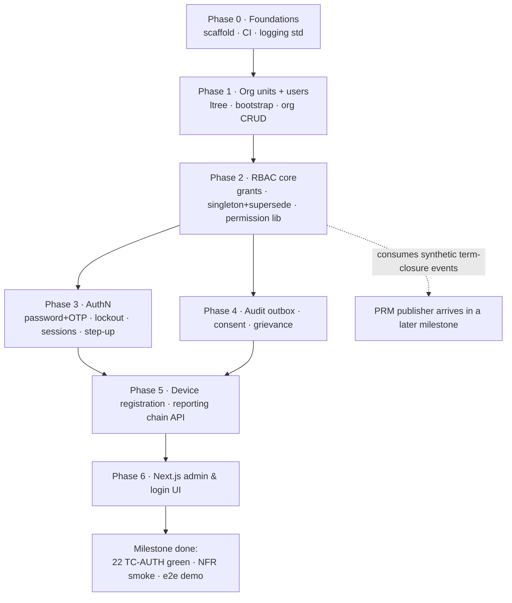

# Implementation Plan — Milestone 1: Users, Authentication & Authorization (AUTH)

Status: PROPOSED — pending sign-off · Created: 25-07-2026
Source requirements: [01-authentication-authorization-security.md](../../requirements/01-authentication-authorization-security.md) (+ role registry sourced from `requirements/sources/module_access_matrix.xlsx`)

## 1. Locked stack decisions (25-07-2026)

| Concern | Decision |
|---|---|
| Backend | Python 3.12 + FastAPI |
| Database | PostgreSQL 16 (AWS RDS, ap-south-1 Mumbai — DPDP residency) |
| Cache / sessions / rate limits | Redis (ElastiCache, ap-south-1) |
| ORM / migrations | SQLAlchemy 2.x + Alembic |
| Web frontend | Next.js (React, TypeScript) |
| Architecture | Modular monolith, monorepo (`backend/` with one package per module: `auth/`, `onboarding/`, …; `frontend/`) |
| SMS/OTP | Pluggable `SmsProvider` adapter; dev stub + email fallback now; DLT provider wired when credentials arrive |
| CI/CD | GitHub Actions: lint (ruff), types (mypy), tests (pytest), migration check; Docker images; deploy to ECS Fargate later |
| Secrets | AWS Secrets Manager (vault per AUTH §9) |
| Logging | Project logging standard (mandatory skill) from the first line of code: JSON logs, trace_id/span_id, runtime level control, duration_ms on API/DB calls |

## 2. Technical decisions proposed with this plan (approve with sign-off)

1. **Sessions: opaque server-side tokens in Redis**, not stateless JWT. Rationale: AUTH requires revocation within 60 s on deactivation and 4-hour privileged sessions with step-up — a server-side session store makes revocation exact and trivial; JWT would need a denylist that reimplements the same store. Device-bound 30-day refresh tokens (student app) added in the ATT milestone.
2. **Password hashing: Argon2id** (argon2-cffi); OTPs stored hashed (SHA-256 + salt); both per AUTH §9.
3. **Singleton roles enforced in the schema**: partial unique index on grants `(role, org_unit) WHERE status='active' AND role IN (singleton set)` + supersede as a single transaction. Fail-closed check also at permission-check time per AUTH-FR-16.
4. **Org hierarchy storage: materialized path (ltree)** on `org_units` — scope checks ("is Section X under Department Y") become index-backed prefix queries; re-parenting rewrites paths in one transaction (Super Admin-only, audited).
5. **Audit + domain events via a Postgres outbox table** with a background dispatcher — one mechanism serves the audit stream now and PRM term-closure / freeze / leave events in later milestones. A lost audit write is impossible while the business transaction commits (same transaction inserts the outbox row).
6. **Permission checks as an in-process library** (`auth.permissions.check(actor, action, scope)`) backed by a per-process cache with ≤60 s TTL — meets the <10 ms p95 NFR; every module imports this one library (AUTH-FR-05, no module rolls its own).

## 3. Build phases

Each phase ends with its mapped TC-AUTH tests green in CI. No phase starts before the previous one's tests pass.

### Phase 0 — Foundations (repo scaffold)
Monorepo layout, FastAPI app skeleton with health endpoint, settings management (pydantic-settings; env-per-stage), Alembic baseline, Docker Compose (Postgres+Redis) for local dev, CI pipeline (ruff/mypy/pytest/migration-drift check), logging library conforming to the logging standard, error envelope + trace-id middleware.
**Exit:** CI green on an empty walking skeleton; structured logs verified.

### Phase 1 — Org structure & identity data model
`org_units` (University/Faculty Division/School/Department/Program + per-term Section instances as a distinct type), ltree paths, deactivate-never-delete; `users` (ERP ID join key, states ACTIVE/DEACTIVATED/WITHDRAWN, contact fields); Super Admin bootstrap seed; org CRUD APIs (Super Admin only, audited).
**Covers:** AUTH-FR-01 (provisioned-only creation), AUTH-FR-19. **Tests:** TC-AUTH-010.

### Phase 2 — RBAC core
`roles` seeded from the registry (§4 table incl. teaching grades, non-academic roles, PA-tier attribute); `grants` (user, role, org-unit scope, validity, academic-term binding, additional-charge flag, status); singleton partial index + atomic supersede endpoint; grant CRUD with scope-widening prevention; permission-check library + Redis-backed cache (≤60 s); deny-by-default middleware; term-closure revocation handler (consumes outbox topic — publisher arrives with PRM, handler tested via synthetic events); grant restore for rollback.
**Covers:** AUTH-FR-04/05/13/14/15/16/17. **Tests:** TC-AUTH-005/006/013/015/016/017/018/019/020/021/022.

### Phase 3 — Authentication
Password login (Argon2id, breached-password check via offline k-anonymity list), forced first-login change; OTP issue/verify (6-digit, 5-min TTL, single-use, 5 attempts, hashed at rest), `SmsProvider` adapter + dev stub + email fallback; lockout ladder (5 fails → 15 min; 3 lockouts/24 h → admin unlock); per-target OTP rate limit (5/hour) + per-IP throttle; session issue/refresh/revoke in Redis (12 h staff / 4 h privileged), step-up re-auth endpoint; password reset via OTP; deactivation → session revocation ≤60 s; login-burst sizing test (5,000/15 min).
**Covers:** AUTH-FR-02/03/07/12 (telemetry counters). **Tests:** TC-AUTH-001/002/003/004/007/012.

### Phase 4 — Audit service, consent, grievance
Append-only `audit_events` fed exclusively by the outbox dispatcher (no update/delete API; integrity hash chain); scoped read API; versioned DPDP notices + consent capture at first login, separate geolocation consent item, consent-state API for other modules; grievance flow (correction/erasure requests, status tracking, statutory-exemption response templates).
**Covers:** AUTH-FR-08/09/10. **Tests:** TC-AUTH-011/014.

### Phase 5 — Device registration & reporting chain
Student single-device registration (device fingerprint binding at first app/web-API login), change-request flow (OTP + Class In-charge/System Admin approval, old device invalidated, history kept); reporting-chain configuration (role-level edges incl. unit-head map; acyclic validation, Chancellor terminal) + resolution API with holder status (active / on-leave / vacant) for LVE/TSK; security telemetry alerts (failed-login spikes, OTP flood, lockout storms → IT-cell notification).
**Covers:** AUTH-FR-06/12/18. **Tests:** TC-AUTH-008/009.

### Phase 6 — Admin & user UI (Next.js)
Login + OTP + forced-change + consent screens; role-scoped home; Super Admin org-tree manager; System Admin user admin + grant manager with supersede UX and singleton-violation messaging; device-change approval queue; audit log viewer (scoped, read-only); reporting-chain editor.
**Exit:** end-to-end happy path demo — bootstrap Super Admin → create org tree → provision a user → grant `class-incharge` → login with OTP → permission-scoped home.

## 4. Definition of done (milestone)

- All 22 TC-AUTH test cases automated and green (unit + integration against real Postgres/Redis in CI).
- NFR smoke checks: login server processing < 1 s p95; permission check < 10 ms p95; grant visible ≤ 60 s.
- Logging-standard compliance check passes on every endpoint (trace ids, duration_ms).
- Seed + bootstrap runbook documented; secrets in Secrets Manager, none in code.
- No DPDP data outside ap-south-1.

## 5. Explicitly out of this milestone

Student bulk import (ONB — next milestone, consumes AUTH-FR-01), the PRM term-closure *publisher* (handler ships now, tested synthetically), FIDO2 for executives (post-MVP), the mobile app (arrives with ATT), real DLT SMS provider wiring (adapter slot ready).

## 6. Risks & open items

- DLT SMS registration lead time — start the university's paperwork now; dev proceeds on the stub.
- Principal/Director open question (AUTH §11) — does not block: the chain is configuration, not code.
- ERP ID format/uniqueness guarantees — confirm before Phase 1 schema freeze.

## 7. Build-order flow

