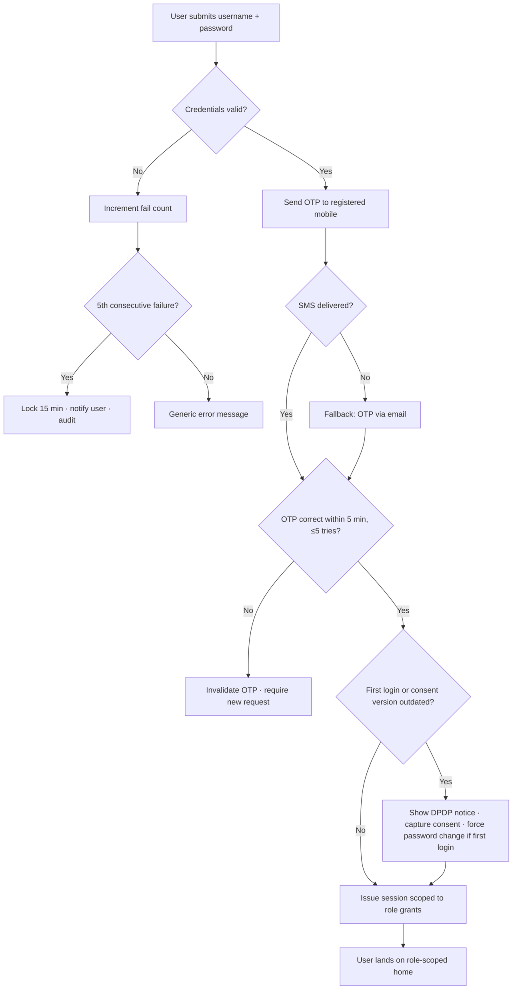

# Requirement: Authentication, Authorization & Security (Cross-Cutting)

Module code: AUTH · Status: DRAFT — pending approval · Last updated: 2026-07-21

## 1. Summary

UniCore operates its **own identity store** — no SSO in MVP. Every user (student, faculty member, staff, executive) signs in with username/password plus an OTP second factor. Authorization is role-based (RBAC) with **org-unit scoping**: a role grant is always bound to a node in the University → Faculty Division → School → Department → Program → Section hierarchy, and a user sees/acts only within their scope. This document defines the identity lifecycle, credential and session policy, the RBAC model every module builds on, the student device-registration scheme required by QR attendance, and the security and DPDP-compliance controls the whole system inherits.

## 2. Goals & Non-Goals

**Goals**
- Single identity per human across all modules and campuses.
- Password + OTP (mobile/email) authentication with sane lockout/rate-limit policy.
- An RBAC + scope model expressive enough for every module's authorization matrix.
- Student device registration with an approval-based change flow.
- Central immutable audit log service used by all modules.
- DPDP Act 2023 compliance foundations: consent capture, grievance/correction flow, breach process. (No minor handling — all students are 18+ per locked policy, 00-overview.md §7.)

**Non-Goals**
- SSO/federation (Google/Microsoft) — future phase; the identity model must not preclude adding it.
- Biometric authentication of any kind.
- Parent/guardian or external-examiner accounts.
- Self-service sign-up: every account is provisioned (import or admin action), never self-created.

## 3. Affected User Groups & Access

| Group | Access granted |
|---|---|
| All users | Login, OTP, password change/reset, own profile view, own consent record |
| Students | Registered-device management (request change) |
| System Admin (IT cell) | User lifecycle, role grants within their campus scope, device-change approvals |
| University Super Admin | Cross-campus administration, role catalog management, School-level configuration |
| Executives / HoDs | No special auth powers — their power comes from module roles |

**Denied:** anonymous access to anything except the login/OTP/password-reset endpoints. There are no public pages.

## 4. Authorization & Business Rules

### RBAC model

- **Role**: named bundle of permissions (e.g., `class-incharge`, `timetable-cell`, `exam-cell`, `hod`, `school-incharge`, `faculty-dean`, `dean-academic-affairs`, `system-admin`).
- **Grant**: (user, role, org-unit scope, validity period). Examples: `hod @ Dept-CSE-CampusA`, `class-incharge @ Section-3B-BTech-CSE`.
- A user may hold multiple grants. Effective permission = union of grants; every check evaluates permission **and** scope. Multi-role is normal and first-class: e.g., an **HoD who is also Class In-charge** of a Section holds both grants concurrently — each action is authorized against the grant that permits it, and the audit record names which grant was exercised.
- **Additional charge (same role, multiple org units):** one person may hold the same leadership role at more than one org unit — the university's own org chart (sources/module_access_matrix.xlsx) shows Dean FET holding Faculty Division FMC and Dean FMS holding FHS as additional charge; an HoD (e.g., of AI & Data Science) may temporarily manage the Computer Science Department. Each unit is a separate grant (typically time-bound for the additional charge), workflows in each unit route to the same person, and every audit record names the specific grant/scope exercised.
- **Singleton leadership roles per org unit:** designated roles allow at most **one active grant per org unit** — one HoD per Department, one School Incharge per School, one Faculty Dean per Faculty Division, one Class In-charge per Section, and one VC / Registrar / Dean Academic Affairs / Chancellor per University (the Chancellor is a top-of-hierarchy role introduced by the Leave module, see 10-leave-management.md; **no Pro-Chancellor exists** — removed 25-07-2026 per the org chart). Granting a second active holder is rejected; replacing the holder (e.g., a permanent HoD arriving to end an additional charge) uses the **supersede flow**: old grant revoked and new grant issued in one atomic, audited operation, so the unit is never leaderless and never double-headed.
- Time-bound grants auto-expire; expiry is enforced at check time, not by cleanup jobs.
- **Academic-term-bound grants:** roles that represent a teaching-term duty — `class-incharge` today, and any future per-term academic role — are bound to (role, org unit, **academic term**) rather than to fixed dates. The term is semester or year per the owning School. These grants are **revoked automatically by the term-closure event that PRM ratification publishes for the Section's cohort** (see 06-student-promotion.md), with the configured term-archival date as a backstop for cohorts that never ratify. A new term always requires fresh designation — nothing rolls over.
- **Subject-teaching allocation is not an AUTH grant:** a Faculty Member's right to teach a subject in a Section for a term derives from the term's **published timetable** (see 03-timetable-management.md) and dies with that term's archival — AUTH stores no separate subject-allocation role, so there is exactly one source of truth for "who teaches what." (Question-bank *authoring* is the one exception: QPG accepts either current-term teaching or an HoD-issued `subject-author` grant from the registry below — see 08-question-paper-generation.md.)

### Role registry (single catalog for all module roles)

Every role any module references is cataloged here; modules must not invent roles outside this registry. Each entry names the scope level and the designating authority (who may grant it, via the standard grant mechanism above):

| Role | Scope | Designated by | Consumed by |
|---|---|---|---|
| `super-admin` | University | University governance (bootstrap) | All modules |
| `system-admin` | Campus | Super Admin | All modules |
| `hod`, `school-incharge`, `faculty-dean`, `class-incharge` | Dept / School / Faculty Division / Section | Per singleton + supersede rules above | All modules |
| `dean-academic-affairs` | University (singleton) | University governance | Reporting chain, LVE, dashboards |
| Teaching grades: `professor`, `associate-professor`, `assistant-professor`, `tutor`, `assistant-teaching-staff` | Department | HoD / System Admin (provisioning) | All "Faculty Member" permissions are identical across grades; Tutors/ATS additionally excluded from QPG bank authoring |
| `timetable-cell` | Campus | System Admin | TTM |
| `exam-cell` (led by the `controller-of-examination`) | Campus/University | Registrar | QPG, TSK (assigner grant), PRM (results import), ATT (percentage-only read for the CoE) |
| `school-admin` (config role) | School | School Incharge | ATT/TSK School-level configuration |
| `subject-coordinator` | Department (subject set) | HoD | QPG moderation |
| `subject-author` | Department (subject set) | HoD | QPG bank authoring outside a teaching term |
| `school-exam-coordinator` | School | Controller of Examination | QPG blueprints |
| `hr-designate` | University | Registrar | LVE catalog/quotas/HR export |
| VC/Pro-VC office recipient list | University | Super Admin | TSK escalation top-of-chain |
| `chancellor` | University (singleton) | University governance | LVE approvals (terminal approver) |
| Non-academic unit heads: `dean-research`, `dean-student-welfare`, `dean-iqac`, `finance-officer`, `dean-admin-ra`, `public-relations-officer` | University | Registrar / VC per org chart | LVE routing, TSK escalation/visibility; restricted dashboards only (no School academic data) |
| Non-academic staff roles (wardens, PE staff, exam-office staff, finance staff, HR, estate, facilities, IT cell, security, canteen, hospitality) | Unit | Their unit head | Accounts with minimal access: leave applicant, task assignee, tier-2 PA where the access matrix grants it |

The registry also carries the **unit-head map** for non-academic staff (e.g., Exam Cell staff → Controller of Examination → Registrar; Department office staff → HoD; wardens → Dean Student Welfare), used by LVE routing, TSK escalation, and TSK skip-level visibility. **PA tiers** (see 09-executive-email-ai.md) are recorded per role here: tier 1 "Access to AI" / tier 2 "mail+tasks, no AI" / none — sourced from sources/module_access_matrix.xlsx. **Alumni have no accounts** (MVP).

### Per-action authorization

| Action | Allowed | Enforced at |
|---|---|---|
| Create/import users | System Admin (campus scope), Super Admin | API + service layer |
| Grant/revoke roles | System Admin within own scope; Super Admin anywhere; nobody can grant a scope wider than their own | API + service layer |
| Approve student device change | System Admin, or Class In-charge for their section | API |
| Designate Class In-charge (term-bound grant) | HoD for Sections in their Department; System Admin as fallback | API + service layer |
| View audit log | Super Admin, System Admin (own scope); read-only, no deletion by anyone | API |
| Deactivate user | System Admin (scope); deactivation is immediate session revocation | API + session store |
| Create/rename/re-parent/deactivate org units (Faculty Division/School/Department/Program) | Super Admin only; deactivate-never-delete; all changes audited | API + service layer |

### Business rules

1. One account per human; re-joining users are reactivated, never duplicated (matched on ERP ID / roll number).
2. Passwords: minimum 10 chars, checked against breached-password lists; forced change on first login after provisioning.
3. OTP: 6 digits, 5-minute validity, single-use, max 5 attempts then a fresh OTP is required; delivery to registered mobile (primary) or email (fallback).
4. Lockout: 5 consecutive failed password attempts → 15-minute lock; 3 consecutive lockouts in 24 h → admin-unlock required, user notified.
5. Sessions: JWT or server session with 12-hour absolute lifetime for staff, 30 days refresh for the student mobile app (device-bound); privileged roles (Exam Cell, System Admin) get 4-hour sessions and re-auth for sensitive actions (paper release, role grant).
6. Student registered device: exactly one active device; change request requires OTP + approval (rule above); the previous device is invalidated on approval. All device history retained.
7. Role-grant changes take effect on the grantee's next request (permission cache ≤ 60 s).

### Audit

Central append-only audit service. Every module writes: actor, action, object, scope, timestamp (IST), before/after snapshot, reason (where mandated). No API exists to modify or delete audit records; retention 7 years.

## 5. Legal & Regulatory Requirements

- **DPDP notice & consent:** at first login every user is shown a plain-language notice (what data, why, retention) and consent is recorded (version, timestamp). Geolocation consent for attendance is a **separate, explicit** consent item shown to students; refusing it triggers the attendance fallback path (see ATT doc) rather than blocking login.
- **Minors:** not applicable — all students are 18+ at admission (locked 24-07-2026, 00-overview.md §7). No parental-consent capture, minor flag, or DOB age guard exists.
- **Correction & erasure:** a grievance flow lets users request data correction; erasure requests are honored subject to the university's statutory record-keeping duties (academic records are exempt from erasure while the retention mandate applies — the response must say so, not silently refuse).
- **Breach:** security-event monitoring feeds a breach-response runbook; personal-data breaches are reported to the Data Protection Board and affected users per DPDP timelines.
- **Data residency:** all personal data stored in India-region infrastructure.

## 6. User Stories & Acceptance Criteria

**US-AUTH-1** — As any user, I sign in with username/password and OTP so that my account stays protected.
- Given valid credentials, when I submit password then OTP within validity, then I get a session scoped to my roles.
- Given a wrong OTP 5 times, when I try a 6th, then the OTP is invalidated and I must request a new one.

**US-AUTH-2** — As a System Admin, I grant a Faculty Member the `class-incharge` role for Section 3B so that they can manage that section's attendance corrections.
- Given my scope covers Section 3B, when I create the grant with a validity period, then the grant is active, audited, and visible to the grantee within 60 s.
- Given my scope does not cover the target org unit, when I attempt the grant, then I get a 403 and the attempt is audited.

**US-AUTH-3** — As a Student, I request a device change after losing my phone so that I can keep marking attendance.
- Given an OTP-verified request, when the Class In-charge or System Admin approves, then the old device is invalidated, the new one becomes the sole registered device, and both events are audited.

**US-AUTH-4** — As a Super Admin, I deactivate a departed staff member so that access ends immediately.
- Given an active user, when I deactivate them, then all their sessions are revoked within 60 s and subsequent requests get 401.

## 7. Functional Requirements

- AUTH-FR-01: Provisioned-only account creation (bulk import or admin action); no self-registration.
- AUTH-FR-02: Password + OTP login; OTP via SMS primary, email fallback; policies as per §4.
- AUTH-FR-03: Password reset via OTP to registered contact; resets audited.
- AUTH-FR-04: RBAC with scoped, time-bound grants; permission = union of grants; deny by default.
- AUTH-FR-05: Scope-aware permission check API used by all modules (single enforcement library — no module rolls its own). **Deny by default at the transport layer (locked 25-07-2026):** every endpoint requires a valid session token via a global gate with an explicit public allowlist, plus a per-endpoint role+scope permission declaration; data access is scope-filtered in the query so responses can never contain another user's data.
- AUTH-FR-06: Student single-device registration with approval-based change flow and device history.
- AUTH-FR-07: Session issuance, refresh, revocation; immediate revocation on deactivation; step-up re-auth for designated sensitive actions.
- AUTH-FR-08: Central append-only audit service with 7-year retention and scoped read access.
- AUTH-FR-09: Consent capture (versioned notices; separate geolocation consent), consent-state API for other modules.
- AUTH-FR-10: Grievance flow for correction/erasure requests with status tracking and statutory-exemption responses.
- AUTH-FR-11: *(Removed — locked 24-07-2026: all students are 18+ at admission; no minor/parental-consent handling exists anywhere in the system. See 00-overview.md §7.)*
- AUTH-FR-12: Security telemetry: failed-login spikes, impossible-travel OTP requests, lockout storms → alerts to IT cell.
- AUTH-FR-13: Academic-term-bound grant type: grants carry (role, org unit, academic term); AUTH subscribes to PRM term-closure events and revokes all term-bound grants for the closed Section/cohort within 60 s; the configured term-archival date is the revocation backstop. Revocations are audited like any grant change.
- AUTH-FR-14: PRM rollback (within its window) **restores** the term-bound grants that the rolled-back ratification revoked, so the Class In-charge regains authority over the re-opened cohort; restore events are audited.
- AUTH-FR-15: Class In-charge designation flow: HoD designates one Class In-charge per Section per term (term-bound grant per AUTH-FR-13); re-designation mid-term supersedes (old grant revoked, new issued, both audited). Singleton enforcement per AUTH-FR-16.
- AUTH-FR-16: Singleton-role enforcement: for designated leadership roles (`hod` per Department, `school-incharge` per School, `faculty-dean` per Faculty Division, `class-incharge` per Section, `dean-academic-affairs`/`chancellor` per University), the system rejects a second active grant on the same org unit; the only path to change holders is the atomic supersede operation (revoke + issue together, both audited). Enforcement is at grant-write time AND at permission-check time (a data-level anomaly fails closed).
- AUTH-FR-17: Additional-charge grants: the same role may be granted to one person at multiple org units (Faculty Dean of one Division + additional charge of another — live examples in the org chart: FET+FMC, FMS+FHS; HoD of one Department temporarily heading another). Additional-charge grants are flagged as such, carry a validity period or "until-superseded" marker, and end automatically when a permanent holder is granted via supersede. All in-flight approvals at that unit transfer to the new holder per PRM-FR-15 continuity.
- AUTH-FR-18: **Reporting-chain configuration** (University-level, role-based): Class In-charge → HoD → School Incharge → Faculty Dean → Dean Academic Affairs → VC → Chancellor, with Registrar → Chancellor and **Principal/Director → VC** (Principals absent from the org chart — see Open Questions); non-academic staff resolve via the registry's unit-head map. Exposed as a resolution API ("who is X's reporting person") consumed by LVE routing/cascade (10-leave-management.md) and TSK escalation/visibility. The API also reports each level's **holder status (active / on-approved-leave / vacant)** so consumers can cascade past on-leave or vacant levels. Changes are audited; the chain must be acyclic with Chancellor as the unique terminal.
- AUTH-FR-19: **Org-structure administration:** Super Admin creates, renames, re-parents, and deactivates org units (Faculty Division, School, Department, Program). Units are never hard-deleted (history and scoped grants hang off them); deactivation blocks new grants/imports against the unit while preserving reads. All changes audited with before/after. Section instances are NOT managed here — they are per-term entities created by the Timetable Cell during term setup (TTM-FR-19).

## 8. Edge Cases, Worst Cases & Decisions

| Case | Decision |
|---|---|
| SMS gateway down during morning login burst | OTP falls back to email automatically; if both fail, login is blocked (no OTP bypass). Availability of gateway is an ops alert, not a security relaxation. |
| Student's registered mobile number changes (SIM lost) | Contact-change requires in-person verification by System Admin (documented override, audited) since OTP to the old number is impossible. |
| User holds conflicting roles (e.g., Faculty Member who is also pursuing a program as Student) | Both grants coexist; the app presents a role context switcher; permissions never merge across the student/staff boundary within one request. Staff-side multi-role (HoD + Class In-charge) needs no switcher — grants union normally. |
| Promotion ratifies while the Class In-charge has unresolved attendance disputes | Revocation still fires (ratification implies the PRM freeze already passed, so ATT corrections were closed anyway); unresolved disputes continue via the AUTH grievance flow, handled by the successor Class In-charge of the new term or the HoD. |
| PRM rollback after term-bound grants were revoked | Grants restored per AUTH-FR-14; if the person has left service, the orphan check requires the HoD to designate a replacement before the rolled-back cohort can be re-ratified. |
| Second active HoD granted to a Department (appointment overlap) | Rejected at grant time per AUTH-FR-16; the admin is pointed to the supersede flow. If a data anomaly ever produces two active grants, permission checks fail closed for both and alert the IT cell. |
| HoD holding two Departments approves items in both in one sitting | Allowed — each approval is authorized and audited against the grant for that Department's scope; nothing merges across the two units. |
| Additional-charge holder's own primary role expires while the charge is active | The two grants are independent — losing the primary does not cascade; the additional charge stands until superseded or expired. The orphan check flags the vacated primary unit for succession. |
| Admin tries to grant a role wider than their own scope | Rejected with 403; attempt audited. Scope escalation only via Super Admin. |
| Clock skew makes OTP/QR validation flaky | All validation server-side against server time; client time is never trusted. |
| Account of a Class In-charge deactivated mid-term | Grant orphan check: deactivation flow warns and requires naming a successor for active `class-incharge`/`exam-cell` grants before completing. |
| Worst case: audit store compromise | Audit writes go to WORM/append-only storage with integrity hashes; tampering is detectable; no delete API exists. |
| Worst case: OTP flooding a victim's phone | Per-target OTP rate limit (max 5/hour) and per-IP request throttling. |

## 9. Non-Functional Requirements

- Login (password+OTP round trip, excluding SMS delivery): < 1 s server processing (p95).
- Permission check: < 10 ms in-process (p95); cache TTL ≤ 60 s.
- Availability: 99.5% during academic hours; login burst 08:00–09:30 IST sized for 5,000 logins/15 min.
- Credential storage: Argon2id (or scrypt) hashing; OTPs stored hashed; secrets in a managed vault.
- Audit write: asynchronous but guaranteed (outbox pattern) — a lost audit record is a sev-2 incident.

## 10. Assumptions

- The university can send SMS at scale (DLT-registered sender) — India SMS regulations apply.
- ERP provides a stable unique student ID used as the identity join key.
- All admitted students are 18 or older (university admission policy, locked 24-07-2026); no minor-consent handling is required or built.
- The role hierarchy and per-module access matrix in `requirements/sources/module_access_matrix.xlsx` (received 25-07-2026) is the stakeholder source of truth for the registry above; discrepancies discovered later are reconciled through the SME clarification pass, not silently.
- Staff data (mobile/email) is accurate enough in ERP for OTP delivery at go-live.

## 11. Open Questions

- Which SMS provider/DLT header does the university already have? (Affects OTP integration only.)
- Should executives get hardware-key (FIDO2) as an optional stronger factor? Proposed: yes, post-MVP.
- **Campus Principals/Directors are absent from the org chart** (sources/module_access_matrix.xlsx) yet referenced by TSK/LVE — confirm whether the role exists; if not, remove Principal → VC from the chain and TSK assigner set.
- The org chart marks "Dean FSC — Faculty of Science **(confirm)**" and labels the Agri Division "Faculty of Health Sciences Agri" (apparent copy error) — confirm both names before org-unit setup.

## 12. Flow Diagram

## 13. Test Cases

| ID | Title / Scenario | Category | Priority | Preconditions | Steps | Expected Result | Covers |
|----|------------------|----------|----------|---------------|-------|-----------------|--------|
| TC-AUTH-001 | Successful password+OTP login | Happy | P0 | Provisioned active user | 1. Submit valid password 2. Submit valid OTP | Session issued, scoped to grants | AUTH-FR-02, US-AUTH-1 |
| TC-AUTH-002 | 5 wrong passwords locks account | Negative | P0 | Active user | Fail password 5× | 15-min lock, user notified, audit written | §4 rule 4 |
| TC-AUTH-003 | OTP expires after 5 minutes | Boundary | P0 | OTP issued | Wait 5:01, submit correct OTP | Rejected; new OTP required | §4 rule 3 |
| TC-AUTH-004 | 6th OTP attempt invalidates OTP | Boundary | P0 | OTP issued | Enter wrong OTP 5×, then correct one | Rejected; OTP invalidated | US-AUTH-1 |
| TC-AUTH-005 | Role grant outside admin's scope | Access | P0 | Admin scoped to Campus A | Grant role at Campus B dept | 403; attempt audited | §4 matrix |
| TC-AUTH-006 | Grant visible within 60 s | NFR | P1 | Grant created | Grantee calls API after 60 s | New permission effective | §4 rule 7 |
| TC-AUTH-007 | Deactivation revokes sessions | Access | P0 | User has active session | Deactivate user; user calls API | 401 within 60 s | US-AUTH-4 |
| TC-AUTH-008 | Device change invalidates old device | Happy | P0 | Approved change request | Old device attempts attendance scan | Rejected: unregistered device | AUTH-FR-06 |
| TC-AUTH-009 | Two devices race to register | Concurrency | P1 | One approval pending | Second change request submitted | Second request queued/rejected; never two active devices | AUTH-FR-06 |
| TC-AUTH-010 | Org-unit CRUD restricted to Super Admin | Access | P0 | System Admin (campus scope) session | Attempt to create a Department; then Super Admin creates it and later deactivates it | System Admin gets 403 (audited); Super Admin succeeds; deactivated unit rejects new grants/imports but remains readable; no delete API exists | AUTH-FR-19 |
| TC-AUTH-011 | Erasure request on academic record | Legal | P1 | Student files erasure grievance | Process request | Response cites statutory retention exemption; request logged | §5 |
| TC-AUTH-012 | OTP flood protection | Negative | P1 | Target mobile number | Request 6 OTPs within an hour | 6th request throttled | §8 |
| TC-AUTH-013 | Expired time-bound grant | Boundary | P0 | Class In-charge grant expired yesterday | Attempt attendance correction | 403; grant expiry enforced at check time | §4 RBAC |
| TC-AUTH-014 | Audit record immutability | Legal | P0 | Audit record exists | Attempt update/delete via any API | No such API; storage rejects modification | AUTH-FR-08 |
| TC-AUTH-015 | Ratification revokes term-bound grants | Access | P0 | Class In-charge grant on Section 3B; cohort ratified in PRM | PRM publishes term-closure; former In-charge attempts an ATT correction | Grant revoked within 60 s; correction gets 403; revocation audited | AUTH-FR-13 |
| TC-AUTH-016 | Rollback restores revoked grant | Access | P0 | Grant revoked by ratification; PRM rollback approved in window | Rollback commits; former In-charge acts on the re-opened cohort | Grant active again; action succeeds; restore audited | AUTH-FR-14 |
| TC-AUTH-017 | HoD + Class In-charge dual role | Access | P1 | User holds both grants | Perform an HoD approval and an In-charge correction in one session | Both succeed; each audit record names the exercised grant | §4 RBAC |
| TC-AUTH-018 | Second Class In-charge for same Section blocked | Negative | P0 | Active In-charge grant on Section 3B | HoD designates a second person without superseding | Rejected: one In-charge per Section; supersede flow required | AUTH-FR-15/16 |
| TC-AUTH-019 | Second active HoD for one Department blocked | Negative | P0 | Department CSE has an active HoD grant | Grant `hod @ Dept-CSE` to another person | Rejected citing singleton rule; supersede flow offered; attempt audited | AUTH-FR-16 |
| TC-AUTH-020 | Additional charge across two Departments | Access | P0 | HoD of AI&DS also granted `hod @ Dept-CSE` (additional charge) | Perform an approval in each Department | Both succeed; each audit record names the grant/scope used; no cross-unit merge | AUTH-FR-17 |
| TC-AUTH-021 | Permanent HoD supersedes additional charge | Happy | P0 | Additional-charge HoD active on Dept-CSE with pending approvals | Supersede with the permanent appointee | One atomic op: charge revoked + new grant issued; pending approvals transfer; unit never has 0 or 2 active HoDs at any instant | AUTH-FR-16/17 |
| TC-AUTH-022 | Concurrent grant race on one Department | Concurrency | P1 | No active HoD on a Department | Two admins submit HoD grants simultaneously | Exactly one succeeds; the other is rejected by the singleton constraint | AUTH-FR-16 |

Coverage: all §6 acceptance criteria, the §4 authorization matrix (incl. org-unit CRUD, TC-010), DPDP erasure/consent obligations (§5), term-bound grant lifecycle (TC-015/016/018), singleton + additional-charge rules (TC-019–022), and every §8 edge case except SMS-gateway failover (covered operationally, add TC in integration phase) map to at least one test. Minor-consent tests were removed with the 18+ policy lock (00-overview.md §7).
