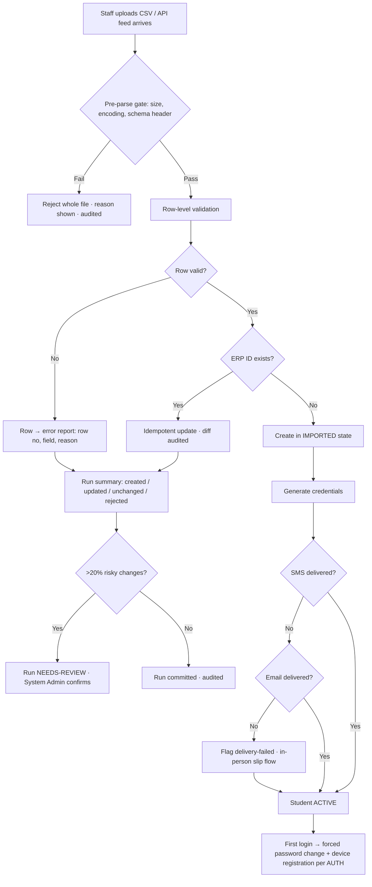

# Requirement: Student Onboarding

Module code: ONB · Status: DRAFT — pending approval · Last updated: 2026-07-30

## 1. Summary

Student onboarding in UniCore is **import-only**: students arrive fully formed from the university's existing ERP, either as bulk files (CSV) or via an ERP API feed. UniCore does **not** admit students — it **provisions** them: creates the user account, delivers initial credentials (SMS primary, email fallback), maps each student to campus/School/Department/Program/Section, records the roll number, and kicks off device registration on first login (per 01-authentication-authorization-security.md). All students are 18+ at admission (locked 24-07-2026, 00-overview.md §7) — there is no minor/parental-consent handling. Sections are **per-term instances created by the Timetable Cell during term setup** (TTM-FR-19); allotment targets the current term's instances. The module also covers the ongoing lifecycle: mid-term single-student additions, section allotment and re-allotment, campus/program transfers, withdrawal/dropout deactivation, and data-correction grievances.

## 2. Goals & Non-Goals

**Goals**
- Bulk import of student records from ERP (CSV upload and API feed) with row-level validation and an actionable error report.
- Idempotent imports: re-running the same import run upserts, never duplicates.
- Account + credential provisioning with initial-credential delivery via SMS (email fallback) and forced password change on first login (AUTH doc).
- Program/Section mapping and roll-number recording at import time.
- Mid-term single-student add, section re-allotment, campus/program transfer, withdrawal deactivation — all audited.
- Data-correction handling via the AUTH grievance flow, with ERP as the master for ERP-owned fields.

**Non-Goals**
- Admissions, merit lists, seat allocation, fee collection or fee status — all remain in the ERP.
- Self-registration of any kind (locked in AUTH doc).
- Faculty/staff onboarding (provisioned by System Admin under AUTH-FR-01; not this module).
- Editing ERP-mastered fields (name, date of birth, ERP ID) inside UniCore — corrections round-trip through the ERP.

## 3. Affected User Groups & Access

| Group | Access granted |
|---|---|
| Admin/office staff (`office-staff` role, School-scoped) | Run imports, single adds, section (re-)allotment, withdrawal — **scoped to their granted org subtree** (see the campus-scope note in §4) |
| System Admin (IT cell) | Same operations **cross-campus**; transfer execution; import configuration (ERP API keys, file schema version) |
| HoD | Read-only view of their Department's onboarding status (imported / pending activation / active) |
| Class In-charge | Read-only roster of their Section |
| Students | View own profile; raise correction grievances; no onboarding actions |
| Faculty Members / Executives | No onboarding actions; roster visibility via their module roles |

**Denied:** students cannot self-register, self-select Sections, or edit any imported field. No user outside campus scope sees another campus's import runs.

## 4. Authorization & Business Rules

### Per-action authorization

| Action | Allowed | Enforced at |
|---|---|---|
| Upload/trigger import run | Admin/office staff (own campus), System Admin (any campus) | API + service layer |
| View import error report | Uploader, Admin/office staff of that campus, System Admin | API |
| Single-student add (mid-term) | Admin/office staff (own campus), System Admin | API + service layer |
| Section allotment / re-allotment | Admin/office staff (own campus, own Program scope), System Admin | API + service layer |
| Campus or Program transfer | System Admin only (crosses org-unit scopes) | API + service layer |
| Withdrawal / dropout deactivation | Admin/office staff (own campus), System Admin; deactivation revokes sessions per AUTH | API + session store |
| Approve data-correction grievance | Admin/office staff for UniCore-owned fields; ERP-mastered fields routed to ERP with tracked status | API |

**Campus-scope note (28-07-2026):** the requirement is written as "campus-scoped".
Because campus is a dimension on org units rather than a hierarchy node, this is
realised as **org-unit scoping**: an `office-staff` grant at a School covers that
subtree, and rows targeting Programs outside it are rejected `scope-conflict`.
System Admin / Super Admin hold University scope and therefore cross everything.

### Business rules

1. **Two one-to-one student identifiers (locked 28-07-2026).**
   - **SIF id** — issued when admission completes, so it exists from day one. It is the join key for a **new** student: only a row carrying a SIF may create one.
   - **Enrollment No** — the student's **canonical identifier** (what the university and its reports refer to), but issued weeks or months *after* admission. It is optional until issued, **unique university-wide**, and correctable afterwards with a before/after audit record.
   Both resolve the same student: search and directory reads accept either, and once an enrollment number exists an import row carrying it matches that student too. Enrollment No leads in rosters, the user directory and exports; SIF is shown as the secondary reference.
   **Either identifier is sufficient on an import row (locked 31-07-2026, superseding "every row must carry a SIF").** A row must name the student by *at least one* of the two and may carry both; it is matched on whichever it carries. This exists because a mid-programme ERP extract of continuing students often carries only the canonical Enrollment No. Three rules keep it safe:
   - A row carrying **neither** is rejected on `sif_id/enrollment_id` — it names nobody.
   - A row carrying **only an Enrollment No that matches nobody** is rejected. Enrollment numbers are issued to students who already exist, so one matching nothing is a typo, not an admission; creating here would mint a phantom student no later SIF-bearing feed could reconcile. New students arrive with a SIF.
   - A row carrying **both, pointing at two different students**, is rejected — one of the two is wrong, and guessing which would corrupt a record either way.
2. **Idempotent upsert:** an incoming row whose SIF id exists updates the existing record (changed fields only, all diffs audited); it never creates a duplicate. Re-running an entire import run is safe.
3. A student is created in state `IMPORTED`; moves to `ACTIVE` once credential delivery is initiated. (No consent gate — all students are 18+ per locked policy; UniCore's own DPDP consent is captured at first login per the AUTH doc.)
4. Roll numbers are **imported from the ERP** and unique within a **Batch** (Program + joining year — the pairing this rule already used before the batch was named); a collision rejects the row. Roll number is the Programme-scoped academic number and is distinct from both the SIF id and the university-wide Enrollment No.
5. Section allotment is per Program term; re-allotment closes the old membership with an effective date (history preserved — attendance stays attached to the old Section's Sessions).
6. Transfers create a new org-unit mapping with effective date; the old mapping is closed, never deleted. Roll number handling on transfer follows the ERP's decision carried in the transfer record.
7. Withdrawal sets state `WITHDRAWN`, revokes sessions immediately (AUTH), removes the student from future Sessions, and preserves all history for statutory retention. Re-joining reactivates the same account (AUTH business rule 1).
8. First login triggers device registration (AUTH-FR-06); onboarding only kicks it off, it does not manage devices.
9. **Every student carries a Programme, a Batch and a position (locked 30-07-2026).**
   - **Programme** — already imported as `program_code`.
   - **Batch** — the admission cohort, (Programme × joining year). **Auto-created on first import**: a row naming a Programme and joining year for which no batch exists creates one, named from a university-level template (default `{programme_code}-{joining_year}`, e.g. `BT-CSE-2026`). The template is configuration, not code, because the university's numbering rule is expected to change; changing it renames nothing already issued.
   - **Position** — where the student sits in the curriculum ladder. For a semester-cadence Programme the **current semester** is stored and the year is *derived* (semester 3 → year 2); for a yearly-cadence Programme the **current year** is stored. Exactly one number is authoritative, so year and semester can never contradict each other. Defaults to **position 1** (first year, first semester) when the file leaves it blank.
10. **Lateral entrants join the batch they will graduate with**, not their literal joining year. A D.Pharm holder entering B.Pharm at semester 3 in 2026 sits alongside the 2025 intake, is timetabled with them, is promoted with them and graduates with them — so their batch is `B-PHARM-2025`. Their joining year remains on the student record for reporting; the batch reflects the cohort, and the Programme's `lateral_entry_semester` is what makes the difference legible.
11. **Import screen defaults, file wins.** Programme and position are **per-row columns**; the upload screen offers a Programme and position picker that fills only cells the file left **blank**. A single-Programme intake needs no per-row values, a mixed ERP extract works untouched, and the file is always authoritative where it speaks. Blank in both places means position 1.

### Audit

Every import run (who, when, file hash, row counts: created/updated/rejected), every single add, re-allotment, transfer, and withdrawal writes to the central audit service with before/after snapshots and reason where applicable.

## 5. Legal & Regulatory Requirements

- **DPDP data minimization:** the import schema carries only fields UniCore needs (identity, contact for OTP/credentials, org mapping, DOB as an identity field). Fee, caste/category, and other ERP fields are not imported.
- **DPDP notice & consent:** consent is captured at first login per the AUTH doc; onboarding must not activate processing beyond provisioning before that (credential delivery itself is covered by the admission-time notice recorded in the ERP — see Assumptions).
- **Minors:** not applicable — all students are 18+ at admission (locked 24-07-2026, 00-overview.md §7). DOB is imported but never age-checked; no consent artifact, minor flag, or `PENDING-CONSENT` state exists.
- **Right to correction:** grievances on UniCore-owned fields (contact number, section-display data) are correctable in UniCore; ERP-mastered fields are forwarded to the ERP and the grievance status tracks the round-trip — the student always receives a response, never silence.
- **Retention:** withdrawn students' academic records are retained per university statute (erasure requests answered with the statutory-exemption response per AUTH doc §5).

## 6. User Stories & Acceptance Criteria

**US-ONB-1** — As an Admin/office staff member, I import the new B.Tech intake CSV so that 600 students get accounts before term start.
- Given a file with 600 rows of which 12 are invalid, when I run the import, then 588 accounts are created/updated, 12 rows land in a downloadable error report with row number + field + reason, and the import-run summary is audited.
- Given I re-upload the corrected file, when the import runs, then the 588 already-imported rows update idempotently (0 duplicates) and the 12 fixed rows are created.

**US-ONB-2** — As a newly imported Student, I receive my initial credentials so that I can log in.
- Given my account reached `ACTIVE`, when provisioning completes, then I receive a one-time credential SMS (email fallback on SMS failure) and my first login forces a password change and starts device registration.

**US-ONB-3** — As an Admin/office staff member, I add one mid-term admission so that a late joiner is provisioned without an import file.
- Given valid single-student data with an ERP ID, when I submit, then the same validation and credential flow run as for bulk rows.

**US-ONB-4** — As an Admin/office staff member, I re-allot a student from Section A to Section B so that the roster matches the Department's decision.
- Given an effective date, when I confirm, then Section B membership starts on that date, Section A history and past attendance are untouched, and both rosters plus the timetable-facing membership update within 5 minutes.

**US-ONB-5** — As a System Admin, I execute a campus transfer so that a student moves campuses with history intact.
- Given ERP transfer confirmation, when I execute, then the old mapping closes, the new campus/Program/Section mapping opens, and the student's login, device registration, and history carry over unchanged.

**US-ONB-6** — *(Removed — locked 24-07-2026: all students are 18+; no parental-consent gate exists. See 00-overview.md §7.)*

## 7. Functional Requirements

- ONB-FR-01: Bulk import via CSV upload and via ERP API feed against a versioned schema; both paths share one validation pipeline.
- ONB-FR-02: Row-level validation: mandatory fields present, **at least one student identifier present** (SIF id or Enrollment No), valid campus/School/Department/Program/Section codes, DOB plausibility, roll-number uniqueness, contact format.
- ONB-FR-03: **Partial-commit semantics:** valid rows commit, invalid rows go to a per-run error report (row number, field, reason, raw row). All-or-nothing is NOT used — see §8 for rationale.
- ONB-FR-04: Idempotent upsert keyed on **either student identifier** — SIF id or Enrollment No, whichever the row carries; per-row outcome (created/updated/unchanged/rejected) in the import-run summary. Only a SIF-bearing row may create a student.
- ONB-FR-05: In-file duplicate detection across **both** identifiers: two rows sharing a SIF id *or* an Enrollment No are the same student — first valid row wins, later rows rejected to the error report as in-file duplicates. Checking SIF alone would let one student enter twice under different spellings of the file.
- ONB-FR-06: Account provisioning into `IMPORTED` state; activation pipeline: credential generation → delivery (SMS primary, email fallback) → `ACTIVE`.
- ONB-FR-07: **Section-instance dependency:** section allotment (bulk or single) targets only Section instances of the current term created by the Timetable Cell (TTM-FR-19); a row or allotment referencing a Section with no instance for the target term is rejected with `section-not-created`, pointing to the Timetable Cell. Sections are never auto-created from import data.
- ONB-FR-08: Roll-number import and uniqueness enforcement **within a Batch** (Program + joining year).
- ONB-FR-19: **Batch assignment.** Every student resolves to a Batch on import. Batches are auto-created on first use from (Programme, joining year) and named from the configurable university-level template (default `{programme_code}-{joining_year}`); the template is editable by Super Admin and applies to batches created after the change — existing batch ids are never rewritten. Lateral entrants are assigned the batch they graduate with, derived as `joining_year − floor((lateral_entry_semester − 1) / 2)` for semester cadence (and the year equivalent for yearly), which is recorded on the student so the derivation is auditable rather than recomputed. Two rules make that derivation safe:
  - **The offset keys on the Programme's declared `lateral_entry_semester`, never on the row's position.** A row's position is where the student is *now*, not where they entered — on a mid-programme backfill a 2024 admission sitting in semester 3 must stay in the 2024 cohort. A student is lateral only when their Programme declares a lateral entry point and they are sitting on it.
  - **A cohort is decided once and then defended.** Re-importing a student whose `admission_year` has been edited does **not** move them; the row is rejected, because an edited spreadsheet cell must not silently reassign someone's cohort. The one legitimate exception is a **Programme change**, which necessarily changes cohort — and that is already flagged as a risky change, so a feed doing it wholesale is parked by the §8 guardrail rather than committed.
- ONB-FR-23: **Student role granted on provisioning.** The import that creates a student also grants them the `student` role, scoped to their **Programme**, in the same transaction and audited like any other grant (AUTH §4). A student holding no grant can authenticate and do nothing, and an intake of 15,000 cannot be granted a role one screen at a time. The grant is **sole** — a student holds it on exactly one Programme — so a Programme change on import, or a transfer via ONB-FR-11, revokes the old grant and issues the new one rather than leaving both. Issuing is idempotent: re-running a file never produces a second grant, and *does* backfill students provisioned before the role existed. Section membership is **not** a grant: it stays with the dated membership history (ONB-FR-10), so re-allotment and promotion never touch authorization.
- ONB-FR-22: **Created-batch visibility.** An import run records the Batches it brought into existence and reports them in its summary and in the run dashboard. Auto-creation means a typo'd `admission_year` produces a real cohort; naming what was created is what makes that visible in the same breath rather than months later.
- ONB-FR-20: **Position capture.** Each student carries a position: current semester for semester cadence, current year for yearly, per the owning Programme's effective cadence (its own, else its School's). Blank on import defaults to 1. The complementary value (year for a semester student) is **derived on read, never stored**. A position exceeding the Programme's ladder (`duration_years × 2`, or `duration_years`) rejects the row as `position-out-of-range`.
- ONB-FR-21: **Import-screen defaults.** The upload screen accepts a Programme and a position that fill blank cells only; per-row values always win. The resolved value per row is visible in the import-run summary so staff can see what a default did.
- ONB-FR-09: Mid-term single-student add using the identical validation/activation pipeline.
- ONB-FR-10: Section allotment and re-allotment with effective dates; historical memberships immutable; downstream modules (TTM, ATT) read membership as of a date.
- ONB-FR-11: Campus/Program transfer (System Admin) with mapping close/open, effective date, and full audit.
- ONB-FR-12: Withdrawal/dropout: state change, immediate session revocation, removal from future Sessions, retention of history.
- ONB-FR-13: Data-correction grievance handling: UniCore-owned fields correctable with audit; ERP-mastered fields routed to ERP with tracked status and user-visible outcome.
- ONB-FR-14: **Import-run dashboard:** per-run counts, error-report download, the Batches the run created (ONB-FR-22), and credential-delivery status (delivered/failed/pending) per student. A run parked by the §8 risky-change guardrail is shown as such with a **release** action for the confirming role — a held run that cannot be released from the screen is a dead end, and credential delivery stays blocked until it is.
- ONB-FR-15: All operations org-scoped per §4; operations crossing an actor's subtree are restricted to System Admin.
- ONB-FR-16: **Upload template** — the student CSV template is downloadable in-app, generated from the same column definition the validator uses (per the overview's bulk-upload baseline) and carrying worked sample rows that demonstrate the mandatory fields, the DD-MM-YYYY date format, and the at-least-one-contact-channel rule.
- ONB-FR-18: **Enrollment-number assignment.** Enrollment numbers are uploaded in their own two-column file (`sif_id`, `enrollment_id`) through the shared import pipeline — partial commit, error report, idempotent re-upload — and may also be set per student. Rules: unique university-wide (a clash names the current holder), in-file duplicates rejected, an unknown SIF rejected, and a correction to an already-issued number permitted and audited before/after. The number may alternatively be supplied in the student import when already known.
- ONB-FR-17: **Section roster read** — a Section's roster as of any date, powered by the dated membership history (ONB-FR-10), showing each student's account state and credential-delivery status; consumed by the onboarding dashboard and later by TTM/ATT.

## 8. Edge Cases, Worst Cases & Decisions

| Case | Decision |
|---|---|
| File contains some invalid rows | **Partial commit** (valid rows in, invalid rows to error report). Rationale: at 15,000+ students, all-or-nothing lets one typo block an entire campus go-live; idempotent upsert (ONB-FR-04) makes fix-and-re-import of just the failed rows safe and cheap. |
| Same file imported twice (double click, retry after timeout) | Idempotent upsert on SIF — second run reports all rows `unchanged`; zero duplicates. File hash shown in import-run history so staff can see it was a re-run. |
| Two rows in one file share a SIF id | First valid row processed, subsequent rejected as in-file duplicates (ONB-FR-05). No silent last-write-wins. |
| Two rows in one file share an Enrollment No but no SIF | **DECISION:** same treatment — they are the same student. Duplicate detection spans both identifiers, so a file cannot smuggle one student in twice by varying which id it states. |
| Row carries neither identifier | **DECISION:** rejected on `sif_id/enrollment_id`. A row that names nobody cannot be matched or created. |
| Row carries only an Enrollment No that matches no student | **DECISION:** rejected. Enrollment numbers are issued to students who already exist; one matching nobody is a typo, and creating from it would produce a student no SIF-bearing feed could ever reconcile. |
| Row carries a SIF and an Enrollment No belonging to two different students | **DECISION:** rejected naming both values. One is wrong and the system cannot tell which; picking either would corrupt a record. |
| Enrollment-only row for an existing student omits the SIF | **DECISION:** the stored SIF is left intact. Absence of a column value is not an instruction to erase — only stated values update. |
| Position blank in both the file and the screen picker | **DECISION:** defaults to position 1 — first year, first semester. This is the common case (a fresh intake) and the default is recorded on the row so the import-run summary shows it was defaulted, not stated. |
| Position exceeds the Programme's ladder (semester 9 of a 4-year B.Tech) | **DECISION:** row rejected `position-out-of-range` naming the Programme's maximum. Silently clamping would place a student in a term that does not exist and then fail at allotment with a far less obvious error. |
| Import names a Programme whose School has no cadence set | **DECISION:** impossible for new Schools (cadence is mandatory at creation), but the 13 Schools seeded before this rule are migrated to `semester`. Until a School Incharge confirms, the value is flagged `cadence_unconfirmed` and shown as a banner on the School — a wrong cadence silently doubles or halves every position calculation downstream. |
| Student is provisioned but the `student` role is missing (imported before it existed) | **DECISION:** the next import naming them grants it — the operation is idempotent, so a re-upload of the original file is the backfill. No separate migration pass, and no student is left able to sign in but do nothing. |
| Student's Programme changes (import correction or ONB-FR-11 transfer) | **DECISION:** the grant moves with them — old revoked, new issued, one audited operation. Holding a grant on a Programme they have left would leak that Programme's scope to them. |
| A student's joining year has no batch yet | **DECISION:** the batch is created on the fly from the naming template (ONB-FR-19). No separate setup step, and a typo'd year therefore creates a real batch — which is why the run records and displays **newly created batches** distinctly (ONB-FR-22), so an unexpected one is visible immediately. The batch is created only once the row is otherwise valid, so a rejected row never leaves a stray cohort behind. |
| Re-import carries a different `admission_year` for an existing student | **DECISION:** row rejected naming the student's current batch. Cohort membership is decided at first import and is not a function of the latest spreadsheet; moving it is an explicit, audited correction. |
| Re-import moves a student to a different Programme | **DECISION:** allowed, and the batch follows the Programme — a cohort is (Programme × year), so the old one cannot survive the move. The change is flagged risky, so a feed doing it to more than 20% of its rows parks for confirmation (§8). |
| Lateral entrant imported before the Programme's `lateral_entry_semester` is set | **DECISION:** batch derives from joining year alone — with no declared entry point there is no offset to apply. Setting the Programme attribute later does **not** retro-move students already imported; a correction is an explicit, audited batch reassignment. |
| Two lateral entrants of the same Programme, different `lateral_entry_semester` values over time | **DECISION:** the derived batch is stored on the student, not recomputed on read, so students imported under the old value keep their original cohort. Recomputation would silently reshuffle cohorts whenever the Programme was edited. |
| Row's SIF id exists but name/DOB wildly differ | Update is applied (ERP is master) but flagged `identity-warning` in the run report for human review. |
| Invalid Program/Section code | Row rejected to error report. Codes are never auto-created from import data — org structure is configured, not imported. |
| Missing mandatory field (e.g., no mobile AND no email) | Row rejected: with no contact channel, credentials cannot be delivered. Error report says which channel is missing. |
| Credential SMS fails | Automatic email fallback; if both fail, student stays `ACTIVE` but flagged `delivery-failed` in the dashboard; office staff hand out credentials in person via a printed one-time slip (audited). Login still forces password change, so the slip is single-use in effect. |
| Roll-number collision (two students, same Program+year, same roll number) | Second row rejected. Resolution happens in the ERP (it owns roll numbers per the proposed default); re-import after fix. |
| Concurrent imports touching the same campus | Allowed; row-level upsert is transactional per ERP ID. Two runs racing on the same ERP ID: last committed write wins and both run reports record the final state — no partial-field merges. |
| Re-allotment after attendance has been captured | Past Sessions/attendance stay with the old Section (memberships are dated, ONB-FR-10); only future obligations move. Never retro-rewritten. |
| Transfer while the student has open grievances or pending device change | Transfer proceeds; grievances and device requests follow the student (they attach to the account, not the org mapping). |
| Withdrawal reversed (student returns) | Reactivate the same account (never a new one); prior roll number restored if still unique, else the ERP issues a new one in the next import. |
| Enrollment number issued to the wrong student | Correct it by re-uploading the right pairing — the number moves, both changes audited. A number already held by another student is rejected naming that holder, so a silent steal is impossible. |
| Student imported at Campus A appears in Campus B's file | Second file's row rejected with `scope-conflict` unless it is a System Admin-executed transfer; campus staff cannot silently poach records across campuses. |
| Worst case: malformed/oversized file (wrong encoding, 500 MB junk) | Pre-parse gate: size cap 50 MB, UTF-8 required, header row must match schema version — file rejected whole at this gate (this is the only whole-file rejection) with a clear reason. |
| Worst case: ERP sends a corrupted feed that would "update" thousands of records | Batch guardrail: if >20% of rows in a run would change org mapping or DOB, the run pauses in `NEEDS-REVIEW` and requires System Admin confirmation before committing. |

## 9. Non-Functional Requirements

- Import throughput: a 20,000-row CSV validates and commits in < 10 minutes; per-row validation feedback available progressively, not only at the end.
- Run summary + error report available < 1 minute after run completion.
- Credential delivery initiated < 15 minutes after activation; delivery-status visible on the dashboard within 5 minutes of gateway callback.
- Section/roster changes propagate to TTM/ATT reads < 5 minutes (shared membership-as-of-date API).
- Import runs must not degrade interactive traffic: background queue, throttled to keep API p95 < 500 ms during academic hours.
- All import files encrypted at rest, retained 90 days for dispute resolution, then purged (data minimization); run summaries and audit records retained 7 years per AUTH.

## 10. Assumptions

- The ERP export includes: SIF id, name, DOB, gender, mobile, email, campus/School/Department/Program codes, admission year, roll number, and the Enrollment No where already issued. Section may be assigned in UniCore if absent from the file.
- All admitted students are 18 or older (university admission policy, locked 24-07-2026); DOB is never age-checked.
- The admission-time ERP notice covers the disclosure of student data to UniCore for provisioning; UniCore's own DPDP consent is captured at first login (AUTH doc).
- ERP is the system of record for identity fields and roll numbers; UniCore is the system of record for account state, Section membership, and device registration.
- The interpretation of "captured timetable update" as attendance corrections (context brief §per-module 3) does not affect this module; onboarding never edits attendance.

## 11. Open Questions

- ~~Roll-number source~~ — **resolved 27-07-2026: ERP-issued roll numbers are imported**; UniCore enforces uniqueness within Program + admission year and rejects collisions to the error report.
- ~~ERP API feed~~ — **resolved 27-07-2026: CSV upload only for MVP.** The API feed lands later as an adapter over the same validation pipeline.
- **Identifier formats** — SIF id and Enrollment No are both opaque non-empty strings (≤100 chars); tighten validation only if the ERP team confirms stable patterns.
- Should Class In-charge receive a notification on re-allotment into/out of their Section? Proposed: yes, in-app notification, post-MVP email digest.

## 12. Flow Diagram

## 13. Test Cases

| ID | Title / Scenario | Category | Priority | Preconditions | Steps | Expected Result | Covers |
|----|------------------|----------|----------|---------------|-------|-----------------|--------|
| TC-ONB-001 | Clean bulk import creates accounts | Happy | P0 | Valid 100-row CSV, new ERP IDs | Upload, run import | 100 accounts `IMPORTED`→`ACTIVE`, credentials sent, run audited | ONB-FR-01/06, US-ONB-1 |
| TC-ONB-002 | Partial commit with error report | Happy | P0 | 100 rows, 5 invalid | Run import | 95 committed; error report lists 5 rows with field + reason | ONB-FR-03, US-ONB-1 |
| TC-ONB-003 | Re-import same file is idempotent | Happy | P0 | TC-ONB-001 completed | Upload identical file again | All rows `unchanged`; zero duplicates | ONB-FR-04, §8 |
| TC-ONB-004 | In-file duplicate SIF id | Negative | P0 | File with same SIF id twice | Run import | First row processed, second rejected as in-file duplicate | ONB-FR-05 |
| TC-ONB-032 | SIF-only row creates a student | Happy | P0 | New admission, no enrollment number yet | Import with enrollment_id blank | Student created; enrollment number null until issued | §4 rule 1 |
| TC-ONB-033 | Enrollment-only row updates a student | Happy | P0 | Student already holds TU2026CSE0001 | Import a row with sif_id blank and that enrollment number | Matched and updated; no second student; stored SIF untouched | ONB-FR-04, §4 rule 1 |
| TC-ONB-034 | Row with neither identifier rejected | Negative | P0 | Row with both id columns blank | Run import | Rejected on `sif_id/enrollment_id`; other rows commit | ONB-FR-02 |
| TC-ONB-035 | Unknown enrollment-only row rejected | Negative | P0 | No student holds TU-NOBODY | Import a row naming it with no SIF | Rejected; no student created | §4 rule 1 |
| TC-ONB-036 | Conflicting identifiers rejected | Negative | P0 | Student A holds the SIF, student B the enrollment number | Import a row pairing them | Rejected naming both; neither record altered | §4 rule 1 |
| TC-ONB-037 | In-file duplicate on enrollment number | Negative | P0 | Two rows sharing an enrollment number, no SIF | Run import | First processed, second rejected as in-file duplicate | ONB-FR-05 |
| TC-ONB-017 | Enrollment numbers assigned after admission | Happy | P0 | Students onboarded with SIF only | Upload (sif_id, enrollment_id) file | Numbers assigned and audited; untouched students unaffected; re-upload reports unchanged | ONB-FR-18 |
| TC-ONB-018 | Enrollment number unique university-wide | Negative | P0 | TU2026CSE0001 held by student A | Assign the same number to student B | Row rejected naming the current holder; run continues | ONB-FR-18 |
| TC-ONB-019 | Enrollment correction audited | Boundary | P1 | Student holds a mistyped number | Upload the corrected number | Value replaced; audit record carries before/after | ONB-FR-18 |
| TC-ONB-020 | Batch auto-created on first import | Happy | P0 | No batch for BT-CSE joining 2026 | Import a BT-CSE row with admission_year 2026 | Batch `BT-CSE-2026` created and listed as new in the run summary; student linked to it | ONB-FR-19 |
| TC-ONB-021 | Second import reuses the batch | Happy | P0 | `BT-CSE-2026` exists | Import another BT-CSE 2026 row | No second batch created; student joins the existing one | ONB-FR-19 |
| TC-ONB-022 | Position defaults to 1 | Boundary | P0 | Row with blank position, no screen default | Run import | Student stored at position 1; run summary marks the value as defaulted | ONB-FR-20 |
| TC-ONB-023 | Screen default fills blanks only | Happy | P0 | Mixed file: some rows carry position 3, others blank; screen default 1 | Run import | Rows with 3 keep 3; blank rows become 1 | ONB-FR-21 |
| TC-ONB-024 | Position beyond the ladder rejected | Negative | P0 | 4-year semester Programme (max 8) | Import a row with position 9 | Row rejected `position-out-of-range` naming max 8; other rows commit | ONB-FR-20 |
| TC-ONB-025 | Year derived, never stored | Boundary | P1 | Semester-cadence student at position 3 | Read the student | Reported as Year 2, Semester 3; only the semester is persisted | ONB-FR-20 |
| TC-ONB-026 | Yearly cadence stores the year | Happy | P1 | Yearly-cadence School | Import a row at position 2 | Student stored at year 2; no semester value | ONB-FR-20 |
| TC-ONB-027 | Lateral entrant joins the graduating cohort | Happy | P0 | B-PHARM with `lateral_entry_semester` 3; joining year 2026 | Import a lateral row | Batch is `B-PHARM-2025`, not 2026; derivation recorded on the student | ONB-FR-19, §4 rule 10 |
| TC-ONB-028 | Batch naming template change is not retroactive | Boundary | P1 | `BT-CSE-2026` exists; Super Admin edits the template | Import a new 2027 row | New batch uses the new template; `BT-CSE-2026` is unchanged | ONB-FR-19 |
| TC-ONB-029 | Roll-number uniqueness is per batch | Negative | P0 | R-101 held in `BT-CSE-2026` | Import R-101 into `BT-CSE-2027` | Accepted — different batch; the same value in `BT-CSE-2026` is rejected | ONB-FR-08 |
| TC-ONB-030 | Import runs invisible across scopes | Access | P0 | Two office-staff actors in different Schools | Actor B lists import runs and opens A's error report | Listing excludes A's runs; the error report returns 404, not 403 | §3, ONB-FR-14 |
| TC-ONB-031 | Roster read denied outside scope | Access | P0 | HoD granted on Department CSE | Request a roster for a Section under Department MEC | 403; no student data returned | §3, ONB-FR-17 |
| TC-ONB-020 | Either identifier finds the student | Access | P1 | Student with both ids | Search the directory by SIF, then by Enrollment No | Both return the same student | ONB business rule 1 |
| TC-ONB-005 | Invalid Program code rejected | Negative | P0 | Row with unknown Program code | Run import | Row in error report; no org unit auto-created | ONB-FR-02, §8 |
| TC-ONB-006 | Missing both contact channels | Negative | P1 | Row without mobile and email | Run import | Row rejected: no credential-delivery channel | ONB-FR-02, §8 |
| TC-ONB-007 | Allotment to a Section with no current-term instance rejected | Negative | P0 | Section "3B" exists for last term only; new term instance not yet created by Timetable Cell | Attempt allotment of a student to "3B" for the new term | Rejected with `section-not-created` pointing to the Timetable Cell; no membership written | ONB-FR-07, TTM-FR-19 |
| TC-ONB-008 | Allotment targets the per-term Section instance | Happy | P0 | Timetable Cell created new-term instance of "3B" | Allot the same student again | Membership written against the new term's instance; last term's "3B" roster unchanged | ONB-FR-07/10 |
| TC-ONB-009 | SMS fails, email fallback | Boundary | P1 | Student with dead mobile, valid email | Activate | Email credential delivered; dashboard shows fallback used | ONB-FR-06, §8 |
| TC-ONB-010 | Roll-number collision rejected | Boundary | P0 | Existing roll no. R-101 in Program+year | Import row with R-101, different ERP ID | Row rejected; existing record untouched | ONB-FR-08, §8 |
| TC-ONB-011 | Campus staff imports into other campus | Access | P0 | Admin scoped to Campus A | Upload file targeting Campus B | 403 / rows rejected `scope-conflict`; attempt audited | §4, §8 |
| TC-ONB-012 | Concurrent runs, same ERP ID | Concurrency | P1 | Two runs with one shared ERP ID | Run both simultaneously | Row-level transactionality; final state consistent, no field merge; both reports accurate | §8 |
| TC-ONB-013 | Re-allotment preserves attendance | Happy | P0 | Student in Section A with attendance | Re-allot to Section B effective today | Past attendance stays with A; future obligations in B; audit written | ONB-FR-10, US-ONB-4 |
| TC-ONB-014 | Withdrawal revokes access | Access | P0 | Active student with session | Mark withdrawn | Sessions revoked ≤ 60 s; removed from future Sessions; history retained | ONB-FR-12 |
| TC-ONB-015 | Corrupted mega-file rejected at gate | Negative | P1 | 500 MB non-UTF-8 file | Upload | Rejected whole at pre-parse gate with reason; nothing committed | §8 |
| TC-ONB-016 | 20k-row import within 10 min | NFR | P1 | Valid 20,000-row CSV | Run import during academic hours | Completes < 10 min; interactive API p95 stays < 500 ms | §9 |

Coverage: every §6 acceptance criterion, the §4 authorization matrix (TC-011/014), the per-term Section-instance dependency (TC-007/008), and all §8 decisions map to at least one test except the ERP corrupted-feed guardrail and grievance round-trip, which are covered in the integration test phase. Minor-consent tests were removed with the 18+ policy lock (00-overview.md §7).
