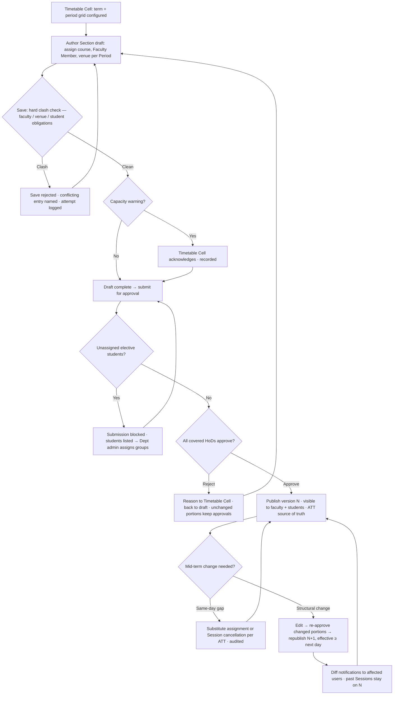

# Requirement: Timetable Management

Module code: TTM · Status: DRAFT — pending approval · Last updated: 2026-07-30

## 1. Summary

The central **Timetable Cell** (one per campus) builds per-Section timetables for each term — manually in MVP, with the system enforcing **clash detection at save time**: a Faculty Member cannot be in two places, a venue cannot host two sessions (except designated combined classes), and no student can carry two obligations in the same slot (via Section, lab group, or elective-group membership). The module supports three non-trivial structures: **lab blocks** (multi-Period contiguous slots where a Section splits into lab groups, each group with its own Faculty Member and venue), **elective slots** (students from many Sections converge into elective groups, all running simultaneously), and **combined classes** (multiple Sections, one venue, one Faculty Member). Timetables move through draft → approval → published; the **published** timetable is the source of truth for attendance Sessions (see 04-attendance-capture.md) — only its assigned (or substitute) Faculty Member can open a Session. Mid-term changes are versioned republishes; past Sessions are never rewritten. Constraint-based auto-generation is a documented future non-goal that this design must not preclude.

## 2. Goals & Non-Goals

**Goals**
- Term setup: per-School academic calendars (uploaded by School office staff, School Incharge-approved, versioned — start/end dates, exam-date ranges, special-event dates, term-archival backstop date), campus holiday calendars (System Admin), and per-campus/per-School period-grid definitions (Schools may have different period structures).
- **Section-instance creation:** the Timetable Cell creates each term's Section instances during term setup — Sections are per-term entities (Program × term × label); ONB allotment and draft authoring depend on them existing.
- Manual timetable construction per Section per term by the Timetable Cell, with save-time clash detection (hard blocks, not warnings).
- Lab blocks with student lab groups; elective slots with elective groups; combined classes.
- Draft vs published states with an HoD → Timetable Cell approval flow before publish.
- Versioned republish for mid-term edits, with change notifications to affected faculty/students; past Sessions unaffected.
- Substitute Faculty Member assignment per Period occurrence — temporary, audited, conferring session-open rights per the ATT doc.
- **Rebalancing suggestions:** when a Faculty Member is on approved leave or absent same-day, ranked substitute candidates per affected Period occurrence, confirmed by the HoD — nothing auto-assigns.
- **Class swaps:** two Faculty Members exchange specific Period occurrences by mutual consent (both-ways clash-checked); HoD notified, not a gate; occurrence-level only.
- Venue-capacity vs enrolled-headcount warnings (soft) alongside hard clash blocks.
- Elective-group enrollment managed by Department admin staff with capacity limits.

**Non-Goals**
- Constraint-based auto-generation (future phase). The data model must keep constraints (faculty availability, venue attributes, lab-group/elective-group structures) as first-class data so a solver can be added without remodeling — but no solver ships in MVP.
- Decentralized timetable authoring by Departments (MVP is central Timetable Cell only).
- Room booking for non-teaching events (seminars, meetings) — out of scope.
- ~~Student self-selection of electives~~ — **reversed 31-07-2026.** Students now choose their own elective: each elective offering belongs to one of three groups — General and Professional (Programme-bound) and Open (university-wide) — and a student picks exactly one subject per group per term, enforced by a database constraint so a double-submit cannot enrol them in two alternatives. **Capacity is enforced** (TTM-FR-14): each elective offering carries an optional seat limit — NULL means unlimited — and a full offering refuses further choices, naming the limit and leaving the alternatives in the group open. Students see seats remaining before they commit. The seat claim takes a **row lock on the offering** rather than counting and then inserting: two students taking the last seat concurrently would otherwise both read one free and both commit. A student switching *away* from a full offering is not blocked by their own occupancy of it, and capacity cannot be lowered below the students already enrolled — that would leave the offering over-subscribed with no honest way to decide whose place to withdraw.
- Attendance capture itself — see 04-attendance-capture.md; this module only feeds it the published schedule.

## 3. Affected User Groups & Access

| Group | Access granted |
|---|---|
| Timetable Cell | Full authoring: term setup, grids, drafts, publish, republish, substitutes — scoped to their campus |
| HoD | Approve/reject drafts covering their Department's Sections/Faculty Members; request mid-term changes; assign substitutes for their Department |
| Department admin staff | Elective-group creation and student-to-group assignment within their Department, within capacity |
| Faculty Members | Read own published timetable (all versions); notified on changes and substitute assignments |
| Students | Read own published timetable (Section + lab group + elective view merged); notified on changes |
| System Admin | Venue master data, campus holiday calendars |
| School office staff (Admin/office staff of a School) | Upload the School's per-term academic calendar (start/end, exam dates, special events) for School Incharge approval |
| School Incharge | Approve the School academic calendar and its amendments (recorded, versioned) |
| Executives (Principal / Faculty Dean / School Incharge) | Read-only dashboards of published timetables in their scope |

**Denied:** faculty and students never see drafts. Nobody outside the Timetable Cell (plus System Admin for master data) can mutate a timetable; HoDs approve and request, they do not edit slots directly.

## 4. Authorization & Business Rules

### Per-action authorization

| Action | Allowed | Enforced at |
|---|---|---|
| Define campus holiday calendar, venue master | System Admin (campus scope) | API + service layer |
| Upload School academic calendar (term dates, exam dates, special events, archival backstop) | School office staff (own School); becomes active only on School Incharge approval | API + service layer |
| Apply one calendar to **several Schools at once** (`ttm:term-upload-multi`) | Super Admin, System Admin, Registrar, Dean Academic Affairs — university-level only; fans out to one draft per School, each still approved by its own School Incharge | API + service layer |
| Approve School academic calendar / amendment | School Incharge (own School); approval recorded, versions kept | API (workflow) |
| Create Section instances for a term (single or bulk CSV) | Timetable Cell (own campus), per Program per term; deactivate-only once students are allotted or a timetable is published | API + service layer |
| **Generate** a term's Section ladder (TTM-FR-22) | Timetable Cell (own campus); proposal reviewed and committed by the same actor — never triggered by calendar approval | API + service layer |
| Set the class-size cap | School Incharge (own School); the university-wide default by Super Admin | API + service layer |
| Define period grid per School | Timetable Cell (own campus), after School sign-off recorded | API + service layer |
| Create/edit draft timetable | Timetable Cell (own campus) | API + service layer |
| Approve/reject draft | HoD for their Department's portion; publish requires all covered HoDs approved | API (workflow engine) |
| Publish / versioned republish | Timetable Cell (own campus), only from fully approved draft | API + service layer |
| Assign substitute for a Period occurrence | HoD (own Department) or Timetable Cell (own campus) | API |
| Confirm a rebalancing suggestion | HoD (own Department); Timetable Cell as fallback | API |
| Propose / accept / cancel a class swap | The two Faculty Members assigned to the occurrences being exchanged (own Periods only); HoD(s) auto-notified | API + service layer (both-ways clash check) |
| Set an elective offering's seat capacity | HoD / School Incharge / admins (`subject:write`), per Department | API + service layer (row-locked seat claim) |
| Assign/remove student in elective group | Department admin staff (own Department), within capacity | API |
| View published timetable | Any authenticated user within org scope (students/faculty: own; HoD/exec: their units) | API |
| View draft | Timetable Cell + approving HoDs only | API |

### Business rules

1. **Clash detection is a hard save-time block** for: (a) same Faculty Member in two Periods overlapping in time; (b) same venue double-booked, unless both entries belong to one declared combined class; (c) any student with two obligations in one slot, resolved through the union of their Section, lab-group, and elective-group memberships (membership as of date, per ONB-FR-10).
2. Combined classes are **declared explicitly** (one teaching entry linked to multiple Sections) — never inferred from coincidental identical bookings.
3. A lab block is one contiguous multi-Period entry; its lab groups must partition the Section (every student in exactly one group); each group has its own Faculty Member + venue, all checked for clashes individually.
4. An elective slot pins one time slot across participating Sections; each elective group has its own Faculty Member + venue; a student belongs to at most one group per elective slot; students not enrolled in any group for that slot are flagged before publish (block — see §8).
5. Publish requires: all HoDs whose Departments' Sections or Faculty Members appear have approved; zero hard clashes; zero unassigned-elective students. Capacity warnings do not block (see rule 7).
6. **Republish is versioned:** version N+1 supersedes N from its effective date; Sessions already delivered (or in progress) under N are immutable; change notifications go to every affected Faculty Member and student listing exactly which Periods changed.
7. Venue capacity < enrolled headcount raises a **warning** requiring Timetable Cell explicit acknowledgment (recorded) — not a block, because real-world constraints (renovations, temporary rooms) need overrides; the acknowledgment is audited.
8. Substitute assignment: per Period occurrence (a date) or a date range; the original assignment is retained; the substitute gains session-open rights for exactly those occurrences (ATT doc); substitution never edits the published timetable version.
9. Attendance integration: the ATT module resolves "who may open this Session" strictly from the current published version + active substitutions + committed swaps; drafts have no runtime effect.
9a. **Rebalancing suggestions:** triggered by (a) LVE approval of a Faculty Member's leave (proactive — before the leave starts) and (b) same-day absence (an ATT never-opened flag, or the HoD marking the member absent). For each affected Period occurrence the system proposes ranked candidates: clash-free in that slot (hard filter), then ranked by same-subject familiarity (teaches the same subject this term), same Department, and lowest incremental load. The HoD confirms a candidate — which creates a standard substitution per rule 8 — or rejects all and acts manually (own substitution or Session cancellation per ATT). **Nothing is ever auto-assigned.** Same-day triggers mark the suggestion urgent.
9b. **Class swaps:** Faculty Member A proposes exchanging specific Period occurrences with Faculty Member B (each must be the assigned/substitute/swapped-in teacher of the occurrences offered). Both directions are clash-checked at proposal AND at acceptance (state may have changed between). On B's acceptance the swap **commits immediately** — mutual occurrence-level reassignment, session-open rights follow (ATT), and the HoD(s) of both members are notified (informed, not a gate) with the swap details. Audited end to end. Either party may cancel a committed swap before the first swapped occurrence (counterpart + HoDs notified); after that, changes go through substitution. A swapped-in occurrence cannot be re-swapped — one hop only; the HoD can still substitute over it.
10. **Subject allocation is term-bound.** A Faculty Member's allocation to a subject in a Section exists only inside that term's published timetable and confers no rights beyond the term. When PRM ratification closes a Section's cohort (see 06-student-promotion.md), the Section's timetable for that term is **archived**: no new Sessions can be opened from it, substitutions on it are rejected, and it remains readable as historical record only. The new term's teaching rights exist only once the new term's timetable is published — nothing carries over automatically, even for the same Faculty Member teaching the same subject. A PRM rollback (within its window) un-archives the affected Section's timetable together with the AUTH grant restore.

### Audit

Every publish/republish (version, diff, approver chain), clash-override attempt (there are none — blocks are absolute; the attempt itself is logged), capacity acknowledgment, substitute assignment, and elective-group change writes to the central audit service with actor, timestamp, before/after, and reason where mandated.

## 5. Legal & Regulatory Requirements

- **UGC/AICTE:** published timetables underpin minimum-attendance computation (75%-type norms, School-configurable per the PRM doc); therefore Period → Session traceability must be lossless across republishes — every delivered Session records the timetable version it was scheduled under.
- **DPDP purpose limitation:** timetable data includes personal data (faculty assignments, student group memberships); visibility is org-scoped per §3 — no public timetable exports carrying student lists. Faculty workload views expose only what the viewer's scope permits.
- **DPDP correction rights:** a Faculty Member disputing their assignment (e.g., wrongly rostered) raises it via the HoD/Timetable Cell change flow; the AUTH grievance mechanism covers profile data, not scheduling disputes — this doc's change flow is the remedy and must respond within a defined SLA (§9).
- Localization: all Periods stored and displayed in IST; DD-MM-YYYY; the week structure (working Saturdays etc.) comes from the campus calendar.

## 6. User Stories & Acceptance Criteria

**US-TTM-1** — As a Timetable Cell member, I build Section 3B's draft so that the term schedule exists.
- Given the period grid and term are configured, when I place a Period where the Faculty Member is already teaching elsewhere, then the save is rejected with the exact conflicting entry named.
- Given a clash-free draft, when I submit for approval, then all covered HoDs see it in their approval queue.

**US-TTM-2** — As a Timetable Cell member, I schedule a 3-Period lab block with two lab groups so that half the Section does Physics lab while the other half does Chemistry lab.
- Given Section 3B is partitioned into lab groups B1 and B2, when I save the block with distinct Faculty Members and venues per batch, then the system verifies contiguity, the lab-group partition, and clash checks per batch.
- Given a student is left out of both lab groups, when I submit for approval, then submission is blocked naming the unassigned students.

**US-TTM-3** — As a Department admin staff member, I assign students to elective groups so that the elective slot is deliverable.
- Given group "German-A" has capacity 40 with 40 assigned, when I add a 41st student, then the assignment is rejected with a capacity message.
- Given a student already in "German-A", when I try adding them to "Music-A" in the same elective slot, then the assignment is rejected (one group per slot).

**US-TTM-4** — As an HoD, I approve the draft portion covering my Department so that publish can proceed.
- Given a pending draft, when I reject with a reason, then the Timetable Cell sees the reason, the draft returns to editing, and prior approvals from other HoDs are preserved unless their portion changes (see §8).

**US-TTM-5** — As a Faculty Member, I see my published timetable and get notified of changes so that I show up at the right venue.
- Given a republish moves my Tuesday Period, when version N+1 publishes, then I receive a notification listing the change, and my calendar shows N+1 from its effective date while past days still reflect N.

**US-TTM-6** — As an HoD, I assign a substitute for Dr. Rao's Thursday Period so that the class runs during his leave.
- Given the substitute is free that slot, when I assign for 2 dates, then the substitute can open those Sessions (ATT doc), the original assignment remains in the published version, and the substitution is audited.
- Given the proposed substitute already teaches in that slot, when I assign, then the assignment is rejected as a clash.

## 7. Functional Requirements

- TTM-FR-01: Term setup: campus holiday/working-day calendar (System Admin, per campus) + **School academic calendar** per term per TTM-FR-18; term dates are per School, not per campus (one campus hosts semester- and year-based Schools simultaneously).
- TTM-FR-02: Period-grid definition per School: named Periods with start/end times; different Schools may run different grids; grids are **versioned and never edited in place** (a change would silently move classes for people already holding the published schedule), and a new version supersedes the last. Overlapping Periods within one grid are refused at creation — they would make every Section in the School clash with itself. Grid changes mid-term require versioned republish of affected timetables.
- TTM-FR-03: Draft timetable authoring per Section per term: assign course, Faculty Member, venue to each Period.
- TTM-FR-04: Save-time hard clash detection across Faculty Member, venue, and student obligations (Section/lab-group/elective-group union, membership-as-of-date). **Drafts collide with drafts as well as with published timetables** (locked 02-08-2026): a room taken by another School's unpublished draft is a real conflict, and catching it at save time is cheaper than at publish. Overlap is half-open, so a class ending at 10:00 does not clash with one starting at 10:00. Superseded and archived timetables are ignored — they are history. Clashes are re-checked at publish, because another School may have published into a shared room while the draft waited for approval. Spanning Schools and grids by absolute time overlap — not by Period index.
- TTM-FR-05: Lab blocks: contiguous multi-Period entries; lab-group definitions partitioning a Section; per-group Faculty Member + venue; per-group clash checks.
- TTM-FR-06: Elective slots: cross-Section slot pinning; elective groups with own Faculty Member + venue + capacity; one group per student per slot; unassigned-student pre-publish block.
- TTM-FR-07: Combined classes: one teaching entry explicitly linked to multiple Sections; venue clash check exempts only the declared combination; headcount = sum of Sections for capacity warning.
- TTM-FR-08: Approval workflow: draft → per-HoD approval (each HoD approves their Department's portion) → publish eligibility; rejection returns to draft with reason. The **draft is one School's timetable for one term** and publishes atomically (locked 02-08-2026): entries belong to Sections, but a timetable is only consistent as a whole — clash-free per Section says nothing about the pair. The Departments that must sign off are derived from the Sections actually in the draft. **Any edit resets every approval to pending**: an HoD approved a timetable that no longer exists, so their decision cannot carry to a different one.
- TTM-FR-09: Publish: atomic version creation; visible to faculty/students; becomes the ATT source of truth; publish blocked while hard clashes, missing approvals, or unassigned elective students exist.
- TTM-FR-10: Versioned republish with effective date, computed diff, and notifications to affected users; delivered/in-progress Sessions immutable; each Session records its scheduling version.
- TTM-FR-11: Substitute assignment per occurrence or date range; clash-checked; audited; grants session-open rights per ATT doc; auto-expires at range end.
- TTM-FR-12: Venue-capacity warnings with mandatory recorded acknowledgment to proceed.
- TTM-FR-13: Personal timetable views, served as **own-data reads** — the subject is resolved from the session, never from a client-supplied id, so nobody reads another person's week by guessing. A **student** sees their Section's published classes with electives merged: an elective appears only if they chose *that* offering, because two alternatives in one group are taught in the same slot and only one is theirs; a student with a record but no current Section is told so rather than shown a blank page. A **Faculty Member** sees their own load across every School they teach in. Neither ever sees a draft — the read path filters on published rather than trusting the caller. (Lab groups and substitutions merge in once TTM-FR-05/FR-11 land; scope dashboards for HoD/exec remain open.)
- TTM-FR-14: Constraint data (faculty availability notes, venue attributes, group structures) stored as structured first-class data so a future auto-generation solver can consume it (non-goal to build the solver).
- TTM-FR-15: Term-bound archival: on the PRM term-closure event for a Section's cohort, archive that Section's timetable — reject Session opens (ATT) and new substitutions/swaps against it, keep read access for history/audit; un-archive on PRM rollback within the rollback window.
- TTM-FR-16: Rebalancing suggestions per §4 rule 9a: triggered by LVE leave approval and same-day absence; ranked clash-free candidates (subject familiarity, Department, lowest load); HoD confirmation creates a substitution; urgent flag for same-day; suggestion, confirmation, and rejection all audited.
- TTM-FR-17: Class swaps per §4 rule 9b: propose → both-ways clash check → accept (re-check) → immediate commit; occurrence-level only; one-hop (no re-swap); HoD notification; cancellation before first swapped occurrence; session-open rights and ATT/SYL attribution follow the swap.
- TTM-FR-18: **School academic calendar:** per School per term — start/end dates, exam-date ranges, special-event dates, **term parity** (odd/even, which drives TTM-FR-22), and the term-archival backstop date (consumed by AUTH-FR-13). Uploaded by School office staff, active only on recorded School Incharge approval; amendments create a new version requiring re-approval; all versions retained and audited.
- TTM-FR-25: **Multi-School calendar application (locked 30-07-2026).** A university-level actor (Super Admin, System Admin, Registrar, Dean Academic Affairs — permission `ttm:term-upload-multi`) may apply one set of term dates to **several Schools in one action**. The upload **fans out into an independent draft calendar per selected School**; there is no shared calendar record. Consequences, all deliberate: each School Incharge still approves their own School and **may amend the dates before approving**, so the university proposes and the School disposes; one School's approval can never activate another's term; and a School that already holds an approved calendar for that term code receives a new draft **version** through the existing amend-and-supersede path (TTM-FR-18) rather than a silent overwrite. School office staff retain single-School upload only — the multi-School power is exactly what the new permission adds. The action reports per School whether a draft was created, versioned, or skipped. Consumers: TTM scheduling warnings (below), TSK exam-duty conflict signal (TSK-FR-17), LVE On-Duty overlap display, AUTH archival backstop. Exam/special-event dates are **soft signals** in MVP: placing a regular Period inside an exam-date range raises a warning requiring recorded Timetable Cell acknowledgment — never a hard block.
- TTM-FR-19: **Section-instance creation:** during term setup the Timetable Cell creates the term's Section instances per Program (label reusable across terms; each instance a distinct org unit for scoping, singleton Class In-charge, and term-closure). Instances with allotted students or a published timetable cannot be deleted — deactivate only. ONB allotment (ONB-FR-07) and draft authoring (TTM-FR-03) reject Sections with no instance for the target term.
- TTM-FR-22: **Section generation (locked 30-07-2026).** Rather than typing Sections one label at a time, the Timetable Cell triggers **generation for a term** and the system proposes the term's whole Section ladder. For each active Programme in scope it walks the Programme's **live positions** and, for each, divides the expected headcount by the School's class-size cap (`ceil(headcount / cap)`, minimum 1) to decide how many parallel Sections that position needs. B.Tech AI & Data Science at semester II with 90 students and a cap of 60 yields two: "II Semester - A" and "II Semester - B".
  - **Live positions** follow **term parity**: a semester-cadence Programme contributes its odd positions (1, 3, 5, 7) in an odd term and its even positions in an even term. A yearly-cadence Programme contributes every position (1..`duration_years`) every term. Generating the full ladder regardless of parity would create twice the Sections that can exist and leave half of them empty for a whole term.
  - **Headcount** comes from the **batch** occupying that position: the count of active students of the Programme currently at that position (ONB-FR-20). A position with no students yet — a first-year intake that has not been imported — has no roster to count, so the Timetable Cell supplies an **expected intake** for it; the same division then applies.
  - **Generation is a proposal, not a commit.** The Timetable Cell sees the proposed Sections with the headcount and cap that produced each, may adjust the count per position, and then commits. Sections that already exist for that (Programme, term, position) are left untouched and reported as existing — generation is **idempotent** and never renames, merges or deletes.
  - **Manual addition remains available at all times** (TTM-FR-19): a position that outgrows its Sections mid-term gets another by hand, taking the next free division letter.
  - Generation is an explicit Timetable Cell action, **never** a side effect of calendar approval — calendar approval is the School Incharge's power and creating Sections is the Timetable Cell's; auto-generating on approval would silently cross that line.
- TTM-FR-23: **Section labelling.** A Section stores its **position** and **division letter** as data; its display label renders from a university-level template (default `{position_roman} Semester - {letter}` for semester cadence, `{position_roman} Year - {letter}` for yearly). Labels are therefore parseable and consistent across Schools, and the template may change without a data migration. Division letters run A, B, C… in creation order and are never reused within a (Programme, term, position).
- TTM-FR-24: **Class-size cap.** Maximum students per Section: a university-wide default (initially 60) that each **School Incharge may override for their School**, consistent with every other School-configurable threshold (attendance %, promotion criteria). The cap in force is snapshotted onto each generation run so a later change to the cap never rewrites the reasoning behind Sections already created.
- TTM-FR-21: **Bulk Section creation** — Section instances may be created one at a time or from a CSV template (one row per Section: Programme path + label), for the term selected at upload time; the term must already be approved for the owning School, and per-row failures are reported without failing the run. The template is downloadable in-app per the overview's bulk-upload baseline.
- TTM-FR-20: **Faculty Dean timetable inputs** (locked 25-07-2026, reconciling the access matrix's "upload Time Table" rows): Faculty Dean offices submit structured timetable inputs (course offerings, teaching assignments, constraints) per School/term to the central Timetable Cell — a tracked submission, not direct authoring. The Timetable Cell remains the sole author (locked decision #8, 00-overview.md); submissions are versioned, acknowledged, and audited, and the draft records which submission(s) it drew from.

## 8. Edge Cases, Worst Cases & Decisions

| Case | Decision |
|---|---|
| Generation run twice for the same term | **DECISION:** idempotent. Sections already existing for a (Programme, term, position) are reported as existing and left untouched — never renamed, merged or deleted. Only genuinely missing Sections are proposed. |
| Headcount is not an exact multiple of the cap (90 students, cap 60) | **DECISION:** `ceil(90/60)` = 2 Sections. Rounding down would leave 30 students with nowhere to sit. Distribution across the two is an allotment concern (ONB), not a generation one. |
| Headcount is zero because the intake has not been imported yet | **DECISION:** no roster to divide, so the Timetable Cell supplies an **expected intake** for that position; with neither roster nor expected intake, one Section is proposed so the position is never left unschedulable. |
| Headcount exceeds the cap only after students are imported | **DECISION:** generation does not retro-split. The Timetable Cell adds Sections manually (TTM-FR-19), taking the next free division letter; existing Sections and their allotments are untouched. A re-run surfaces the shortfall as a warning rather than silently creating Sections mid-term. |
| Class-size cap changed after Sections were generated | **DECISION:** the cap in force is snapshotted on the generation run. Existing Sections stand; the new cap applies to the next generation. Re-deriving Sections from a changed cap would invalidate published timetables and allotments. |
| A Programme's `duration_years` is null | **DECISION:** its ladder is unknown, so it is skipped with a named warning rather than assumed to be 4 years. Guessing a duration would create Sections for terms the Programme does not have. |
| Term parity not set on the calendar | **DECISION:** generation refuses to run for that School and names the calendar. Parity decides which half of every semester ladder is live; defaulting it would create the wrong half for every Programme in the School. |
| Yearly-cadence Programme in an "odd" term | **DECISION:** parity is ignored — every position 1..`duration_years` is live in every term. Parity is a semester-cadence concept only. |
| Multi-School calendar applied where one School already has that term approved | **DECISION:** that School gets a new draft **version** (amend-and-supersede, TTM-FR-18), never an overwrite, and never an auto-approval. The per-School result is reported as created / versioned / skipped. |
| Multi-School calendar: one School Incharge approves, another does not | **DECISION:** entirely independent — the approving School's term is active while the other's stays draft. This is the intended consequence of fanning out rather than sharing a record. |
| A School Incharge amends the dates the university proposed | **DECISION:** allowed. The multi-School upload is a proposal; the School Incharge owns their calendar and their amendment simply creates the next version for their School alone. |
| Two Timetable Cell members edit the same Section draft concurrently | Optimistic locking per Section-draft: second save on a stale version is rejected with a refresh prompt. No silent merge. |
| Clash created indirectly (re-allotted student now double-booked via elective group) | Membership changes (ONB) trigger a re-validation job; conflicts surface in a Timetable Cell "new conflicts" queue. Published timetable stands; Department admin must move the student's group (or Section fix via ONB) within the SLA — the student is never left with two simultaneous obligations silently. |
| Combined class where one Section's HoD approved, the other rejected | Publish blocked until every covered HoD approves. Rejection reason routes to the Timetable Cell; the combined entry is edited or split. |
| HoD approval granted, then that HoD's portion is edited | That HoD's approval auto-invalidates (portion-scoped approval hash); other HoDs' approvals stand. Re-approval required only where content changed. |
| Republish while a Session under version N is in progress | The in-progress Session completes under N; N+1 applies from its effective date, which cannot be earlier than "tomorrow" (next calendar day) — same-day republish is rejected to avoid mid-day ambiguity. Same-day emergencies use substitution or Session cancellation (ATT doc), not republish. |
| Substitute needed but every eligible Faculty Member clashes | System offers no override — a clash block is absolute. HoD either reschedules via republish or cancels the occurrence (ATT doc). Recorded decision: integrity of clash rules outranks convenience. |
| Rebalancing suggestion list is empty (no clash-free candidate) | The HoD is told explicitly ("no eligible substitute") with the option to cancel the occurrence (ATT) or reschedule via republish; the empty result is recorded — silence is never the outcome. |
| Confirmed substitute then goes on leave themselves | Their leave approval re-triggers rebalancing for the occurrences they had picked up — the suggestion flow is re-entrant. |
| Swap accepted but a republish moves one of the swapped occurrences | The swap is auto-voided for the affected occurrences only; both parties and HoD(s) notified; unaffected occurrences of the swap stand. |
| Both parties accept a swap simultaneously with a conflicting change (e.g., substitution landing on the same occurrence) | Acceptance re-runs the clash check transactionally; the first commit wins, the second actor gets a stale-state error naming the conflict. |
| Cross-Department swap (A and B report to different HoDs) | Allowed — both HoDs are notified; each sees the swap in their Department view. |
| Faculty Member leaves service mid-term | Deactivation (AUTH) triggers the orphan check: all their future Periods appear in the Timetable Cell conflicts queue; substitutes cover the gap until a republish reassigns permanently. Past Sessions retain the departed member as historical fact. |
| Venue becomes unavailable mid-term (flooding, renovation) | Venue marked inactive from a date by System Admin; all future Periods there enter the conflicts queue; republish relocates them. Capacity warnings recalculated for the new venues. |
| Period grid change mid-term (School shifts timings) | Allowed only with a new grid version effective a future date + forced republish of every affected Section; absolute-time clash checks (TTM-FR-04) handle the transition week correctly. |
| Elective group under-enrollment (3 students in a group) | No system minimum — running a small group is an academic decision. The pre-publish report lists group sizes so the Department decides; system enforces only the capacity maximum. |
| Student in two Sections' worth of obligations due to cross-Program elective spanning different Schools' grids | Clash check compares absolute time ranges, not Period indexes, so cross-grid overlaps are caught (TTM-FR-04). |
| Worst case: publish attempted with 0 clashes but notification fanout fails | Publish commits (schedule truth first); notifications retry with backoff; undelivered notifications after 3 retries alert the Timetable Cell for manual comms. Publish is never rolled back for notification failure. |
| Worst case: accidental publish of a wrong draft | No unpublish (faculty/students may have seen it). Remedy: immediate republish of the corrected version effective next day + notifications. Same-day damage handled via substitutions/cancellations. Audit trail shows both versions. |
| Faculty Member tries to open a Session from last term's timetable after their Section's cohort was promoted | Rejected — the timetable is archived per business rule 10/TTM-FR-15; the error names the archival cause. The same Faculty Member teaching the same subject next term acts only under the new term's published timetable. |
| Schools promote on different dates (semester Schools ratify while year Schools are mid-term) | Archival is per Section-cohort, driven by each School's own PRM ratification — never a campus-wide cutoff. Mixed-state campuses are the normal case, not an exception. |
| Regular Period scheduled inside a declared exam-date range | Soft warning naming the exam range; Timetable Cell acknowledges to proceed (recorded, audited). Never a hard block — other cohorts legitimately hold classes during a School's exam window. |
| School academic calendar amended mid-term (exam dates move) | New calendar version requires School Incharge re-approval; existing acknowledgments stay attached to the version they were made against; new/edited Periods validate against the newest approved version. |

## 9. Non-Functional Requirements

- Clash detection at save: < 2 s (p95) for a single entry against a full campus term (~500 Sections, ~40 Periods/week each).
- Full-draft validation (pre-publish check of one Section): < 10 s; whole-campus re-validation job after membership changes: < 15 min, run off-peak plus on-demand.
- Publish (version creation + visibility flip): < 30 s; notifications fan out to all affected users < 10 min after publish.
- Timetable read (personal view): < 500 ms (p95); read availability 99.5% during academic hours (ATT depends on it at every Session open).
- Change-request SLA (faculty disputes per §5): Timetable Cell response within 2 working days, tracked in-app.
- Version history retained for the statutory academic-record period (aligned with AUTH 7-year audit retention); every Session permanently linked to its scheduling version.

## 10. Assumptions

- Venue master data (rooms, labs, capacities, campus) is maintainable by System Admin before timetable authoring starts; venues belong to exactly one campus.
- Subject catalogue: the **org module** owns it (locked 31-07-2026 — previously unowned, which blocked this module entirely). A **Subject** belongs to the Department that teaches it and carries code, name, kind (core/elective), elective group, credits and theory/lab hours; a **SubjectOffering** places it at (Programme, position), so one subject serves many Programmes. An offering may instead be **university-wide** — no Programme, no position — which is how an **Open** elective is published: common to the whole university, choosable by any student in any term (locked 02-08-2026). Expressing that as one offering per Programme would mean 113 rows that immediately drift; the single row also means a single shared seat pool, so capacity is competed for university-wide. General and Professional electives stay Programme-bound, being discipline-specific by definition. TTM references offerings and does not define them.
- Venues: org-owned, University-level with a campus code, carrying capacity and kind (classroom/lab/seminar/auditorium/workshop). Clash detection is university-wide, so rooms cannot be School-owned.
- Section, lab-group, and elective-group membership is served by the ONB membership-as-of-date API (ONB-FR-10); TTM owns Section-*instance* creation (TTM-FR-19) but not student membership, except elective-group assignment.
- One Timetable Cell per campus; cross-campus teaching (one Faculty Member at two campuses) is rare but real — clash checks therefore run on the Faculty Member globally, not per campus.
- Substitution semantics for attendance (session-open rights) are specified in 04-attendance-capture.md; TTM only records the assignment.

## 11. Open Questions

- **Student self-selection of electives (post-MVP):** should students pick elective groups themselves with first-come-first-served capacity? Proposed: yes post-MVP, with a selection window and waitlist; MVP stays Department-admin-assigned as locked.
- Should HoD approval be delegable (e.g., to a Department timetable coordinator) via a scoped role grant? Proposed: yes, using the standard AUTH time-bound grant mechanism — no new workflow needed.
- Minimum notice for republish effective dates (next-day per §8, or configurable 48 h per School)? Proposed default: next calendar day, School-configurable later.

## 12. Flow Diagram

## 13. Test Cases

| ID | Title / Scenario | Category | Priority | Preconditions | Steps | Expected Result | Covers |
|----|------------------|----------|----------|---------------|-------|-----------------|--------|
| TC-TTM-001 | Author and publish clean timetable | Happy | P0 | Term + grid configured; HoDs available | Build clash-free draft, get approvals, publish | Version 1 visible to faculty/students; ATT reads it | TTM-FR-03/08/09, US-TTM-1 |
| TC-TTM-002 | Faculty double-booking blocked | Negative | P0 | Dr. X teaches Mon P2 in Sec A | Place Dr. X Mon P2 in Sec B draft | Save rejected naming Sec A entry | TTM-FR-04, US-TTM-1 |
| TC-TTM-003 | Venue clash blocked except combined class | Negative | P0 | Room 101 booked Mon P3 | 1. Book Room 101 Mon P3 for another Section 2. Repeat as declared combined class | Step 1 rejected; step 2 saves | TTM-FR-04/07 |
| TC-TTM-004 | Lab block lab-group partition enforced | Boundary | P0 | Section of 60; lab groups of 30+29 | Submit draft for approval | Blocked: 1 unassigned student named | TTM-FR-05, US-TTM-2 |
| TC-TTM-005 | Lab groups clash-checked individually | Negative | P0 | Lab group B1 faculty busy that slot | Save lab block | Rejected on B1's faculty clash | TTM-FR-05 |
| TC-TTM-006 | Elective group capacity limit | Boundary | P0 | Group capacity 40, 40 assigned | Assign 41st student | Rejected with capacity message | TTM-FR-06, US-TTM-3 |
| TC-TTM-007 | One elective group per student per slot | Negative | P0 | Student in German-A | Assign same student to Music-A (same slot) | Rejected | TTM-FR-06, US-TTM-3 |
| TC-TTM-008 | Publish blocked: unassigned elective student | Negative | P0 | 1 student in no group for the slot | Submit/publish | Blocked; student listed | TTM-FR-06/09 |
| TC-TTM-009 | Partial HoD rejection returns to draft | Happy | P1 | 2 HoDs; one rejects with reason | Attempt publish | Blocked; reason visible; other approval preserved until portion edited | TTM-FR-08, US-TTM-4, §8 |
| TC-TTM-010 | Republish notifies and preserves past Sessions | Happy | P0 | Version 1 published, Sessions delivered | Republish v2 effective tomorrow moving a Period | Diff notifications sent; past Sessions still on v1; v2 live from effective date | TTM-FR-10, US-TTM-5 |
| TC-TTM-011 | Same-day republish rejected | Boundary | P1 | Version 1 live | Attempt republish effective today | Rejected; guidance points to substitution/cancellation | §8 |
| TC-TTM-012 | Substitute gains session-open rights | Access | P0 | Substitute assigned for 2 dates | Substitute opens Session on those dates; original faculty also tries | Substitute allowed per ATT; assignment audited; auto-expires after range | TTM-FR-11, US-TTM-6 |
| TC-TTM-013 | Substitute with clash rejected | Negative | P0 | Proposed substitute teaches in same slot | Assign substitute | Rejected as clash | TTM-FR-11, US-TTM-6 |
| TC-TTM-014 | Concurrent draft edits | Concurrency | P1 | Two Cell members open same Section draft | Both save changes | Second save rejected as stale; refresh prompted | §8 |
| TC-TTM-015 | Draft invisible to faculty/students | Access | P0 | Draft exists, unpublished | Faculty Member/student request timetable | Only published versions returned; draft 403/absent | §3, TTM-FR-09 |
| TC-TTM-016 | Cross-grid clash caught by absolute time | Boundary | P1 | Two Schools with different grids; elective spans both | Create overlap by wall-clock, different Period indexes | Rejected: absolute-time overlap detected | TTM-FR-04, §8 |
| TC-TTM-017 | Session records scheduling version | Legal | P1 | v1 then v2 published | Inspect Sessions delivered under each | Each Session carries its version; attendance traceability intact | §5, TTM-FR-10 |
| TC-TTM-018 | Clash check performance | NFR | P2 | Full campus term loaded (~500 Sections) | Save one entry | Check completes < 2 s (p95) | §9 |
| TC-TTM-019 | Archived timetable rejects Session open and substitution | Access | P0 | Section cohort ratified in PRM (term-closure event received) | 1. Assigned Faculty Member attempts Session open 2. HoD attempts substitution on the archived timetable | Both rejected naming archival; timetable still readable | TTM-FR-15, §4 rule 10 |
| TC-TTM-020 | Rollback un-archives Section timetable | Happy | P1 | Archived timetable; PRM rollback approved in window | Rollback commits; Faculty Member opens a Session | Timetable active again; Session opens; both transitions audited | TTM-FR-15 |
| TC-TTM-021 | Leave approval triggers ranked rebalancing suggestions | Happy | P0 | Faculty leave approved (LVE) covering 4 Periods; eligible candidates exist | Open HoD suggestion queue | 4 suggestion sets, candidates clash-free, ranked (subject, Department, load); HoD confirms → substitutions created and audited | TTM-FR-16, §4 rule 9a |
| TC-TTM-022 | Same-day absence produces urgent suggestion | Happy | P0 | Period flagged never-opened (ATT) | Inspect HoD queue | Urgent-flagged suggestion for the occurrence; confirmation creates substitution | TTM-FR-16 |
| TC-TTM-023 | Empty candidate list surfaces explicitly | Negative | P1 | All Department faculty clash in the slot | Trigger rebalancing | "No eligible substitute" shown with cancel/reschedule options; empty result recorded | §8 |
| TC-TTM-024 | Class swap: propose, accept, teach, cancel path | Happy | P0 | A and B assigned clash-free swappable occurrences | A proposes; B accepts; B opens A's Session on swap date; A cancels a future occurrence pair | Swap commits on acceptance; HoDs notified; session-open rights follow; cancellation before first occurrence reverts with notifications; all audited | TTM-FR-17, §4 rule 9b |
| TC-TTM-025 | Swap clash re-check at acceptance | Concurrency | P0 | Clash created between proposal and acceptance (substitution landed) | B accepts | Acceptance rejected with stale-state error naming the conflict; no partial swap | TTM-FR-17, §8 |
| TC-TTM-026 | Swapped-in occurrence cannot be re-swapped | Negative | P1 | Committed swap gives B occurrence X | B proposes swapping X onward to C | Rejected: one-hop rule; HoD substitution over X still possible | §4 rule 9b |
| TC-TTM-027 | School calendar upload, approval, amendment versioning | Happy | P0 | School office staff account; School Incharge available | 1. Upload term calendar (dates, exam ranges, events) 2. School Incharge approves 3. Amend exam range; School Incharge re-approves | Calendar active only after approval; amendment creates v2 requiring re-approval; all versions retained and audited | TTM-FR-18 |
| TC-TTM-028 | Period on an exam date raises soft warning | Boundary | P1 | Approved calendar with exam range 10-12-2026→20-12-2026 | Place a regular Period on 15-12-2026 | Warning names the exam range; save proceeds only after recorded acknowledgment; never blocks | TTM-FR-18, §8 |
| TC-TTM-029 | Draft authoring blocked without Section instance | Negative | P0 | New term; no Section instances created yet | Attempt to author a draft for "3B" | Rejected with `section-not-created`; after Timetable Cell creates the instance, authoring proceeds | TTM-FR-19 |
| TC-TTM-030 | Bulk Section import for an approved term | Happy | P1 | Approved term; CSV of Programme paths + labels | Upload for that term | Sections created per row; a row naming an unknown Programme is reported without failing the run; unapproved term rejects the whole upload | TTM-FR-21 |
| TC-TTM-031 | Generation splits a position by the cap | Happy | P0 | B.Tech AI & DS, 90 students at semester II, School cap 60 | Generate for the odd term | Two Sections proposed — "II Semester - A" and "II Semester - B" — each showing headcount 90 and cap 60 | TTM-FR-22/23/24 |
| TC-TTM-032 | Odd term generates only odd positions | Boundary | P0 | 4-year semester Programme, term parity odd | Generate | Sections proposed for positions 1, 3, 5, 7 only; none for 2, 4, 6, 8 | TTM-FR-22 |
| TC-TTM-033 | Yearly cadence ignores parity | Boundary | P0 | 3-year yearly-cadence Programme, term parity odd | Generate | Sections proposed for years 1, 2 and 3 | TTM-FR-22 |
| TC-TTM-034 | Generation is idempotent | Happy | P0 | Generation already committed for the term | Generate again | Existing Sections reported as existing, none duplicated, renamed or deleted; nothing new committed | TTM-FR-22 |
| TC-TTM-035 | Exactly at the cap | Boundary | P0 | 60 students, cap 60 | Generate | One Section; 61 students yields two | TTM-FR-22 |
| TC-TTM-036 | New intake with no roster | Boundary | P0 | Position 1, no students imported yet | Generate with expected intake 120, cap 60 | Two Sections; with no expected intake supplied, exactly one | TTM-FR-22 |
| TC-TTM-037 | Missing term parity refuses generation | Negative | P0 | Approved calendar without parity | Generate | Refused, naming the School's calendar; no Sections created | TTM-FR-22, §8 |
| TC-TTM-038 | Programme without duration is skipped | Negative | P1 | Programme with null `duration_years` | Generate | Programme skipped with a named warning; other Programmes generate normally | §8 |
| TC-TTM-039 | Cap change does not re-split existing Sections | Boundary | P0 | Sections generated at cap 60; School Incharge sets cap 40 | Re-generate | Existing Sections unchanged; run snapshot still records cap 60 | TTM-FR-24, §8 |
| TC-TTM-040 | Multi-School apply fans out to drafts | Happy | P0 | Registrar; 8 Schools selected | Apply one calendar | 8 independent drafts created, none approved; each awaits its own School Incharge | TTM-FR-25 |
| TC-TTM-041 | Multi-School apply denied to School staff | Access | P0 | School office staff account | Apply a calendar to 3 Schools | 403; single-School upload still permitted | TTM-FR-25 |
| TC-TTM-042 | One School approves, others unaffected | Happy | P0 | 8 drafts from one apply | School A's Incharge approves | A's term active; the other 7 remain draft | TTM-FR-25 |
| TC-TTM-043 | Apply where a term is already approved | Boundary | P0 | School B holds approved 2026-S1 | Apply 2026-S1 to B | New draft v2 for B; v1 stays approved until v2 is approved; result reported as versioned | TTM-FR-25, TTM-FR-18 |
| TC-TTM-044 | School Incharge amends the proposed dates | Happy | P1 | Draft from a multi-School apply | Incharge edits end date, approves | Amended dates active for that School only; other Schools unchanged | TTM-FR-25 |

Coverage addition: rebalancing triggers/ranking/empty-list (TC-021/022/023), the swap lifecycle incl. concurrency and one-hop (TC-024/025/026) map to TTM-FR-16/17; School calendar lifecycle and exam-date warnings (TC-027/028) map to TTM-FR-18; Section-instance dependency (TC-029, with TC-ONB-007/008) maps to TTM-FR-19.

Coverage: every §6 acceptance criterion, the §4 authorization matrix (TC-012/015 plus scoped-authoring checks folded into TC-001), UGC traceability (TC-017), term-bound archival (TC-019/020), and all §8 decisions map to at least one test except venue-deactivation and faculty-departure conflict-queue flows, which are covered in the integration test phase.
