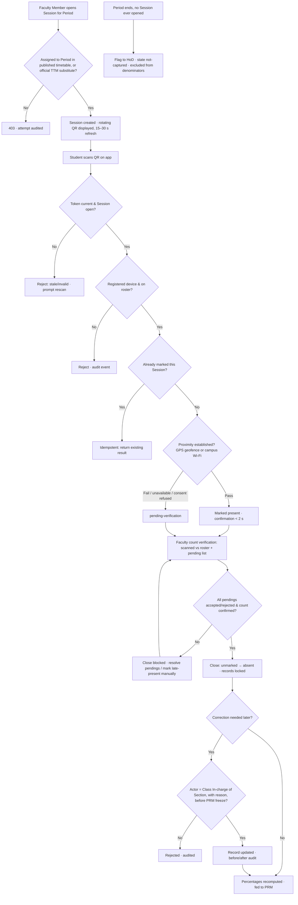

# Requirement: Attendance Capture (QR)

Module code: ATT · Status: DRAFT — pending approval · Last updated: 2026-07-21

## 1. Summary

Attendance in UniCore is captured per **Session** — one delivered instance of a **Period** in the published timetable — via a rotating QR code displayed by the **Faculty Member** teaching that Period. Students scan the QR with the UniCore app on their **single registered device** (see 01-authentication-authorization-security.md). Four anti-fraud safeguards are all mandatory: (a) a rotating, server-validated QR token refreshing every 15–30 seconds; (b) registered-device-only scanning; (c) a geofence/proximity check (GPS or campus Wi-Fi) with a pending-verification fallback; (d) faculty count verification against the expected roster before the Session closes. After close, records lock; only the **Class In-charge** of the Section can correct them, with a mandatory reason and full before/after audit. Captured attendance feeds per-subject and aggregate attendance percentages consumed by the Promotion module (06-student-promotion.md), with the UGC 75% norm configurable per School.

## 2. Goals & Non-Goals

**Goals**
- Fraud-resistant, low-friction attendance marking inside the first minutes of a Period.
- A clear Session lifecycle: open → scanning → count verification → close → locked.
- Correct rosters for every timetable shape: plain Sections, combined classes, lab batches, elective groups.
- DPDP-compliant proximity checking: consent-gated, pass/fail only, no location traces.
- Disciplined corrections (Class In-charge only, reasoned, audited) and a student dispute path.
- Attendance-percentage computation (per subject and aggregate) as the input to promotion eligibility.

**Non-Goals**
- Biometric attendance of any kind (explicitly excluded system-wide).
- Offline scan queueing on the student app — scans require live server validation (see §8).
- Timetable construction/substitution mechanics — owned by 03-timetable-management.md (TTM); ATT consumes the published timetable and official substitute assignments.
- Leave management for students or staff; grievances beyond attendance disputes.
- Automatic disciplinary actions from low attendance — ATT computes and exposes percentages; PRM and humans decide.

## 3. Affected User Groups & Access

| Group | Access granted |
|---|---|
| Faculty Member (assigned to the Period, or official TTM substitute) | Open Session, display rotating QR, view live scan count, resolve pending-verification scans, mark late/present during verification, confirm count, close Session |
| Students (on the Session roster) | Scan QR from registered device, view own attendance records and percentages, raise a dispute to the Class In-charge |
| Class In-charge | Everything a Faculty Member can do for their own Sessions, plus: correct locked attendance records (with reason), resolve student disputes |
| HoD | Read-only attendance dashboards for their Department; receives never-opened-Session flags |
| School Incharge / Faculty Dean / Principal / Executives | Read-only aggregate dashboards within org scope |
| School Admin (config role) | Configure grace window, QR rotation interval within 15–30 s, escalation and percentage thresholds for their School |
| Controller of Examination | **Percentage-only view** — aggregate attendance percentages per student/cohort; never raw per-Session records (locked 25-07-2026 per access matrix) |
| System | Computes percentages, flags never-opened Sessions, exposes read API to PRM |

*Teaching grades:* Professor, Associate Professor, Assistant Professor, Tutor, and Assistant Teaching Staff all act as "Faculty Member" here with identical permissions — QR Sessions for the Periods they teach; manual marking/corrections only via the Class In-charge role where they hold it.

**Denied:** students see only their own records — never classmates'. Faculty Members not assigned to a Period (and not official substitutes or committed swap counterparts per TTM-FR-17) cannot open its Session. Nobody, including Super Admin, can edit locked attendance except the Class In-charge via the correction flow.

## 4. Authorization & Business Rules

### Per-action authorization

| Action | Allowed | Enforced at |
|---|---|---|
| Open Session + generate QR | Only the Faculty Member assigned to the Period in the **published** timetable, the officially assigned substitute, or the committed swap counterpart for that occurrence (per TTM-FR-11/17) | API + service layer (timetable lookup at open time) |
| Scan QR / mark present | Student on the Session roster, from their registered device only | API (device binding per AUTH-FR-06) |
| View live scan count | Session-opening Faculty Member | API |
| Resolve pending-verification scans | Session-opening Faculty Member (during count verification) | API |
| Mark late / present during verification | Session-opening Faculty Member | API |
| Close Session | Session-opening Faculty Member, after count confirmation | API + service layer (blocks close with unresolved pendings) |
| Correct attendance after close | Class In-charge of the Section only; mandatory reason | API + service layer |
| Raise attendance dispute | Student, on their own record only | API |
| Configure grace window / thresholds / rotation interval | School Admin within own School scope | API |
| Read percentages | Student (own), Class In-charge/HoD/School Incharge/Faculty Dean/Principal (scope), Controller of Examination (percentages only, University scope), PRM module (service account) | API |
| Read raw per-Session records | Class In-charge/HoD (scope); explicitly DENIED to the Controller of Examination and exam-office staff | API |

### Business rules

1. A Session can be opened only against a Period in the **published** timetable, within a window from 10 minutes before the Period's scheduled start until the Period's scheduled end (School-configurable window). The opener must be the assigned Faculty Member, the official TTM substitute, **or the committed swap counterpart for that specific occurrence (TTM-FR-17)** — for a swapped occurrence the swapped-in teacher holds the open right and the original assignee is denied for that occurrence.
2. Exactly one open Session per Period instance; a second open attempt returns the existing Session (idempotent).
3. The QR encodes a **server-issued rotating token bound to the Session**, refreshed every 15–30 s (School-configurable within that range). Validation is server-side against server time; stale or replayed tokens are rejected. Client time is never trusted (per AUTH doc).
4. A scan is accepted only when ALL hold: valid current token · student is on the Session roster · request originates from the student's registered device · student not already marked for this Session.
5. Proximity: the app supplies a pass/fail proximity signal (GPS within the venue geofence OR campus Wi-Fi attestation). Pass → `present`. Fail or unavailable (indoor GPS failure, no Wi-Fi match, consent refused) → `pending-verification`, never hard rejection.
6. Duplicate scans are idempotent: the first accepted scan wins; repeats return the existing result and are never double-counted.
7. Count verification: at close, the app shows scanned count vs expected roster count and lists all `pending-verification` scans. The Faculty Member must explicitly accept or reject each pending scan and confirm the count before close succeeds.
8. During verification the Faculty Member may mark unscanned students `present` or `late` (e.g., dead phone, late arrival within the School's grace window). `late` counts as present for percentage purposes unless the School configures otherwise.
9. On close, every roster member has exactly one status: `present` | `late` | `absent`. Unscanned, unmarked students become `absent`. Records lock. An open dispute never changes the status — it sets a separate **`dispute-open` flag** on the record (visible to the student, Class In-charge, and PRM, which excludes flagged students from promotion runs); the status changes only via the correction flow.
10. Corrections after lock: Class In-charge only, mandatory free-text reason, immutable audit record with before/after values (central audit service per AUTH-FR-08). Correction window: until the Program's attendance freeze — fired when the promotion run is triggered (PRM-FR-17). **Post-freeze**, a correction commits only when attached to an open dispute/grievance on that record and only for a non-ratified student; free-form corrections are rejected with a pointer to the dispute flow.
11. A Period that ends with no Session ever opened is flagged to the HoD; its attendance state is `not-captured` (see §8 for the decision).
12. Percentages are computed over **captured Sessions only**: `not-captured` Sessions are excluded from both numerator and denominator.

### Audit

Every Session open/close, pending-scan resolution, manual mark, correction, and dispute decision writes to the central append-only audit service (actor, action, object, scope, IST timestamp, before/after, reason where mandated). Attendance corrections are privileged actions per the system-wide audit baseline.

## 5. Legal & Regulatory Requirements

- **DPDP — geolocation consent:** proximity checking uses geolocation only for students who granted the **separate, explicit geolocation consent** captured by AUTH (AUTH-FR-09). Students who refused consent are never location-checked; their scans always land in `pending-verification` for manual faculty confirmation. Refusal must not block attendance or degrade the student's record.
- **DPDP — data minimization:** only the boolean pass/fail proximity result is stored per scan. Raw coordinates, Wi-Fi BSSIDs, and location traces are never persisted, logged, or transmitted beyond the transient server-side check.
- **DPDP — purpose limitation:** proximity signals are used solely for attendance validation; no other module may consume them.
- **DPDP — correction right:** the student dispute flow (§7, ATT-FR-14) is the module-level realization of the DPDP correction right for attendance records; it feeds the AUTH grievance mechanism for unresolved cases.
- **UGC/AICTE:** the minimum-attendance norm (commonly 75%) informs eligibility computation but the threshold is **School-configurable**, never hardcoded (consumed by PRM).
- **No biometrics:** QR-based capture was chosen partly to avoid biometric data; nothing in this module may collect any.
- Localization: all timestamps recorded and displayed in IST; dates DD-MM-YYYY.

## 6. User Stories & Acceptance Criteria

**US-ATT-1** — As the Faculty Member assigned to a Period, I open the Session and display the rotating QR so that my students can mark attendance.
- Given the timetable is published and I am the assigned Faculty Member (or official substitute), when I open the Session within the allowed window, then a Session is created and a rotating QR (15–30 s refresh) is displayed.
- Given I am not assigned to the Period, when I attempt to open the Session, then I get 403 and the attempt is audited.

**US-ATT-2** — As a Student, I scan the QR from my registered device so that I am marked present in seconds.
- Given I am on the roster, on my registered device, with a passing proximity check, when I scan a current token, then I am marked `present` and see confirmation within 2 s (p95).
- Given I scan a token older than the rotation interval, when the server validates it, then the scan is rejected as stale and the app prompts a rescan.
- Given I scan from an unregistered device, when the server validates the request, then the scan is rejected and the event is audited.

**US-ATT-3** — As a Student who refused geolocation consent (or whose GPS fails indoors), I still scan so that I am not penalized for privacy or signal.
- Given proximity cannot be established, when my scan is otherwise valid, then it lands in `pending-verification` and the Faculty Member resolves it during count verification.

**US-ATT-4** — As the Faculty Member, I verify the count before closing so that ghosts and stragglers are caught.
- Given scanning is done, when I open count verification, then I see scanned vs expected roster counts and every pending scan; I cannot close until each pending is accepted or rejected and I confirm the count.
- Given a student arrived late within the grace window, when I mark them `late`, then their status is recorded as late-present.

**US-ATT-5** — As the Class In-charge, I correct a locked record with a reason so that genuine errors are fixed accountably.
- Given a closed Session in my Section, when I change a student's status and supply a reason, then the record is updated and an audit entry captures before/after, actor, timestamp, reason.
- Given no reason supplied, when I submit, then the correction is rejected.

**US-ATT-6** — As a Student marked absent by mistake, I raise a dispute so that my Class In-charge reviews it.
- Given a locked `absent` record, when I dispute it with a note, then the Class In-charge is notified, and their accept (correction flow) or reject (with reason) is recorded and visible to me.

**US-ATT-7** — As an HoD, I see Periods where no Session was opened so that missed capture is chased, not silently lost.
- Given a Period ended with no Session, when the flagging job runs, then the Period appears on my dashboard as `not-captured` and is excluded from percentage denominators until resolved.

## 7. Functional Requirements

- ATT-FR-01: Session lifecycle open → scanning → count verification → close → locked; one Session per Period instance; open restricted per §4 matrix.
- ATT-FR-02: Server-issued rotating QR token bound to the Session, refresh interval School-configurable within 15–30 s; server-side validation; stale/replayed tokens rejected.
- ATT-FR-03: Scan acceptance requires current token + roster membership + registered device (AUTH-FR-06) + not already marked; all four checked server-side atomically.
- ATT-FR-04: Proximity check via GPS geofence or campus Wi-Fi attestation, producing pass/fail only; fail/unavailable/consent-refused routes to `pending-verification` (never hard rejection); only the boolean result stored.
- ATT-FR-05: NO offline scan queueing — a scan requires live server validation; on network failure the app instructs the student to retry or fall back to faculty manual marking during verification.
- ATT-FR-06: Idempotent scan handling — duplicate scans return the first result; concurrent duplicates never create two records.
- ATT-FR-07: Count verification screen: scanned vs expected roster count, list of pending-verification scans; close blocked until every pending is explicitly accepted/rejected and the count is confirmed.
- ATT-FR-08: Manual marking during verification: Faculty Member may set `present` or `late` for unscanned students; School-configurable grace window governs the late boundary.
- ATT-FR-09: On close, all roster members resolve to `present`/`late`/`absent`; records lock; late counts toward presence unless the School configures otherwise.
- ATT-FR-10: Roster resolution per timetable shape: plain Section → Section roster; combined class → union of all constituent Sections' rosters under one Session; lab Period → the scheduled batch only; elective Period → the elective group (cross-Section), all sourced from TTM.
- ATT-FR-11: Post-lock corrections by the Section's Class In-charge only, with mandatory reason and before/after audit; correction window ends at the Program's attendance freeze (PRM-FR-17); post-freeze corrections only via an open dispute/grievance for non-ratified students (business rule 10).
- ATT-FR-12: Never-opened Period detection: after Period end + grace, flag to HoD; attendance state `not-captured`; excluded from percentage numerator and denominator until resolved (retro-capture by Class In-charge correction flow or HoD-acknowledged write-off). **Retro-capture closes at the attendance freeze (PRM-FR-17); post-freeze the only resolution is the HoD-acknowledged write-off.** The flag also fires the urgent TTM rebalancing suggestion flow (TTM-FR-16) so remaining same-day Periods of the absent Faculty Member get covered.
- ATT-FR-13: Percentage computation per student: per-subject and aggregate, over captured Sessions only; recomputed on every capture/correction; exposed via read API to PRM with the School-configured threshold (default 75%).
- ATT-FR-14: Student dispute flow on own records → sets the `dispute-open` flag (status unchanged) → Class In-charge accepts (triggers correction flow) or rejects with reason; both clear the flag, are audited, and are visible to the student; unresolved disputes escalate to the AUTH grievance mechanism. Open disputes are exposed to PRM (run exclusion) and keep the post-freeze correction path available (business rule 10).
- ATT-FR-15: School-level configuration: grace window, QR rotation interval (15–30 s), Session-open window, late-counts-as-present toggle, attendance threshold; all changes audited.
- ATT-FR-16: Faculty live view during scanning: running scanned count and pending count (no student-by-student proximity detail beyond status).
- ATT-FR-17: Approved-leave marking (LVE integration): when a student's approved leave of a `counts-as-present` type covers a Session (including retro approvals), the system marks the student per the School's policy automatically, audited with the leave reference — outside the Class In-charge correction flow and not counted against it; `absent` and `condonation-evidence` leave types never alter ATT records (see 10-leave-management.md). **Freeze interaction:** automatic marking stays exempt from the attendance freeze until the student ratifies (the PRM case recomputes per PRM-FR-12); once the student is ratified, the leave approval commits but marking is skipped and flagged to PRM as post-ratification evidence (rollback/override paths only).
- ATT-FR-18: **Device-less students:** device registration is required only to scan. A student may remain without a registered device indefinitely; the Class In-charge may set a `no-device` flag so faculty expect a manual mark during count verification each Session (not treated as an anomaly); web-portal viewing of own records works without a registered device. The flag is informational, audited, and reversible on device registration.
- ATT-FR-19: **Controller of Examination percentage-only read** (locked 25-07-2026): a University-scoped read grant exposing per-student/cohort attendance percentages only; raw per-Session and per-scan records are structurally excluded from this API's response shape (not merely filtered); access audited like any percentage read.

## 8. Edge Cases, Worst Cases & Decisions

| Case | Decision |
|---|---|
| Period passes with no Session opened (faculty forgot, absent, outage) | **DECISION:** flag to HoD; attendance stays `not-captured` and is excluded from percentage denominators until resolved. Bulk-absent is NOT auto-applied. Resolution = retro capture via Class In-charge correction flow, or HoD-acknowledged write-off. |
| GPS fails indoors / no campus Wi-Fi match | **DECISION:** scan lands in `pending-verification`; Faculty Member accepts/rejects during count verification. Never hard-rejected. |
| Student refused geolocation consent | **DECISION:** identical path — always `pending-verification`, faculty confirms manually. No penalty, no nagging re-consent at scan time. |
| Network failure on the student device mid-scan | **DECISION:** NO offline queueing — the scan simply fails; student retries while the Session is open, else the Faculty Member marks them manually during verification. Rationale: queued scans defeat server-side token freshness and are forgeable. |
| Student scans twice (double-tap, app retry) | **DECISION:** idempotent — first accepted scan wins; duplicates return the same confirmation; concurrent duplicates resolved by a uniqueness constraint on (Session, student). |
| Screenshot of the QR shared to an absent friend | **DECISION:** defeated by design — the token is stale within ≤30 s, and the friend's scan comes from a device/roster mismatch or fails proximity → rejected or pending, where the count-verification mismatch surfaces it. |
| Faculty phone/projector dies mid-Session | **DECISION:** reopening the same Session resumes it (rule 2 idempotency); already-accepted scans persist. If display cannot resume, the Faculty Member manually marks remaining students during verification. |
| Late arrival after scanning ends | **DECISION:** Faculty Member marks `late` (within School grace window) or `present` at their discretion during verification; after close it becomes a Class In-charge correction. |
| Student marked absent disputes it | **DECISION:** dispute goes to the Class In-charge (US-ATT-6); accept → audited correction; reject → reasoned rejection visible to the student; unresolved → AUTH grievance flow. |
| Combined class (multiple Sections, one venue + Faculty Member) | **DECISION:** ONE Session whose roster is the union of all constituent Sections; percentages attribute the Session to each student's own subject enrolment; corrections route to each student's own Class In-charge. |
| Lab Period with batches | **DECISION:** Session roster = the scheduled batch only, per TTM batch data; students of the other batch are neither expected nor markable. |
| Elective Period | **DECISION:** roster = the elective group (students converging from many Sections); disputes/corrections still route to each student's home-Section Class In-charge. |
| Substitute takes the class | **DECISION:** only an **officially assigned substitute per TTM** can open the Session; ad-hoc stand-ins must first be recorded in TTM. No verbal-arrangement bypass. |
| Committed class swap (TTM-FR-17) | **DECISION:** the swapped-in teacher holds the session-open right for the swapped occurrence exactly like a substitute; the original assignee is denied for that occurrence (and vice versa on the reciprocal occurrence). Attribution in ATT/SYL follows the swap. |
| Student never owns a smartphone | **DECISION:** standing manual-marking path (ATT-FR-18): the Class In-charge sets a `no-device` flag; faculty mark the student during count verification every Session; no penalty, no anomaly alert; record viewing via web portal. |
| Timetable changes after Sessions were captured | **DECISION:** captured Sessions are historical facts — they keep their original Period linkage; republishing the timetable affects future Periods only. |
| Class In-charge role vacant/expired when a correction is needed | **DECISION:** corrections blocked until a successor grant exists (AUTH orphan-check ensures succession); no fallback editor role. |
| Correction attempted after PRM attendance freeze | **DECISION:** free-form corrections rejected with an explanatory error pointing to the dispute flow. A correction attached to an open dispute/grievance commits for non-ratified students (their PRM case recomputes); for ratified students the only paths are PRM rollback/override. Retro `counts-as-present` marking stays exempt until ratification (ATT-FR-17). |
| Worst case: token-guessing/replay attack at scale | **DECISION:** tokens are unguessable (≥128-bit random), single-Session-bound, TTL ≤30 s, validated server-side; per-device scan rate limiting; anomalies (many stale/invalid scans) alert via AUTH security telemetry (AUTH-FR-12). |
| Worst case: validation service degraded during the morning burst | **DECISION:** no client-side acceptance fallback ever; Sessions stay open longer (window permitting) and faculty manual marking during verification is the human fallback. Availability is an ops incident, not a security relaxation. |

## 9. Non-Functional Requirements

- Scan validation throughput: ≥50 scan validations/second sustained (whole-campus burst in the first 10 minutes of a Period).
- Scan-to-confirmation latency: < 2 s (p95) end-to-end on campus network.
- QR token: server-generated, ≥128-bit entropy, TTL = configured rotation interval (15–30 s); validation strictly server-side against server time.
- QR refresh render on faculty device: new token visible within 1 s of rotation.
- Percentage recomputation visible to student and PRM API within 60 s of a capture or correction.
- Availability: 99.5% during academic hours (08:00–18:00 IST), per system baseline.
- Proximity check adds ≤ 300 ms to scan processing; stores 1 boolean, zero location bytes at rest.
- Audit writes: asynchronous but guaranteed (outbox pattern per AUTH doc); a lost attendance audit record is a sev-2 incident.

## 10. Assumptions

- **Interpretation assumption:** the stakeholder phrased the correction requirement as "update the captured time table with valid reason"; this is interpreted as **attendance-record corrections** (Class In-charge, mandatory reason, audited) — not timetable edits, which belong to TTM. Flagged for confirmation at approval.
- TTM provides, via API: published timetables, Period-to-Faculty-Member assignment, official substitute assignments, combined-class/batch/elective rosters.
- Campus Wi-Fi infrastructure can attest "on-campus" presence (e.g., request arrives via campus network egress) reliably enough for a pass/fail signal.
- Venue geofence polygons/radii are maintained as master data (by the Timetable Cell or IT cell).
- Every registered device has a working camera; students without a usable device at class time — or without any device, indefinitely (ATT-FR-18) — are covered by faculty manual marking.
- PRM defines the attendance freeze event per term; ATT only enforces it.

## 11. Open Questions

- Should the never-opened-Period flag also auto-notify the assigned Faculty Member before escalating to the HoD (e.g., 30 min after Period end)? Proposed: yes.
- Exact Wi-Fi attestation mechanism (network egress check vs on-device SSID match)? Egress check preferred — no SSID data leaves the device. Needs IT-cell confirmation.
- Should `late` be reportable separately to PRM (distinct from present) even when it counts toward presence? Proposed: store distinctly, report configurably.
- Grace-window default per School (proposed 10 minutes) — needs academic-council sign-off.

## 12. Flow Diagram

## 13. Test Cases

| ID | Title / Scenario | Category | Priority | Preconditions | Steps | Expected Result | Covers |
|----|------------------|----------|----------|---------------|-------|-----------------|--------|
| TC-ATT-001 | Assigned Faculty Member opens Session and student scans successfully | Happy | P0 | Published timetable; student on roster, registered device, proximity pass | 1. Open Session 2. Student scans current QR | Marked present; confirmation < 2 s | ATT-FR-01/02/03, US-ATT-1/2 |
| TC-ATT-002 | Unassigned Faculty Member cannot open Session | Access | P0 | Faculty Member not assigned, no substitute record | Attempt Session open | 403; attempt audited | §4 matrix, US-ATT-1 |
| TC-ATT-003 | Official TTM substitute can open Session | Access | P0 | Substitute assignment recorded in TTM | Substitute opens Session | Session opens normally | §4 matrix, §8 substitute case |
| TC-ATT-004 | Stale QR token rejected at rotation boundary | Boundary | P0 | Rotation = 15 s | Scan token 16 s after issue | Rejected as stale; rescan prompted | ATT-FR-02, US-ATT-2 |
| TC-ATT-005 | Scan from unregistered device rejected | Access | P0 | Student uses second phone | Scan valid token | Rejected; event audited | ATT-FR-03, AUTH-FR-06 |
| TC-ATT-006 | GPS failure lands scan in pending-verification | Happy | P0 | Indoor venue, no GPS fix, no Wi-Fi match | Student scans | Status pending-verification; appears in faculty pending list | ATT-FR-04, US-ATT-3 |
| TC-ATT-007 | Consent-refused student always pending-verification | Legal | P0 | Student refused geolocation consent | Student scans validly | pending-verification; no location check attempted; no coordinates stored | §5, ATT-FR-04 |
| TC-ATT-008 | Only pass/fail proximity stored | Legal | P0 | Proximity-pass scan completed | Inspect stored record/logs | Boolean only; no coordinates/BSSID anywhere | §5, ATT-FR-04 |
| TC-ATT-009 | Close blocked with unresolved pendings | Negative | P0 | One pending scan exists | Faculty attempts close without resolving | Close rejected; pending listed | ATT-FR-07, US-ATT-4 |
| TC-ATT-010 | Late arrival marked late within grace window | Boundary | P1 | Grace window 10 min; student arrives at 9 min | Faculty marks late during verification | Status late; counts as present in percentage (default config) | ATT-FR-08/09 |
| TC-ATT-011 | Concurrent duplicate scans create one record | Concurrency | P0 | Student device retries scan in parallel | Two simultaneous scan requests | Exactly one record; both requests return same confirmation | ATT-FR-06 |
| TC-ATT-012 | Shared QR screenshot fails for off-roster friend | Negative | P0 | Friend not on roster, own device | Friend scans screenshotted token | Rejected (roster/device mismatch or stale token) | §8 screenshot case, ATT-FR-03 |
| TC-ATT-013 | Correction by Class In-charge with reason succeeds and audits | Happy | P0 | Closed Session in own Section | Change absent→present with reason | Updated; audit has before/after, actor, reason | ATT-FR-11, US-ATT-5 |
| TC-ATT-014 | Correction without reason rejected | Negative | P0 | Closed Session | Submit correction with empty reason | Rejected | ATT-FR-11, US-ATT-5 |
| TC-ATT-015 | Non-Class-In-charge (incl. HoD) cannot correct | Access | P0 | Closed Session; actor = HoD | Attempt correction | 403; audited | §4 matrix |
| TC-ATT-016 | Never-opened Period flagged, excluded from denominator | Happy | P0 | Period ended, no Session | Run flagging job; compute percentage | HoD flag raised; Session absent from numerator and denominator | ATT-FR-12/13, US-ATT-7 |
| TC-ATT-017 | Combined-class Session covers union roster | Happy | P1 | Combined Period for Sections A+B | Open Session; students of both scan | All accepted; percentages attributed per student's enrolment | ATT-FR-10 |
| TC-ATT-018 | Lab batch roster excludes other batch | Boundary | P1 | Lab Period, Batch 1 scheduled | Batch 2 student scans | Rejected: not on Session roster | ATT-FR-10 |
| TC-ATT-019 | Network failure: no offline queue, manual fallback | Negative | P1 | Student device loses network mid-scan | Scan fails; faculty marks student during verification | No queued scan ever submitted; manual mark recorded | ATT-FR-05/08, §8 |
| TC-ATT-020 | 75% threshold configurable per School | Legal | P1 | School A = 75%, School B = 80% | Compute eligibility inputs via PRM API | Each School's threshold applied; nothing hardcoded | §5, ATT-FR-13/15 |
| TC-ATT-021 | Sustained 50 scans/sec with p95 < 2 s | NFR | P0 | Load environment, burst profile | Drive ≥50 validations/sec for 10 min | No errors; p95 scan-to-confirmation < 2 s | §9 |
| TC-ATT-022 | Free-form correction after freeze rejected | Boundary | P0 | Promotion run triggered for the Program (freeze fired) | Class In-charge attempts a correction with no open dispute | Rejected with explanatory error pointing to the dispute flow; attempt audited | §8, ATT-FR-11, PRM-FR-17 |
| TC-ATT-023 | Dispute-driven correction commits post-freeze | Boundary | P0 | Freeze fired; record has `dispute-open` flag; student not ratified | Class In-charge accepts the dispute and corrects with reason | Correction commits; flag cleared; PRM case recomputes; audited | ATT-FR-11/14, PRM-FR-17 |
| TC-ATT-024 | Swap counterpart opens Session; original denied | Access | P0 | Committed swap gives Dr. Iyer Dr. Rao's Monday occurrence | 1. Dr. Iyer opens the Session 2. Dr. Rao attempts open on the same occurrence | Iyer's open succeeds; Rao gets 403 for that occurrence (audited); reciprocal occurrence mirrors | §4 matrix, TTM-FR-17 |
| TC-ATT-025 | No-device student marked manually as standing path | Happy | P1 | Student flagged `no-device` by Class In-charge | Faculty runs count verification for a Session | Student appears as expected-manual; faculty marks present; no anomaly flag raised; mark audited | ATT-FR-18, §8 |
| TC-ATT-026 | CoE sees percentages only, never raw records | Access | P0 | Controller of Examination account | 1. Query percentage API for a cohort 2. Attempt any per-Session/per-scan record API | Percentages returned; raw-record APIs 403 (audited); percentage payload contains no Session-level fields | ATT-FR-19, §4 matrix |

Coverage: every §6 acceptance criterion, the §4 authorization matrix (incl. swap counterparts, TC-024), all four anti-fraud safeguards, the DPDP consent/minimization obligations (§5), the UGC configurability rule, the freeze semantics (TC-022/023), the no-device path (TC-025), and every §8 decision except faculty-device failure and timetable-republish history (deferred to integration testing with TTM) map to at least one test.
