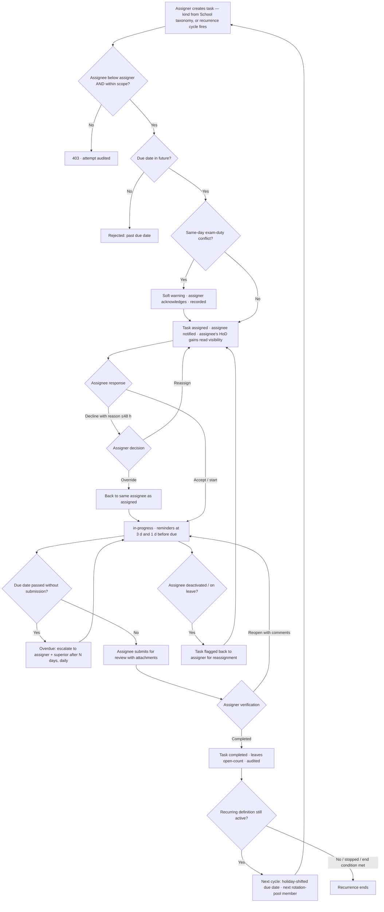

# Requirement: Faculty Task Management

Module code: TSK · Status: DRAFT — pending approval · Last updated: 2026-07-21

## 1. Summary

Tasq gives university leadership a hierarchical task system for non-teaching work: **Principal/Dean → HoD → Faculty Member**. An assigner can only assign downward within their org scope; skip-level assignment (Dean directly to a Faculty Member) is legal, with the assignee's HoD given read visibility. VC/Registrar are deliberately **not** assigners — leadership routes work through Principals/Deans — but the escalation chain tops out at the **VC/Pro-VC office**, so Principal-assigned overdue tasks always have somewhere to go. Task kinds are a **School-configurable taxonomy** (seeded with administrative duty, exam duty, event coordination, report submission). Tasks carry due dates, P1/P2/P3 priorities, a status lifecycle (assigned → accepted/in-progress → submitted-for-review → completed | reopened), attachments, a comments thread, configurable reminders, and overdue escalation. **Full recurrence ships in MVP**: fixed-interval cycles that are holiday-aware (campus calendar) and support per-cycle assignee rotation. Assignment warns (soft) when the assignee already has an exam-duty obligation on the same day. Bulk assignment fans out into individual trackable copies — there are no shared group tasks; committee work is modeled as a task to the convener. Visibility is vertical: assigner, assignee, the chain above the assigner, plus the assignee's HoD — peers never see each other's tasks. Assigners see per-Faculty-Member open-task counts to distribute work fairly. Completion is verified by the assigner, who marks completed or reopens with comments.

## 2. Goals & Non-Goals

**Goals**
- One accountable place for assigning and tracking administrative/exam/event/report duties down the hierarchy.
- Clear per-task lifecycle with assigner-verified completion.
- Reminders and overdue escalation so nothing dies quietly.
- Fair-distribution signal: open-task workload per Faculty Member visible to assigners.
- Dashboards: my tasks (everyone), department overdue (HoD), campus overview (Principal).

**Non-Goals**
- Teaching workload (Periods/Sessions) — owned by TTM/ATT/SYL.
- Student-facing tasks or assignments of any kind.
- Project management features (Gantt, dependencies between tasks, sprints).
- Approval workflows beyond the single assigner-verification step (e.g., multi-level sign-off) — post-MVP.
- Tasks assigned upward or laterally (peer-to-peer) — the hierarchy is one-way downward.
- VC/Registrar as assigners — leadership delegates through Principals/Deans (locked). They appear in this module only as escalation recipients.
- Shared group tasks (one deliverable, many owners) — locked out; bulk assignment always produces individual copies, and committee work is a task to the convener.
- Full calendar-conflict detection against the timetable — MVP ships only the same-day exam-duty warning; a personal calendar view is post-MVP.

## 3. Affected User Groups & Access

| Group | Access granted |
|---|---|
| Principal / Dean | Create/assign tasks to HoDs and Faculty Members within their campus/School scope; verify completion; reopen; campus/School overview dashboard; workload counts |
| HoD | Create/assign tasks to Faculty Members within their Department; verify completion; reopen; department overdue dashboard; workload counts; **read visibility of every task assigned to their Department's members from above** (skip-level transparency — the HoD answers for departmental workload) |
| VC / Pro-VC office | Not assigners. Receive escalation notifications for overdue tasks assigned by Principals/Deans (top of the escalation chain); no task read access beyond the escalation summary (title, assignee, due date, overdue days) |
| Faculty Member (assignee) | View own tasks; accept/start; comment; attach; submit for review; decline with reason (48 h); request delegation |
| Admin/office staff | May be assignees for administrative duties (same assignee rights as Faculty Members) |
| Exam Cell | May be an assigner for exam duties within its mandate (scoped grant), same assigner rights |
| System | Reminders, escalation notifications, audit |

**Denied:** peers cannot see each other's tasks. An assignee's subordinates see nothing. Nobody outside the assigner-chain-plus-assignee set can read a task. Students have no access to this module at all.

## 4. Authorization & Business Rules

### Per-action authorization

| Action | Allowed | Enforced at |
|---|---|---|
| Create/assign task | Principal/Dean/HoD (and scoped Exam Cell grant) — only to users **below them** in the hierarchy AND within their org-unit scope | API + service layer (hierarchy + scope check) |
| Bulk-assign task | Same as create; every target individually passes the downward+scope check | API + service layer |
| View task | Assigner, assignee, and the chain above the assigner within scope | API (visibility filter) |
| Accept / start / submit-for-review | Assignee only | API |
| Decline with reason | Assignee, within 48 h of assignment | API + service layer (window check) |
| Comment / attach | Assigner, assignee | API |
| Edit task (due date, priority, description) | Assigner (before completion); edits audited | API |
| Reassign | Assigner (or successor in role) | API |
| Approve delegation | Assigner only — assignee cannot delegate without assigner consent | API + service layer |
| Mark completed / reopen | Assigner only | API |
| Cancel task | Assigner; audited with reason | API |
| Configure reminders/escalation (N days) | School Admin within scope | API |
| Configure task-kind taxonomy | School Dean (own School); seeded defaults editable, kinds with live tasks cannot be deleted (deactivate only) | API + service layer |
| Configure recurrence (schedule, rotation pool, stop) | The assigner who owns the recurring task | API |
| View workload counts | Any user with assigner rights, for potential assignees within their scope | API |

### Business rules

1. Assignment is strictly downward: assigner's role rank must be above the assignee's, and the assignee must sit within the assigner's org-unit scope (RBAC + scope per 01-authentication-authorization-security.md).
2. Status lifecycle: `assigned → accepted → in-progress → submitted-for-review → completed | reopened`; `reopened` returns to `in-progress`. Only the assignee moves a task forward; only the assigner closes or reopens it. Skipping `accepted` (assignee starts directly) is allowed; skipping `submitted-for-review` is not.
3. Due date must be in the future at creation (server time, IST). Priority ∈ {P1, P2, P3}; both required at creation.
4. Reminders: configurable per School; default 3 days and 1 day before due, sent to the assignee (in-app + email).
5. Escalation: N days after due (N School-configurable, default 2), an overdue task auto-notifies the assigner and the assigner's superior; repeated daily until state changes. **Top of chain:** when the assigner is a Principal or Dean with no assigner above them, the escalation's "superior" recipient is the **VC/Pro-VC office** (configured recipient list at university level) — escalation never dead-ends. VC office recipients get the escalation summary only, not task access.
6. Bulk assignment creates one **individual, independently trackable copy per target** — separate status, comments, attachments; the assigner sees a fan-out summary.
7. Delegation: the assignee may request delegation to a specific colleague; it takes effect only on the assigner's approval, whereupon the task is reassigned and the change audited. The assignee can never transfer a task unilaterally.
8. Decline: within 48 h of assignment the assignee may decline with a mandatory reason; the assigner then reassigns or overrides (task returns to `assigned` on the same assignee); both paths audited.
9. Visibility (vertical + HoD transparency): assigner, assignee, and the chain above the assigner within scope (e.g., a Dean sees tasks an HoD under them assigned) — **plus the assignee's HoD**, who has read visibility of every task assigned to their Department's members from above (skip-level assignments included). Peers of the assignee see nothing; the assignee's own reports see nothing.
9a. **Task-kind taxonomy is School-configurable:** each School owns its kind list (seeded with administrative duty, exam duty, event coordination, report submission). Kinds are managed by the School Dean; a kind with live tasks can be deactivated (hidden for new tasks) but never deleted, so history stays reportable. Cross-School reporting groups by kind label; the university accepts that Schools' taxonomies may diverge.
9b. **Same-day exam-duty warning:** at assignment (single or bulk), if the assignee already has an open exam-duty task due on the proposed due date, or the due date falls on a day the assignee has an exam-duty obligation, the assigner sees a soft warning naming the conflict and must acknowledge to proceed (acknowledgment recorded). Never a hard block.
9c. **Recurrence (full, MVP):** a recurring task definition carries: interval (daily/weekly/monthly/per-term), schedule anchor, holiday awareness (a cycle landing on a campus-calendar holiday shifts to the **next working day** — locked default, School-overridable to previous working day), an optional ordered **rotation pool** of assignees (each cycle instantiates to the next pool member; a skipped/ineligible member is passed over and flagged to the assigner), an end condition (until-date, N cycles, or open-ended), and a stop toggle. Every cycle instantiation is an ordinary independent task following all rules above.
10. Attachments allowed on tasks (assigner) and submissions/comments (assignee); max 25 MB per file, standard document/image types, virus-scanned.
11. Workload visibility: assigners see, for each potential assignee in their scope, the count of open tasks (assigned/accepted/in-progress/submitted-for-review/reopened) — counts only, not titles of tasks assigned by others.
12. Completion verification: on `submitted-for-review`, the assigner marks `completed` or `reopened` with mandatory comments on reopen.

### Audit

Every create, edit, reassignment, delegation approval, decline, override, cancellation, completion, and reopen writes to the central append-only audit service (actor, action, before/after, IST timestamp, reason where mandated). Comment threads are retained with the task for the same period.

## 5. Legal & Regulatory Requirements

- **DPDP — purpose limitation:** task content and workload counts are employment-administration data; used only for task management and fair distribution, not exported for other profiling.
- **DPDP — data minimization in visibility:** the vertical-only visibility rule (§4 rule 9) is a DPDP-aligned control — a Faculty Member's duties are not exposed to peers; workload counts expose numbers, never task contents.
- **DPDP — correction/grievance:** disputed task records (e.g., "I never received this") route through the decline/comment mechanism and, failing that, the AUTH grievance flow.
- **Retention:** completed/cancelled tasks and their audit trail retained 7 years (aligned with the audit baseline), as exam-duty assignments may be evidence in examination-related inquiries.
- Localization: due dates and reminders in IST, DD-MM-YYYY.
- No UGC/AICTE norm governs this module directly; exam-duty assignment records support Exam Cell compliance evidence.

## 6. User Stories & Acceptance Criteria

**US-TSK-1** — As an HoD, I assign a report-submission task to a Faculty Member in my Department so that the accreditation report is ready on time.
- Given the Faculty Member is in my Department, when I create the task with due date (future), priority, and description, then it appears as `assigned` in their "my tasks" and they are notified.
- Given I pick an assignee outside my scope or above me, when I submit, then I get 403 and the attempt is audited.

**US-TSK-2** — As a Faculty Member, I work a task to completion so that my assigner can verify it.
- Given an `assigned` task, when I accept, work, attach my report, and submit for review, then the status trail shows each transition with timestamps and the assigner is notified on submission.

**US-TSK-3** — As an assigner, I verify a submitted task so that quality is confirmed before closure.
- Given a `submitted-for-review` task, when I mark completed, then it closes and leaves the assignee's open count.
- Given the submission is inadequate, when I reopen with comments, then the task returns to `in-progress` and the assignee is notified with my comments.

**US-TSK-4** — As a Dean, I bulk-assign exam invigilation duty to 40 Faculty Members so that each is individually accountable.
- Given all 40 are in my scope, when I bulk-assign, then 40 independent task copies exist, each tracking its own status, and I see a fan-out summary.
- Given 2 of the 40 are outside my scope, when I submit, then those 2 are rejected with named errors and the other 38 are created (partial success, reported).

**US-TSK-5** — As a Faculty Member, I decline an event-coordination task I cannot do so that it is reassigned in time.
- Given the task was assigned 20 h ago, when I decline with a reason, then the assigner is notified and must reassign or override; the outcome and reason are audited.
- Given 49 h have passed, when I try to decline, then the option is unavailable and I am directed to the comments thread.

**US-TSK-6** — As an HoD, I check workload counts before assigning so that duties are fairly spread.
- Given three candidate Faculty Members, when I open the assignment picker, then I see each one's open-task count (not the contents of tasks others assigned).

**US-TSK-7** — As a Principal, I see the campus task overview so that systemic overdue pockets are visible.
- Given tasks exist across Schools in my campus, when I open the overview dashboard, then I see counts by status/priority/School including overdue, drillable within my scope only.

## 7. Functional Requirements

- TSK-FR-01: Task creation with title, description, kind (from the School's configured taxonomy, seeded with administrative duty | exam duty | event coordination | report submission), due date (future-only), priority P1/P2/P3, assignee; downward + scope check enforced; same-day exam-duty warning per §4 rule 9b.
- TSK-FR-02: Status lifecycle `assigned → accepted → in-progress → submitted-for-review → completed | reopened`, transitions restricted per §4 (assignee forward, assigner close/reopen); full status history retained.
- TSK-FR-03: Attachments on tasks and submissions (≤25 MB/file, virus-scanned) and a per-task comments thread visible to assigner + assignee + chain.
- TSK-FR-04: Configurable reminders (School-level; default 3 days and 1 day before due) to the assignee via in-app + email.
- TSK-FR-05: Overdue escalation: N days after due (configurable, default 2) notify assigner + assigner's superior; repeat daily until status changes.
- TSK-FR-06: Reassignment by the assigner at any time before completion; full history preserved on the task.
- TSK-FR-07: Delegation request by assignee → takes effect only on assigner approval; unilateral delegation impossible.
- TSK-FR-08: Decline-with-reason within 48 h of assignment; assigner reassigns or overrides; both audited.
- TSK-FR-09: Bulk assignment producing individual trackable copies per target, with per-target validation and partial-success reporting.
- TSK-FR-10: Visibility per §4 rule 9: assigner, assignee, chain above assigner within scope, plus read visibility for the assignee's HoD on all tasks assigned to their Department's members; peer and downward visibility denied by default.
- TSK-FR-11: Completion verification: assigner marks completed, or reopens with mandatory comments.
- TSK-FR-12: Dashboards: "my tasks" (all users), department overdue (HoD), campus overview (Principal); all scope-filtered.
- TSK-FR-13: Workload counts (open tasks per potential assignee) shown to assigners within scope; counts only.
- TSK-FR-14: Full recurrence (MVP, per §4 rule 9c): fixed intervals with schedule anchor, holiday-aware shifting via the campus calendar, optional ordered assignee-rotation pool with skip-and-flag for ineligible members, end conditions (until-date / N cycles / open-ended), stop toggle; each cycle instantiates an independent task.
- TSK-FR-15: Deactivated/on-leave assignee handling: open tasks flagged back to the assigner for reassignment (see §8); a deactivated member of a rotation pool is skipped and flagged.
- TSK-FR-16: Full audit of all privileged actions per §4, including taxonomy changes, recurrence definition changes, and conflict-warning acknowledgments.
- TSK-FR-17: Same-day exam-duty conflict warning at assignment (single and bulk): soft warning naming the conflicting obligation; assigner acknowledgment required and recorded; never blocks.
- TSK-FR-18: School task-kind taxonomy management by the School Dean: create/rename/deactivate kinds; kinds with live tasks deactivate-only; seeded with the four default kinds.
- TSK-FR-19: Escalation top-of-chain: university-level configured VC/Pro-VC office recipient list receives escalations for tasks assigned by Principals/Deans; recipients get summaries, not task access.

## 8. Edge Cases, Worst Cases & Decisions

| Case | Decision |
|---|---|
| Assignee goes on leave or is deactivated with open tasks | **DECISION:** all their open tasks are flagged back to each assigner for reassignment; nothing auto-reassigns. Deactivation integrates with the AUTH orphan check. |
| Due date in the past at creation | **DECISION:** rejected at validation (server time, IST). No back-dated tasks. |
| Assigner leaves role mid-task (transfer, term end) | **DECISION:** the successor inherits assigner rights via the role grant (RBAC scope, not personal ownership) — verification, reopening, escalation targets all follow the role. |
| Assignee disputes/declines a task | **DECISION:** decline with mandatory reason within 48 h; assigner reassigns or overrides; override returns the task to the same assignee as `assigned`; everything audited. After 48 h, the comments thread + grievance flow. |
| Assignee tries to delegate to a colleague directly | **DECISION:** impossible without assigner consent — delegation is a request that only takes effect on assigner approval. |
| Bulk assignment where some targets fail validation | **DECISION:** partial success — valid targets get their copies, invalid ones are reported by name; the assigner is never left guessing. |
| Task overdue and assignee unresponsive | **DECISION:** escalation notifies assigner + assigner's superior after N days (default 2), repeating daily; the system never auto-completes or auto-cancels. Humans close tasks. |
| Assigner edits due date/priority after assignment | **DECISION:** allowed until completion; assignee notified; edit audited with before/after. Shortening a due date into the past is rejected. |
| Reopen after completion | **DECISION:** not allowed — `completed` is terminal. Genuine rework becomes a new task referencing the old one. Reopen exists only from `submitted-for-review`. |
| Two assigners give conflicting duties for the same time (e.g., exam duty vs event) | **DECISION:** MVP does not detect scheduling conflicts between tasks; the assignee raises it via comments/decline, and workload counts give assigners the fairness signal. Calendar-conflict detection is post-MVP (Open Questions). |
| Recurring task while a prior cycle is still open | **DECISION:** the new cycle is created anyway as an independent copy; overdue prior cycles keep escalating separately. |
| Recurring cycle lands on a campus-calendar holiday | **DECISION:** due date shifts to the next working day (School-overridable to previous working day); the shift is shown on the task. |
| Rotation-pool member deactivated or on leave when their cycle arrives | **DECISION:** skipped, the next pool member gets the cycle, and the assigner is flagged; the pool order is preserved (the skipped member is next in line for the following cycle unless removed). |
| Rotation pool becomes empty (all members left) | **DECISION:** recurrence pauses and the assigner is notified to refill or stop; no cycle is created with no assignee. |
| Task kind deactivated while tasks of that kind are live | **DECISION:** live tasks keep their kind and remain reportable; the kind just disappears from the create-task picker. Deletion is impossible. |
| Same-day exam-duty warning ignored en masse (bulk assign over exam week) | **DECISION:** each conflicting target is listed in the warning; one acknowledgment covers the batch but is recorded with the full conflict list — the audit trail shows what the assigner knowingly accepted. |
| Worst case: mass bulk-assign flooding (e.g., 1,000 targets by mistake) | **DECISION:** bulk-assign capped at 200 targets per operation with a confirmation step showing the resolved target list; larger fan-outs require repeated deliberate operations. |
| Worst case: escalation storm after a long outage | **DECISION:** escalation jobs are idempotent per task per day — at most one escalation notification per task per day, regardless of job reruns. |

## 9. Non-Functional Requirements

- Dashboard load ("my tasks", department overdue): < 2 s (p95) at 2,000 staff with 50,000 active tasks.
- Task create/transition API: < 500 ms (p95).
- Bulk assignment of 200 targets: completes < 30 s with per-target result report.
- Reminder/escalation delivery: within 15 minutes of the scheduled trigger time (IST).
- Notification fan-out: sized for 5,000 reminder notifications within the 08:00 IST window.
- Attachments: ≤25 MB per file; virus scan before availability; stored encrypted at rest per system baseline.
- Availability: 99.5% during academic hours (08:00–18:00 IST), per system baseline.
- Audit writes asynchronous but guaranteed (outbox pattern per AUTH doc).

## 10. Assumptions

- The role hierarchy (Principal/Dean > HoD > Faculty Member) and org-unit scoping are resolvable from AUTH role grants; TSK performs no hierarchy bookkeeping of its own.
- Leave status is available at least as a manual flag (a full leave-management integration is not assumed in MVP).
- Email delivery infrastructure exists for reminders (shared with AUTH OTP email fallback).
- Exam Cell task-assignment authority is granted as a scoped role, not hardcoded.
- ~2,000 staff, tens of tasks per person per term — well within the NFR sizing above.
- The campus calendar (working days/holidays) maintained by System Admin for TTM is readable by this module for holiday-aware recurrence; exam-duty obligations for the conflict warning are resolvable from open exam-duty tasks in this module (MVP scope — timetable-level invigilation data is not consulted).

## 11. Open Questions

All previously open questions are now **resolved and locked** (2026-07-21): full recurrence in MVP (§4 rule 9c); acceptance stays skippable; VC/Registrar are not assigners (escalation-recipients only, TSK-FR-19); MVP conflict detection is the same-day exam-duty soft warning (TSK-FR-17). Remaining:

- Personal calendar view of task deadlines (beyond the exam-duty warning): post-MVP, design unconstrained.
- Rotation-pool fairness reporting (per-member cycle counts): proposed as part of the workload-counts view; confirm during UI design.

## 12. Flow Diagram

## 13. Test Cases

| ID | Title / Scenario | Category | Priority | Preconditions | Steps | Expected Result | Covers |
|----|------------------|----------|----------|---------------|-------|-----------------|--------|
| TC-TSK-001 | HoD assigns task to own Faculty Member; full lifecycle to completed | Happy | P0 | HoD + Faculty Member in same Department | Create → accept → in-progress → submit → assigner completes | Every transition recorded; assignee notified at assignment; assigner at submission | TSK-FR-01/02/11, US-TSK-1/2/3 |
| TC-TSK-002 | Assignment outside scope rejected | Access | P0 | HoD of Dept-A, target in Dept-B | Create task for Dept-B Faculty Member | 403; attempt audited | §4 matrix, US-TSK-1 |
| TC-TSK-003 | Upward assignment rejected | Access | P0 | Faculty Member actor, HoD target | Faculty Member attempts to assign to HoD | 403; downward-only rule enforced | §4 rule 1 |
| TC-TSK-004 | Past due date at creation rejected | Negative | P0 | Assigner in scope | Create task dated yesterday | Validation error; no task created | TSK-FR-01, §8 |
| TC-TSK-005 | Reminders at 3 days and 1 day before due | Happy | P1 | Task due in 4 days, default config | Advance clock past both trigger points | Two reminders to assignee within 15 min of each trigger | TSK-FR-04, §9 |
| TC-TSK-006 | Overdue escalation to assigner + superior after N days | Boundary | P0 | N=2; task 2 days overdue | Run escalation job | Assigner and assigner's superior notified; repeats daily; once per task per day | TSK-FR-05, §8 |
| TC-TSK-007 | Decline within 48 h with reason | Happy | P0 | Task assigned 20 h ago | Assignee declines with reason; assigner reassigns | Decline + reassignment audited; new assignee notified | TSK-FR-08, US-TSK-5 |
| TC-TSK-008 | Decline at 49 h unavailable | Boundary | P1 | Task assigned 49 h ago | Assignee attempts decline | Option unavailable/rejected; comments path suggested | TSK-FR-08, US-TSK-5 |
| TC-TSK-009 | Unilateral delegation impossible; assigner-approved delegation works | Access | P0 | Task in-progress | 1. Assignee tries direct transfer 2. Assignee requests delegation; assigner approves | Step 1 rejected; step 2 reassigns with audit | TSK-FR-07, §8 |
| TC-TSK-010 | Bulk assign 40 targets creates 40 independent copies | Happy | P0 | Dean, 40 in-scope Faculty Members | Bulk assign | 40 tasks, independent statuses; fan-out summary shown | TSK-FR-09, US-TSK-4 |
| TC-TSK-011 | Bulk assign partial failure reported by name | Negative | P1 | 38 valid + 2 out-of-scope targets | Bulk assign | 38 created; 2 rejections named; no silent drops | TSK-FR-09, §8, US-TSK-4 |
| TC-TSK-012 | Peer cannot see colleague's task | Access | P0 | Two Faculty Members, same Department; task on one | Other queries/opens the task | 404/403; not present in any list | TSK-FR-10, §4 rule 9 |
| TC-TSK-013 | Chain above assigner sees the task | Access | P1 | HoD-assigned task; Dean above HoD | Dean opens task | Visible read-only per chain visibility | TSK-FR-10 |
| TC-TSK-014 | Reopen returns task to in-progress with comments | Happy | P0 | Task submitted-for-review | Assigner reopens with comments | Status reopened→in-progress; assignee notified with comments; audited | TSK-FR-11, US-TSK-3 |
| TC-TSK-015 | Completed is terminal | Negative | P1 | Completed task | Assigner attempts reopen | Rejected; guidance to create follow-up task | §8 |
| TC-TSK-016 | Deactivated assignee's tasks flagged to assigner | Happy | P0 | Assignee with 3 open tasks deactivated | Deactivation flow runs | All 3 flagged to their assigners for reassignment; nothing auto-reassigned | TSK-FR-15, §8 |
| TC-TSK-017 | Successor inherits assigner rights | Access | P1 | HoD role regranted to successor mid-task | Successor verifies a submitted task | Allowed via role grant; audited under successor's identity | §8 |
| TC-TSK-018 | Concurrent verify vs submit race | Concurrency | P1 | Task in-progress | Assignee submits while assigner reopens/edits simultaneously | Single consistent final state; no lost transition; history shows both attempts in order | TSK-FR-02 |
| TC-TSK-019 | Workload counts show numbers, not contents | Legal | P1 | Assignee has tasks from two different assigners | Third assigner opens picker | Sees open count only; no titles of others' tasks | TSK-FR-13, §5 |
| TC-TSK-020 | Dashboard p95 under load | NFR | P1 | 2,000 staff, 50,000 active tasks seeded | Load "my tasks" and HoD overdue dashboards | p95 < 2 s | §9, TSK-FR-12 |
| TC-TSK-021 | Assignee's HoD sees skip-level task | Access | P0 | Dean assigns directly to a Faculty Member in Dept-A | Dept-A HoD opens department task view | Task visible read-only to the HoD; peers still see nothing | TSK-FR-10, §4 rule 9 |
| TC-TSK-022 | Same-day exam-duty warning with acknowledgment | Happy | P0 | Assignee has exam-duty task due 15-09-2026 | Assign a new task due 15-09-2026 | Soft warning names the conflict; acknowledgment required, recorded; task created | TSK-FR-17, §4 rule 9b |
| TC-TSK-023 | Recurring cycle shifts off a holiday | Boundary | P0 | Monthly recurrence; next cycle lands on a campus holiday | Cycle instantiates | Due date = next working day; shift shown on task | TSK-FR-14, §8 |
| TC-TSK-024 | Rotation pool advances and skips deactivated member | Happy | P0 | Pool [A, B, C]; B deactivated | Run two cycles | Cycle 1 → A; cycle 2 → C with B skipped and assigner flagged; order preserved | TSK-FR-14/15, §8 |
| TC-TSK-025 | Empty rotation pool pauses recurrence | Negative | P1 | All pool members removed | Next cycle trigger fires | No task created; recurrence paused; assigner notified to refill or stop | §8 |
| TC-TSK-026 | Principal-assigned overdue escalates to VC office | Access | P0 | Principal-assigned task N days overdue; VC office recipients configured | Escalation job runs | VC office gets summary (title, assignee, due, overdue days) — no task access granted | TSK-FR-19, §4 rule 5 |
| TC-TSK-027 | Kind with live tasks deactivate-only | Negative | P1 | Kind "event coordination" has 12 live tasks | Dean attempts delete, then deactivate | Delete impossible; deactivate hides kind from picker; live tasks unchanged and reportable | TSK-FR-18, §8 |
| TC-TSK-028 | VC attempts to assign a task | Access | P0 | VC user (executive role, no assigner grant) | Create task for any user | 403 — VC/Registrar are not assigners; attempt audited | §2 Non-Goals, §4 matrix |

Coverage: every §6 acceptance criterion, the §4 authorization matrix (downward-only, scope, delegation, visibility incl. HoD skip-level and VC exclusion), all §8 decisions including recurrence/holiday/rotation and taxonomy rules, the DPDP visibility-minimization rule, and the headline NFRs map to at least one test. The bulk-cap (200) worst case is covered implicitly by TC-TSK-010/011 tooling limits — add an explicit cap test during implementation.
