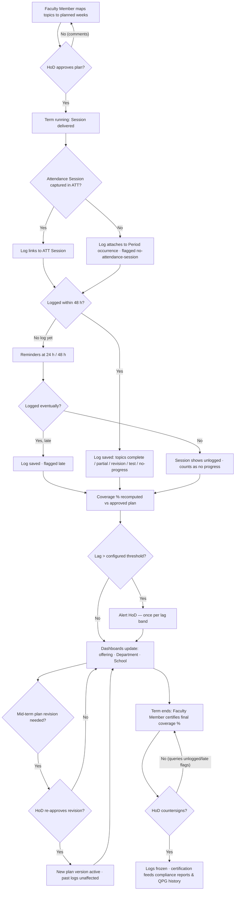

# Requirement: Syllabus Coverage Tracking

Module code: SYL · Status: DRAFT — pending approval · Last updated: 2026-07-21

## 1. Summary

Syllabus coverage tracking answers "are we teaching what we planned, on schedule?" per **subject offering** (subject × Section/elective-group × term). The approved syllabus is broken into units → topics; the teaching Faculty Member authors a planned schedule mapping topics to planned Periods/weeks, which the HoD approves. After each delivered Session (linked to the attendance session from the ATT module), the Faculty Member logs which topics were covered — or marks the Session as revision, test, or no-progress. Dashboards show % coverage vs plan per offering, rolled up to Department (HoD) and School (Dean); the HoD is alerted when an offering falls more than 2 weeks (configurable) behind plan. Coverage feeds the QPG module's exam-blueprint validation and an end-of-term coverage certification for compliance reporting.

## 2. Goals & Non-Goals

**Goals**
- Structure each offering's approved syllabus as units → topics with a planned Period/week schedule.
- Per-Session logging of topics covered (with revision / test / no-progress / partial markers), linked to the ATT Session.
- Coverage-vs-plan dashboards: offering level, Department roll-up (HoD), School roll-up (Dean).
- Configurable lag alerts to the HoD (default: > 2 weeks behind plan).
- Versioned mid-term plan revisions with HoD re-approval.
- End-of-term coverage certification (Faculty Member certifies, HoD countersigns) feeding compliance reporting.
- Covered-topics feed for QPG blueprint validation (see 08-question-paper-generation.md).

**Non-Goals**
- Authoring or approving the syllabus content itself (curriculum design happens in academic bodies outside UniCore; SYL consumes the approved unit/topic breakdown).
- Grading, assessment, or student-facing learning content.
- Attendance capture — that is ATT; SYL only links to its Sessions.
- Auto-rescheduling the Timetable when an offering lags — alerts inform humans; TTM changes stay with the Timetable Cell.

## 3. Affected User Groups & Access

| Group | Access granted |
|---|---|
| Faculty Member (teaching the offering) | Author/revise the plan; log coverage per Session; view own offerings' dashboards; certify end-of-term coverage |
| Substitute / committed swap counterpart (TTM-FR-17) | Log coverage only for the specific Session they taught |
| Class In-charge | Read-only coverage view for their Section's offerings |
| HoD | Approve plans and revisions; Department roll-up dashboard; receive lag alerts; countersign certifications |
| School Dean | School roll-up dashboard; read-only drill-down |
| Exam Cell | Read covered-topics status for blueprint validation; override coverage warnings in QPG (audited there) |
| Admin/office staff | Read-only reports for compliance filings |
| Students | No access in MVP (see Open Questions) |

**Denied:** Faculty Members cannot view or edit other offerings' plans/logs (except the substitute-Session case above). Nobody edits another person's log entries; corrections are made by the original author with history retained.

## 4. Authorization & Business Rules

### Per-action authorization

| Action | Allowed | Scope check |
|---|---|---|
| Create/edit plan (draft) | Teaching Faculty Member of the offering | Offering assignment from published Timetable |
| Approve plan / revision | HoD of the owning Department | Department |
| Log coverage for a Session | Faculty Member who delivered that Session (incl. substitute or committed swap counterpart for their Session, per TTM-FR-11/17) | Session ownership from ATT/TTM |
| Edit own log entry (history kept) | Original logger, until term certification | Session ownership |
| View offering dashboard | Teaching Faculty Member, Class In-charge (Section), HoD, Dean | Org unit |
| Configure lag threshold | HoD (Department default), Dean (School default) | Org unit |
| Certify end-of-term coverage | Teaching Faculty Member (certify) + HoD (countersign) | Offering / Department |
| Read covered-topics feed | QPG module service; Exam Cell | Offering |

All checks via the AUTH scope-aware permission API (see 01-authentication-authorization-security.md).

### Business rules

1. A plan exists per offering per term; logging is allowed before plan approval, but the dashboard shows "unplanned" until the HoD approves (coverage % needs a baseline).
2. One log per Session; the log records covered topics (zero or more) plus optional markers: revision, test, no-progress, partial (topic started, not finished). A topic is "covered" only when marked complete; partial coverage counts 0% until completed.
3. Logs link to the ATT Session where one exists; if attendance was not captured for a delivered Period, the log attaches to the Period occurrence and is flagged `no-attendance-session`.
4. Logging window: expected within 48 h of the Session; reminders nag at 24 h and 48 h; late logs are accepted but flagged `late` (visible on HoD roll-up).
5. Plan revisions are versioned: revision requires HoD re-approval; past logs remain attached to the topics as logged — coverage % recomputes against the newest approved version.
6. Combined classes and elective groups: the offering is defined over its roster context (multiple Sections combined, or an elective group); one log per Session covers the whole offering — no per-Section duplicate logging.
7. Lag = planned cumulative topics to date minus covered topics, expressed in plan-weeks; alert to HoD when lag > threshold (default 2 weeks, configurable per Department/School).
8. Certification freezes the offering's logs: after Faculty certification + HoD countersign, logs are read-only; corrections require the HoD to re-open (audited, before/after kept).
9. QPG cross-check: at the exam-prep cutoff, QPG warns when a blueprint includes topics not marked covered; this is a **warning, not a hard block** — Exam Cell may override (audited in QPG). SYL provides the feed only.

### Audit

Plan approvals/revisions, log edits, certification, re-opening, and threshold changes write to the central audit service (AUTH-FR-08) with before/after state. Routine log creation keeps full history (who, when) but is a normal record, not a privileged action.

## 5. Legal & Regulatory Requirements

- **Data minimization (DPDP):** coverage logs contain no student personal data — only the logging Faculty Member's identity, Session reference, and topic markers. Dashboards aggregate at offering level and never expose student-level data.
- **Retention:** coverage logs, plans, and certifications are internal academic records — **3-year retention proposed** (aligned to accreditation/audit cycles; see Open Questions), then purged. Certifications referenced by compliance filings inherit the filing's retention.
- **Correction rights:** a Faculty Member may correct their own logs (history retained); post-certification corrections go through the HoD re-open flow — a grievance never silently edits a certified record.
- **Accreditation support (UGC/AICTE/NBA):** end-of-term certifications and coverage reports must be exportable per Program/Department for accreditation evidence, showing plan vs delivered with dates in DD-MM-YYYY, IST.

## 6. User Stories & Acceptance Criteria

**US-SYL-1** — As a Faculty Member, I author my offering's plan so that coverage has a baseline.
- Given the approved syllabus units/topics for my offering, when I map topics to planned weeks and submit, then the plan goes to my HoD for approval and I can already log Sessions meanwhile.
- Given the HoD rejects with comments, when I revise and resubmit, then the new version supersedes the draft.

**US-SYL-2** — As a Faculty Member, I log coverage right after class so that dashboards stay current.
- Given a Session I delivered today, when I mark topics T3 complete and T4 partial, then T3 counts toward coverage, T4 does not, and the log links to the ATT Session.
- Given I have not logged within 24 h, when the reminder fires, then I get a nag notification; at 48 h a second one; a log after 48 h is saved but flagged `late`.

**US-SYL-3** — As an HoD, I see my Department's roll-up and get lag alerts so that I can intervene early.
- Given an offering whose covered topics trail the plan by more than 2 weeks, when the daily lag evaluation runs, then I receive one alert for that offering (no re-alert spam until the lag band changes).
- Given a plan revision request, when I approve it, then coverage % recomputes against the new version and past logs are unaffected.

**US-SYL-4** — As a substitute Faculty Member, I log the Session I taught so that coverage stays truthful.
- Given I delivered Session S as a substitute, when I open logging, then I can log only Session S for that offering, and the log records me as the logger.

**US-SYL-5** — As a Faculty Member with my HoD, we certify end-of-term coverage so that compliance reporting has a signed basis.
- Given the term has ended, when I certify the final coverage % and my HoD countersigns, then the offering's logs freeze and the certification appears in Department compliance reports.

## 7. Functional Requirements

- SYL-FR-01: Syllabus structure per offering: units → topics, imported/entered from the approved syllabus; offering = subject × Section/elective-group × term, derived from the published Timetable.
- SYL-FR-02: Plan authoring by the teaching Faculty Member (topics → planned Periods/weeks); HoD approval; versioned revisions with re-approval; past logs unaffected by revisions.
- SYL-FR-03: Per-Session coverage logging: covered topics, partial marker, revision/test/no-progress markers; linked to the ATT Session; one log per Session; author-only edits with history.
- SYL-FR-04: Logging for Sessions without attendance capture: log attaches to the Period occurrence, flagged `no-attendance-session`.
- SYL-FR-05: Logging window management: 24 h and 48 h reminders; late logs accepted and flagged `late`.
- SYL-FR-06: Substitute/swap logging: the Faculty Member who delivered the Session (per the TTM substitution record or committed swap, TTM-FR-17) logs it; access limited to that Session; the log names the actual deliverer; the owning Faculty Member sees it read-only.
- SYL-FR-07: Combined-class / elective-group support: one offering-level log per Session across the roster context; no duplicate per-Section logs.
- SYL-FR-08: Coverage computation: % of topics complete vs plan-to-date and vs full plan; partial topics count only when completed.
- SYL-FR-09: Dashboards: offering view (Faculty Member, Class In-charge), Department roll-up (HoD), School roll-up (Dean), with drill-down and `late`/`no-attendance-session` flag visibility.
- SYL-FR-10: Lag alerts: daily evaluation; alert HoD when lag > configured threshold (default 2 weeks); alert once per lag band per offering.
- SYL-FR-11: Covered-topics feed for QPG blueprint validation at exam-prep cutoff; warning-only semantics, Exam Cell override handled in QPG (see 08-question-paper-generation.md).
- SYL-FR-12: End-of-term certification: Faculty Member certifies final coverage %, HoD countersigns; logs freeze; HoD re-open flow for post-certification corrections (audited).
- SYL-FR-13: Compliance exports per Program/Department: plan vs delivered, certifications, flags; DD-MM-YYYY, IST.

## 8. Edge Cases, Worst Cases & Decisions

| Case | Decision |
|---|---|
| Session delivered but attendance never captured | **DECISION:** syllabus log is still possible — it attaches to the Period occurrence, flagged `no-attendance-session`, and counts toward coverage. |
| Faculty Member logs nothing for weeks | **DECISION:** reminders at 24/48 h per Session; unlogged Sessions surface on the HoD roll-up as `unlogged`; unlogged Sessions count as no progress in lag computation (worst-case assumption drives the alert). |
| Topic spans multiple Sessions | **DECISION:** partial marker on intermediate Sessions; the topic counts toward coverage only when a Session marks it complete. |
| Plan revision mid-term (topics added/removed) | **DECISION:** versioned revision with HoD re-approval; past logs keep their topic references; coverage % recomputes against the newest approved version; removed topics with existing logs remain visible as "logged, no longer planned". |
| Substitute teaches the Session | **DECISION:** the substitute logs that Session only; the log names the substitute; the owning Faculty Member sees it read-only in their offering. |
| Committed swap: counterpart teaches the Session | **DECISION:** identical to the substitute rule — the swapped-in teacher logs that Session only (TTM-FR-17 attribution); the original assignee is denied logging for the swapped occurrence and sees the log read-only. |
| Combined class: two Section timetables, one delivery | **DECISION:** single offering-level log per Session (business rule 6); dashboards show it once; both Sections' Class In-charges get read access. |
| Log edited after HoD already acted on a lag alert | **DECISION:** edits keep full history; lag re-evaluates on the next daily run; the alert record is never rewritten. |
| Blueprint includes an uncovered topic at exam-prep cutoff | **DECISION:** QPG shows a warning listing uncovered topics; Exam Cell may override with reason (audited in QPG). SYL never hard-blocks paper assembly. |
| Certification requested with unlogged Sessions outstanding | **DECISION:** certification allowed but the certificate records the unlogged-Session count and the final % is computed treating them as no progress; HoD sees this before countersigning. |
| Faculty Member leaves mid-term | **DECISION:** the replacement teacher (per updated Timetable assignment) inherits plan ownership and future logging; predecessor's logs remain attributed to the predecessor. |
| Timetable changes reduce/increase total Periods mid-term | **DECISION:** plan weeks stay authoritative for lag; the Faculty Member is prompted to submit a plan revision when the published Timetable materially changes the offering's Period count. |
| Worst case: mass late logging just before certification | **DECISION:** allowed but every such log carries the `late` flag with actual log timestamp; certifications expose the late-log percentage so the HoD countersigns with eyes open; no retroactive un-flagging exists. |

## 9. Non-Functional Requirements

- Log entry save: < 1 s (p95); logging UI usable on mobile in ≤ 3 taps for a single-topic Session.
- Dashboard load: offering view < 2 s (p95); Department roll-up (≤ 100 offerings) < 3 s (p95); School roll-up < 5 s (p95).
- Lag evaluation: daily batch across all offerings (~3,000–5,000 per term) completes in ≤ 15 minutes; alerts delivered within 15 minutes of evaluation.
- Scale: ~5,000 offerings × ~60 Sessions/term ≈ 300k logs/term; queries stated above hold at this volume.
- Availability: 99.5% during academic hours (baseline); logging must queue offline on the mobile app and sync when connectivity returns (log timestamp = creation time, not sync time).
- Retention: automatic purge at 3 years (configurable upward) with certification records exempted while referenced by filings.

## 10. Assumptions

- The approved syllabus (units/topics) is available in a structured or import-friendly form per subject; SYL does not manage syllabus approval workflows.
- Offering-to-teacher assignment comes from the published Timetable (TTM) and substitution records; SYL never maintains its own assignment source.
- "Week" for lag purposes = academic calendar week of the term as configured in TTM.
- Exam-prep cutoff dates are configured in QPG; SYL only serves the covered-topics feed as of a requested date.
- Departments accept that unlogged Sessions count as no progress in lag math (deliberately pessimistic to drive logging discipline).

## 11. Open Questions

- Should students see their offering's coverage % (transparency) in a later phase? Proposed: yes, read-only, post-MVP.
- Is 3-year retention sufficient for NBA/NAAC accreditation evidence cycles, or should certifications be kept 5 years? Needs registrar confirmation.
- Should the lag threshold be configurable per offering (not just Department/School) for project/lab-heavy subjects? Proposed: Department default with per-offering override by HoD.

## 12. Flow Diagram

## 13. Test Cases

| ID | Title / Scenario | Category | Priority | Preconditions | Steps | Expected Result | Covers |
|----|------------------|----------|----------|---------------|-------|-----------------|--------|
| TC-SYL-001 | Plan authored and approved | Happy | P0 | Offering exists from published Timetable | 1. Faculty maps topics to weeks 2. HoD approves | Plan active v1; dashboard baseline set | SYL-FR-02, US-SYL-1 |
| TC-SYL-002 | Log after Session with ATT link | Happy | P0 | Session captured in ATT | Log topic T3 complete | Log saved, linked to ATT Session; coverage % updates | SYL-FR-03/08 |
| TC-SYL-003 | Partial topic counts zero until complete | Boundary | P0 | Topic T4 marked partial in Session 1 | 1. Check coverage 2. Mark complete in Session 2 | 0% credit after step 1; counted after step 2 | SYL-FR-08, §8 |
| TC-SYL-004 | Log at exactly 48 h vs after | Boundary | P1 | Session ended 48 h ago / 48 h 1 min ago | Save log at each moment | On-time at ≤ 48 h; flagged `late` after | SYL-FR-05 |
| TC-SYL-005 | Session without attendance capture | Happy | P0 | Period delivered, no ATT session | Log coverage | Log attaches to Period occurrence, flagged `no-attendance-session`, counts toward coverage | SYL-FR-04, §8 |
| TC-SYL-006 | Substitute logs only their Session | Access | P0 | Substitution recorded for Session S | Substitute opens logging | Can log S only; other Sessions of the offering denied; log names substitute | SYL-FR-06, US-SYL-4 |
| TC-SYL-007 | Faculty Member logs another offering | Access | P0 | Faculty not assigned to offering X | Attempt to log a Session of X | 403; attempt audited | §4 matrix |
| TC-SYL-008 | Second log for same Session rejected | Negative | P0 | Log exists for Session | Submit another log (not an edit) | Rejected: one log per Session; edit flow offered | §4 rule 2 |
| TC-SYL-009 | Concurrent edit of same log | Concurrency | P1 | Author opens log in two clients | Save from both | Second save gets conflict; history shows single lineage | SYL-FR-03 |
| TC-SYL-010 | Lag alert fires once per band | Happy | P0 | Offering 2.5 weeks behind, threshold 2 | Run daily evaluation twice | One alert to HoD on first run; no duplicate on second | SYL-FR-10, US-SYL-3 |
| TC-SYL-011 | Plan revision recomputes, past logs intact | Happy | P1 | Plan v1 with logs; topics added | 1. Revise 2. HoD approves | v2 active; % recomputed vs v2; v1-era logs unchanged | SYL-FR-02, §8 |
| TC-SYL-012 | Unapproved revision does not change baseline | Negative | P1 | Revision submitted, not approved | View dashboard | Coverage still computed vs v1 | SYL-FR-02 |
| TC-SYL-013 | Certification freezes logs | Happy | P0 | Term ended; certify + countersign done | Author attempts log edit | Rejected: frozen; HoD re-open path works and is audited | SYL-FR-12, §4 rule 8 |
| TC-SYL-014 | Certification with unlogged Sessions | Boundary | P1 | 3 Sessions unlogged | Certify | Allowed; certificate records unlogged count; % treats them as no progress | §8 |
| TC-SYL-015 | QPG warned on uncovered blueprint topic | Happy | P1 | Blueprint includes topic not covered by cutoff | QPG queries SYL feed | Feed reports topic uncovered; QPG warning (no block) — override tested in QPG | SYL-FR-11, §8 |
| TC-SYL-016 | Logs carry no student personal data | Legal | P0 | Any saved log | Inspect stored record and dashboard payloads | Only faculty identity, Session ref, topics; no student fields | §5 |
| TC-SYL-017 | 3-year purge spares referenced certifications | Legal | P2 | Logs older than 3 years; certification in a filing | Run retention job | Old logs purged; referenced certification retained | §5, §9 |
| TC-SYL-018 | Roll-up performance at scale | NFR | P2 | 100 offerings in Department, 300k logs | Load HoD roll-up | < 3 s (p95) | §9 |
| TC-SYL-019 | Swap counterpart logs their swapped Session only | Access | P0 | Committed swap gives Dr. Iyer one occurrence of Dr. Rao's offering | 1. Iyer logs that Session 2. Iyer attempts another Session of the offering 3. Rao attempts to log the swapped Session | Step 1 saves, log names Iyer; steps 2 and 3 denied (403, audited); Rao sees Iyer's log read-only | SYL-FR-06, TTM-FR-17, §8 |

Coverage: all §6 acceptance criteria, the §4 authorization matrix (TC-006/007/019 incl. swap counterparts), every §8 decision except mid-term teacher replacement and Timetable-driven Period-count change (both exercised through the TC-001/011 plan flows — add integration TCs during implementation), DPDP minimization and retention (§5 via TC-016/017), and the §9 latency numbers map to at least one test.
