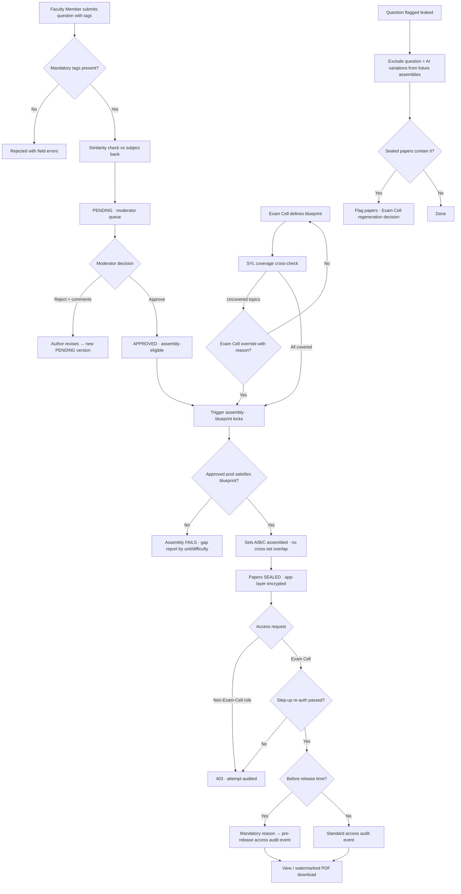

# Requirement: Question Paper Generation

Module code: QPG · Status: DRAFT — pending approval · Last updated: 2026-07-21

## 1. Summary

QPG turns per-subject **question banks** maintained by Faculty Members into sealed, exam-ready question papers assembled against an **Exam Cell blueprint**. Faculty Members author questions tagged by unit, course outcome (CO), difficulty, marks, and question type; an HoD or subject coordinator moderates every entry before it becomes eligible. The system (with AI assistance for selection/optimization and for generating question **variations**) assembles multiple non-overlapping sets that satisfy the blueprint. The defining property of this module is **strict confidentiality**: assembled papers are app-layer encrypted, visible **only** to the Exam Cell, never to contributing Faculty Members, watermarked on download, and every access is audited. AI never invents questions directly into a final paper — all AI output passes through the same human moderation gate as human-authored questions.

## 2. Goals & Non-Goals

**Goals**
- A moderated, per-subject question bank tagged by unit / CO / difficulty (easy·medium·hard) / marks / question type.
- Blueprint definition per exam: total marks, duration, section structure, marks distribution across units, COs, and difficulty.
- Automated assembly of candidate papers from **approved** questions only, with AI-assisted selection and AI-generated variations (moderated before use).
- Multiple sets (Set A/B/C…) with configurable no-overlap guarantee across sets.
- Sealed-paper confidentiality: app-layer encryption at rest, Exam Cell-only access, watermarked downloads, full access audit, pre-release access controls.
- Syllabus-coverage cross-check against SYL data (warn, not block).
- Leak containment: flagging compromised questions, excluding them and their variations, regeneration workflow, audit-driven incident tracing.

**Non-Goals**
- Conducting or scheduling exams, valuation, or results processing (external exam systems / out of scope per 00-overview.md).
- Printing-press logistics beyond producing the watermarked PDF.
- Plagiarism checking against external corpora (only intra-bank similarity detection is in scope).
- Student- or parent-facing views of any kind — this module has zero student surface.

## 3. Affected User Groups & Access

| Group | Access granted |
|---|---|
| Faculty Members | Author/edit/retire own bank questions for subjects they qualify for (see authoring basis, §4 rule 0); view own questions' moderation status; **never** any assembled paper |
| HoD / Subject Coordinator | Moderate (approve/reject with comments) bank entries in their scope; view bank analytics (counts by unit/difficulty); no assembled papers |
| Exam Cell (incl. School exam coordinator) | Define blueprints, trigger assembly, view/download sealed papers, set/adjust release times, flag leaked questions, order regeneration |
| System Admin | Role grants per 01-authentication-authorization-security.md; **no** paper content access |
| Executives | Aggregate dashboards only (bank health, assembly status); no question or paper content |

**Denied:** Students, admin/office staff outside Exam Cell, Timetable Cell, lab assistants — no access to bank content or papers. Contributing Faculty Members are explicitly denied access to any assembled paper containing their own questions.

## 4. Authorization & Business Rules

### Per-action authorization

| Action | Allowed | Notes / enforcement |
|---|---|---|
| Create/edit/retire bank question | Faculty Member (own subject scope) | Edits to an approved question create a new version requiring re-moderation |
| Moderate bank question (approve/reject + comments) | HoD or designated subject coordinator (scope) | Cannot moderate own-authored questions |
| Define/edit exam blueprint | Exam Cell, School exam coordinator | Blueprint locked once assembly for that exam starts |
| Trigger assembly / regenerate sets | Exam Cell | Draws from APPROVED questions only |
| View/download sealed final paper | Exam Cell only | Step-up re-auth per AUTH doc; watermarked PDF; every access audited |
| Pre-release access to sealed paper | Exam Cell only, with mandatory reason | Logged as a distinct "pre-release access" audit event |
| Set/change release time | Exam Cell | Change audited with reason |
| Flag question as leaked/compromised | Exam Cell | Cascades to AI variations; flags affected sealed papers |
| Override syllabus-coverage warning | Exam Cell, with mandatory reason | Warning + override both audited |
| View access audit for a paper | Exam Cell lead, Super Admin | Read-only per AUTH doc |

### Business rules

0. **Authoring basis (locked 24-07-2026):** a Faculty Member may author for a subject when EITHER (a) they teach it in the current term's published timetable (TTM), or (b) they hold an active `subject-author` grant — an HoD-issued, Department-scoped grant from the AUTH role registry, optionally time-bound — covering between-term windows and supplementary-exam top-ups. Bank content itself is term-independent; only the authoring right is checked at write time.
1. Only questions in status **APPROVED** are eligible for assembly. Draft, pending, rejected, retired, and leaked-flagged questions are never selectable.
2. Moderation is mandatory and applies identically to human-authored questions and AI-generated variations; a moderator cannot approve their own submissions.
3. AI may (a) select/optimize questions against a blueprint and (b) generate variations (paraphrase, parameter change) of existing bank questions, which enter the bank as **new entries pending moderation**. AI never places unmoderated content into a final paper.
4. Multi-set assembly guarantees zero question overlap across sets of the same exam by default; overlap tolerance is configurable per exam (default 0).
5. On assembly completion, the paper is **sealed**: app-layer encrypted at rest with keys held outside the application database; plaintext exists only transiently during authorized rendering.
6. Every view, download, and print of a sealed paper is audited: who, when, from where (IP/device), which set. Downloads are watermarked PDFs carrying the user's identity + timestamp.
7. Before an exam's release time, every Exam Cell access is additionally recorded as a "pre-release access" event with a mandatory reason. After release time, standard access audit continues.
8. Blueprint validation cross-checks SYL coverage: topics not marked covered by the exam-prep cutoff produce a **warning**, overridable by Exam Cell with reason — never a hard block.
9. Bank questions are university property; authorship is recorded for attribution and DPDP purposes only, not ownership.
10. Assembly is deterministic per seed and reproducible for audit; the mapping of bank questions to sealed papers is itself confidential and access-restricted like the papers.

### Audit

All actions above write to the central append-only audit service (see 01-authentication-authorization-security.md): actor, action, object (question/blueprint/paper/set), scope, timestamp (IST), before/after, reason where mandated. Paper-access events additionally record source IP/device. Retention 7 years.

## 5. Legal & Regulatory Requirements

- **Confidential records:** question banks and assembled papers are university confidential records. Access is need-to-know per §4; papers and their access audit trails are retained **7 years**.
- **DPDP Act 2023 (minimal footprint):** the only personal data in this module is author/moderator/accessor identity in metadata and audit logs, and identity embedded in download watermarks. Processing purpose: attribution, moderation accountability, and leak investigation — stated in the DPDP notice per AUTH doc. No student personal data enters this module.
- **Data minimization:** question content itself is not personal data; the module stores no personal data beyond the identities above. Watermarks contain name/ID + timestamp only.
- **UGC/AICTE alignment:** blueprints reference COs to support outcome-based education reporting; no statutory threshold is hardcoded.
- **Breach duty:** a paper leak is a confidentiality incident under the university's incident process (see §8 worst case); it is not a DPDP personal-data breach unless audit/identity data is also exposed, in which case DPDP breach notification duties apply per AUTH doc.

## 6. User Stories & Acceptance Criteria

**US-QPG-1** — As a Faculty Member, I add questions to my subject's bank tagged by unit/CO/difficulty/marks/type so they can be used in papers.
- Given a valid question with all mandatory tags, when I submit it, then it enters status PENDING and appears in my moderator's queue.
- Given a missing mandatory tag (e.g., no CO), when I submit, then the save is rejected with a field-level error.

**US-QPG-2** — As an HoD/subject coordinator, I moderate pending questions so only quality questions become eligible.
- Given a pending question, when I approve it, then it becomes APPROVED and assembly-eligible; when I reject it with comments, the author sees the comments and can revise (creating a new pending version).
- Given a question I authored myself, when I open it for moderation, then the approve/reject actions are disabled.

**US-QPG-3** — As Exam Cell, I define a blueprint and assemble three sets so the exam has non-overlapping papers.
- Given an approved-question pool sufficient for the blueprint, when I trigger assembly for Sets A/B/C, then three sealed papers are produced with zero question overlap and a satisfaction report per constraint.
- Given an insufficient pool, when I trigger assembly, then assembly **fails** with a gap report by unit/difficulty and no paper is produced.

**US-QPG-4** — As Exam Cell, I open a sealed paper before release time to verify formatting.
- Given step-up re-auth passed and a reason entered, when I view the paper, then a "pre-release access" audit event is written and the view proceeds.
- Given a Faculty Member (even the author of every question in it), when they attempt any paper URL/API, then they get 403 and the attempt is audited.

**US-QPG-5** — As Exam Cell, I flag a compromised question so it never appears again.
- Given a question flagged as leaked, when future assemblies run, then the question and all its AI variations are excluded; sealed papers already containing it are flagged with a regeneration decision task.

## 7. Functional Requirements

- QPG-FR-01: Question CRUD by Faculty Members within subject scope per the authoring basis (§4 rule 0: current-term timetable teaching OR active `subject-author` grant); mandatory tags: unit, CO, difficulty (easy/medium/hard), marks, question type; optional attachments (figures).
- QPG-FR-02: Moderation workflow — PENDING → APPROVED / REJECTED(with comments); re-edit creates a new pending version; self-moderation blocked.
- QPG-FR-03: Near-duplicate detection — on submit and at moderation, similarity check against the same subject's bank; matches above threshold shown to the moderator as a warning (non-blocking).
- QPG-FR-04: Blueprint editor — per exam: total marks, duration, section structure (sections, questions per section, choice patterns), marks distribution across units/COs/difficulty; blueprint locks at first assembly.
- QPG-FR-05: Assembly engine — selects only APPROVED questions to satisfy the blueprint exactly; fails with a per-unit/per-difficulty gap report when the pool is insufficient; no silent constraint relaxation.
- QPG-FR-06: AI-assisted selection/optimization against the blueprint (e.g., balancing difficulty spread); AI output is a selection over approved questions only.
- QPG-FR-07: AI variation generation (paraphrase / parameter change) from existing bank questions; variations are created as new PENDING bank entries linked to their source question; never inserted directly into a paper.
- QPG-FR-08: Multi-set generation (configurable count, default naming Set A/B/C…) with configurable cross-set overlap (default zero).
- QPG-FR-09: Sealing — on assembly completion the paper is app-layer encrypted at rest; decryption only through the authorized view/download path.
- QPG-FR-10: Access control — view/download/print restricted to Exam Cell with step-up re-auth per 01-authentication-authorization-security.md; contributing Faculty Members and all other roles denied.
- QPG-FR-11: Watermarked PDF download — user identity + timestamp embedded visibly and in metadata on every page.
- QPG-FR-12: Release time per exam; pre-release accesses require a mandatory reason and are logged as distinct "pre-release access" audit events.
- QPG-FR-13: Full access audit — every view/download/print records who, when, from where (IP/device), which paper/set.
- QPG-FR-14: Syllabus-coverage cross-check against SYL (07-syllabus-coverage.md) at blueprint validation and assembly; uncovered topics raise a warning; Exam Cell override with reason.
- QPG-FR-15: Leak flagging — mark a question compromised; cascade exclusion to its AI variations; flag sealed papers containing it for a regeneration decision.
- QPG-FR-16: Regeneration — assemble a replacement set from remaining approved questions; the compromised paper's seal and audit history are preserved (never deleted).
- QPG-FR-17: Bank retention on staff exit — questions authored by a departed Faculty Member remain in the bank as university property; authorship metadata retained.
- QPG-FR-18: Bank health dashboard — approved-question counts by subject/unit/difficulty/CO vs upcoming blueprint demand, for HoD and Exam Cell planning.

## 8. Edge Cases, Worst Cases & Decisions

| Case | Decision |
|---|---|
| Insufficient approved questions to satisfy the blueprint | Assembly **fails** with a gap report by unit/difficulty (e.g., "Unit 3: need 4 medium, have 1"). No silent relaxation of any constraint. Exam Cell asks faculty to top up the bank or edits the blueprint (before lock). |
| Question flagged as leaked/compromised | Exam Cell flags it; the question **and all AI variations derived from it** are excluded from all future assemblies. Sealed papers already containing it are flagged and routed to Exam Cell for a regeneration decision per paper. |
| Duplicate / near-duplicate questions in the bank | Similarity detection warns the moderator at submission and moderation time; moderator decides (approve anyway / reject as duplicate). Warning, not auto-rejection. |
| Faculty Member leaves the university | Their bank entries remain — questions are university property (QPG-FR-17). Their account deactivation follows AUTH; authorship metadata is retained for audit. |
| Term archived; Exam Cell asks for bank top-ups before a supplementary exam | The published-timetable authoring basis is gone with the archival; the HoD issues `subject-author` grants (§4 rule 0) to the chosen Faculty Members; authoring proceeds under the grant, moderation unchanged. |
| Exam postponed | Exam Cell updates the release time; the seal is maintained unchanged; no regeneration required. The change is audited with reason. |
| Emergency reprint after release | Post-release, Exam Cell downloads a fresh watermarked PDF; each download is individually watermarked and audited, so every physical copy traces to a person and time. |
| Two moderators act on the same pending question concurrently | First decision wins (optimistic lock); the second moderator sees "already moderated" with the outcome. No double-processing. |
| AI variation subtly changes the answer/validity of a question | This is exactly why variations require full moderation: the moderator reviews the variation against its linked source question before approval. AI output is never trusted unmoderated. |
| Blueprint edited after assembly started | Blocked — blueprint locks at first assembly (QPG-FR-04). Changing it requires discarding the assembly run (audited) and re-locking. |
| Syllabus coverage data missing (SYL not logged) for a subject | Cross-check reports "coverage unknown" as a warning; Exam Cell may proceed with override reason. Absence of data never hard-blocks an exam. |
| **Worst case: paper leak before the exam** | Containment flow: (1) audit trail enumerates every access (who/when/where) of the affected sealed paper — since only Exam Cell can access and every access is logged, the suspect set is small and complete; (2) watermark on any leaked PDF copy identifies the downloader; (3) Exam Cell flags the paper compromised and regenerates from the bank with an alternate non-overlapping set; (4) incident recorded per the university incident process with the access report attached. This flow is a documented runbook, not ad hoc. |
| **Worst case: encryption key loss** | Papers are reproducible: re-assembly from the bank with the stored blueprint + seed regenerates content. Keys are managed in a vault with backup per AUTH secrets policy; key loss is a sev-1 ops incident but never loses exams permanently. |

## 9. Non-Functional Requirements

- Assembly of one paper (typical blueprint, bank ≤ 2,000 questions/subject): < 30 s; 3-set assembly < 90 s.
- Similarity check on question submit: < 5 s (p95) against a 2,000-question subject bank.
- Sealed paper view/download (after step-up): first render < 3 s (p95); watermarked PDF generation < 10 s for a 20-page paper.
- Encryption: papers app-layer encrypted (AES-256-GCM or equivalent) at rest, on top of baseline disk encryption; keys in the managed vault, rotated yearly.
- Audit write for paper access: synchronous — the view/download is not served until the audit event is durably queued (outbox); a lost paper-access audit record is a sev-1.
- Availability: 99.5% during academic hours; assembly and release operations sized for exam-season peaks (all Schools assembling within the same fortnight).
- Retention: papers, blueprints, and access audit — 7 years.

## 10. Assumptions

- Subject–Faculty Member mapping (who can author for which subject) comes from the current term's published timetable (03-timetable-management.md) plus HoD-issued `subject-author` grants (AUTH role registry) for out-of-term authoring.
- SYL module (07-syllabus-coverage.md) exposes per-subject topic-coverage status queryable by exam-prep cutoff date.
- "Subject coordinator" is an org-scoped role grant per AUTH, designated by the HoD.
- Exam schedules (dates, hence release times) are known to the Exam Cell from the external exam system; UniCore stores release time per exam but does not schedule exams.
- Printing and physical distribution of papers happen outside UniCore; the watermarked PDF is the module's final artifact.

## 11. Open Questions

- Cross-set overlap default is 0 — should a configurable percentage (e.g., ≤10% for large banks) be allowed at the School level, or only per-exam by Exam Cell? Proposed: per-exam by Exam Cell only.
- Similarity-detection threshold and technique (lexical vs embedding-based) — proposed: embedding-based with a tunable threshold, calibrated during pilot.
- Should question banks be shareable across campuses for the same subject code? Proposed: yes, read-only reuse with approval by the owning Department, post-MVP.

## 12. Flow Diagram

## 13. Test Cases

| ID | Title / Scenario | Category | Priority | Preconditions | Steps | Expected Result | Covers |
|----|------------------|----------|----------|---------------|-------|-----------------|--------|
| TC-QPG-001 | Submit fully-tagged question | Happy | P0 | Faculty Member with subject scope | Submit question with unit/CO/difficulty/marks/type | Status PENDING; appears in moderator queue | QPG-FR-01, US-QPG-1 |
| TC-QPG-002 | Submit question missing CO tag | Negative | P1 | Faculty Member | Submit without CO | Save rejected with field-level error | QPG-FR-01 |
| TC-QPG-003 | Moderator approves pending question | Happy | P0 | Pending question, scoped moderator | Approve | Status APPROVED; assembly-eligible | QPG-FR-02, US-QPG-2 |
| TC-QPG-004 | Self-moderation blocked | Access | P0 | HoD authored a pending question | HoD opens own question in moderation | Approve/reject disabled; API returns 403 | §4 rule 2 |
| TC-QPG-005 | Near-duplicate warning at moderation | Boundary | P1 | Bank contains a highly similar approved question | Submit near-duplicate; moderator opens it | Similarity warning shown; moderator can still approve or reject | QPG-FR-03, §8 |
| TC-QPG-006 | 3-set assembly with zero overlap | Happy | P0 | Approved pool ≥ 3× blueprint demand | Assemble Sets A/B/C | Three sealed papers; no question appears in two sets; constraint report produced | QPG-FR-05/08, US-QPG-3 |
| TC-QPG-007 | Insufficient pool fails with gap report | Negative | P0 | Approved pool lacks 3 hard questions in Unit 4 | Trigger assembly | Assembly fails; gap report names Unit 4 / hard / count; no paper produced | QPG-FR-05, §8 |
| TC-QPG-008 | Rejected question never selected | Boundary | P0 | Rejected + retired questions exist matching blueprint | Assemble | Only APPROVED questions used | §4 rule 1 |
| TC-QPG-009 | Faculty author denied paper access | Access | P0 | Sealed paper contains Faculty Member F's questions | F requests paper via API/URL | 403; attempt audited | QPG-FR-10, US-QPG-4 |
| TC-QPG-010 | Pre-release access requires reason + step-up | Access | P0 | Sealed paper, release time in future, Exam Cell user | View without reason; then with reason after step-up | First blocked; second succeeds with "pre-release access" audit event | QPG-FR-12, US-QPG-4 |
| TC-QPG-011 | Download produces watermarked PDF | Happy | P0 | Exam Cell user, post step-up | Download Set A | PDF pages carry user identity + timestamp; download audited with IP/device | QPG-FR-11/13 |
| TC-QPG-012 | AI variation enters moderation, not paper | Legal | P0 | AI generates a variation during assembly assist | Inspect assembled paper + bank | Variation exists as new PENDING bank entry linked to source; paper contains only previously APPROVED questions | QPG-FR-07, §4 rule 3 |
| TC-QPG-013 | Leaked question cascade | Happy | P0 | Approved question Q with 2 approved AI variations; Q in sealed paper P | Flag Q as leaked; run new assembly | Q + variations excluded from new sets; paper P flagged for regeneration decision | QPG-FR-15/16, US-QPG-5 |
| TC-QPG-014 | Exam postponed keeps seal | Boundary | P1 | Sealed paper with release time T | Exam Cell moves release to T+7 days | Seal unchanged; release-time change audited; pre-release rules apply until new time | §8 |
| TC-QPG-015 | Concurrent moderation of one question | Concurrency | P1 | Two moderators open same pending question | Both submit decisions | First wins; second sees "already moderated"; single audit trail | §8 |
| TC-QPG-016 | Blueprint locked after assembly starts | Negative | P1 | Assembly triggered for exam E | Attempt blueprint edit for E | Blocked; edit possible only by discarding assembly run (audited) | QPG-FR-04, §8 |
| TC-QPG-017 | Syllabus-coverage warning + override | Legal | P1 | SYL shows Unit 5 not covered by cutoff | Validate blueprint including Unit 5; override with reason | Warning raised, not a block; override recorded with reason in audit | QPG-FR-14, §8 |
| TC-QPG-018 | Assembly performance | NFR | P2 | 2,000-question bank, standard blueprint | Assemble 3 sets | Completes < 90 s | §9 |
| TC-QPG-019 | Between-term authoring via subject-author grant | Access | P0 | Term archived (no timetable basis); Faculty Member F | 1. F submits a question (no grant) 2. HoD issues `subject-author` grant to F 3. F resubmits | Step 1 rejected 403 (audited); step 3 accepted into PENDING with normal moderation | §4 rule 0, QPG-FR-01 |

Coverage: every §6 acceptance criterion, the §4 authorization matrix (author-denial, self-moderation, pre-release access), all §8 edge cases except encryption-key loss (ops runbook drill, not an app test) map to at least one test; leak containment and the AI-moderation boundary are covered as P0.
