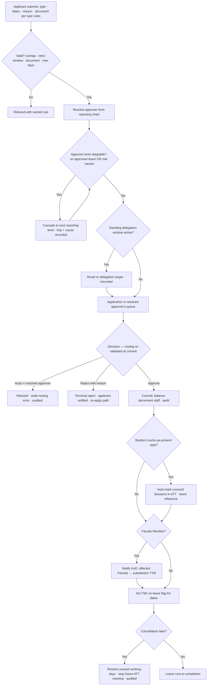

# Requirement: Leave Management

Module code: LVE · Status: DRAFT — pending approval · Last updated: 2026-07-22

## 1. Summary

Leave Management lets every member of the university — students and staff — apply for leave and have it approved through a single-step, hierarchy-routed workflow. The approver is determined by the applicant's position in the reporting chain: **Student → Class In-charge**, **Faculty Member → HoD**, **HoD → School Incharge**, **School Incharge → Faculty Dean**, **Faculty Dean → Dean Academic Affairs**, **Dean Academic Affairs → VC**, **VC / Registrar → Pro-Chancellor → Chancellor** (Pro-Chancellor restored 28-07-2026 per the university's published leadership page, which lists **two** holders — the role is not a singleton and either holder may approve; the Chancellor remains terminal). Two delegation mechanisms exist: **auto-cascade** — if the designated approver is on approved leave overlapping the application date (or the role is vacant), the application routes automatically to *their* reporting person, cascading upward — and **standing delegation** — an approver can open an audited delegation window that routes their queue to their reporting person (Class In-charge → HoD, HoD → School Incharge, School Incharge → Faculty Dean, and so on up the chain). Leave types are a configurable catalog; for students each type's **attendance impact is School-configurable** (counts-as-present, absent, or condonation-evidence for promotion). Staff leave carries **simple balances**: per-type annual quotas decremented on approval and restored on cancellation — accrual, carry-forward, and encashment stay in the external HR system. Approved leave feeds the modules that need it: ATT (student attendance impact), TTM (substitution prompt for faculty on leave), TSK (on-leave flag), and PRM (medical leave as condonation evidence).

## 2. Goals & Non-Goals

**Goals**
- One application-and-approval flow for all user groups, routed by the reporting chain.
- Auto-cascade past approvers who are themselves on leave; standing delegation windows.
- Configurable leave-type catalog with per-type document rules and (for students) School-configurable attendance impact.
- Simple balance tracking for staff (quota, decrement, restore) with an HR export.
- Integrations: ATT, TTM substitution prompting, TSK on-leave flag, PRM condonation evidence.
- Pro-Chancellor (multi-holder) and Chancellor as first-class system roles topping the reporting chain.

**Non-Goals**
- Full leave accounting (accrual, carry-forward, encashment, loss-of-pay computation) — external HR/payroll owns it; UniCore exports approved-leave data.
- Multi-step approval chains — leave is a single-approver decision (the routing picks *which* single approver).
- Per-application manual forwarding — locked out; only auto-cascade and standing delegation move an application away from the designated approver.
- Attendance capture mechanics — ATT owns them; LVE only supplies the approved-leave facts and per-type impact policy.

## 3. Affected User Groups & Access

| Group | Access granted |
|---|---|
| Students | Apply, view own applications/status/history, cancel before or during leave, upload documents |
| Faculty Members | Same applicant rights; additionally see own staff balance per type |
| Class In-charge | Approve/reject student applications for their Section; set a standing delegation window (to HoD) |
| HoD | Approve/reject Faculty Member applications for their Department (+ delegated student applications); standing delegation to School Incharge; sees Department leave calendar |
| School Incharge | Approve/reject HoD applications in their School (+ delegated faculty applications); standing delegation to Faculty Dean; School leave calendar |
| Faculty Dean | Approve/reject School Incharge applications in their Faculty Division (+ delegated HoD applications); standing delegation to Dean Academic Affairs; Division leave calendar |
| Dean Academic Affairs | Approve/reject Faculty Dean applications (+ delegated); standing delegation to VC; own application routes to the VC |
| VC / Registrar | VC approves Dean Academic Affairs applications; VC's and Registrar's own applications route to a **Pro-Chancellor** |
| Pro-Chancellor | Approves/reject VC and Registrar applications. **Not singleton** — two holders are documented (28-07-2026); either may approve, and both appear as holders in the reporting API |
| Chancellor | **Terminal approver.** Approves/rejects Pro-Chancellor applications. Minimal-capability account under standard AUTH rules |
| Admin/office staff & non-teaching support | Applicant rights; approver = their unit head per the AUTH role-registry unit-head map (locked 24-07-2026) |
| System Admin / HR designate | Configure leave-type catalog, quotas, retro window; manage the HR export; no approval powers |

**Denied:** applicants never see others' applications or balances. Approvers see only applications routed to them (plus their scope's leave calendar). Medical documents are visible only to the approver(s) in the application's actual routing path.

## 4. Authorization & Business Rules

### Per-action authorization

| Action | Allowed | Enforced at |
|---|---|---|
| Apply for leave | Any active user, for themselves only | API |
| Approve / reject (mandatory reason on reject) | The resolved approver for that application (designated, delegated, or cascade target) — exactly one active approver at any moment | API + service layer (routing resolution) |
| Cancel application | Applicant (pending: freely; approved: before/during leave, unused days restored) | API + service layer |
| Set standing delegation window | Any approver role, target fixed to their reporting person; start/end dates required | API |
| Configure leave types, quotas, retro window, attendance-impact policy | System Admin / HR designate (catalog: University level; attendance impact: School Incharge per School) | API + service layer |
| View leave calendar | Approver roles for their scope (counts and names+dates only, never reasons/documents) | API (scope filter) |
| View/download medical documents | Only approvers in the application's actual routing path | API + object-store ACL |
| HR export of approved staff leave | System Admin / HR designate | API |

### Business rules

1. **Routing map (locked, revised 28-07-2026):** Student → Class In-charge of their Section; Faculty Member (any teaching grade) → HoD of their Department; HoD → School Incharge of their School; School Incharge → Faculty Dean of their Division; Faculty Dean → Dean Academic Affairs; Dean Academic Affairs → VC; VC and Registrar → **Pro-Chancellor**; Pro-Chancellor → Chancellor. **Principals are School Incharges by another name** and route as such — they are not a separate chain tier. Admin/office staff and non-teaching support → their **unit head** per the AUTH role-registry unit-head map (e.g., Exam Cell staff → Controller of Examination → Registrar; Department office staff → HoD; wardens → Dean Student Welfare). The Chancellor is terminal — no cascade above.
2. **Reporting chain is AUTH-owned:** LVE resolves approvers via the AUTH reporting-chain configuration (AUTH-FR-18) — role-level, university-configurable, also used by TSK escalation. LVE never hardcodes names.
3. **Auto-cascade (extended 24-07-2026):** at routing time (application submit AND whenever the queue is re-evaluated), if the resolved approver level is skippable, the application routes to their reporting person, recursively. A level is skippable when (a) the holder has *approved* leave overlapping today-through-decision (`on-leave`), or (b) the role has **no active holder** (`vacant-role` — e.g., the window between term-closure revoking a Class In-charge and the new term's designation). If the applicant has **no Section at all** (promoted, pre-allotment), resolution starts at the HoD of the Department owning their Program (`no-section`). Every hop and its cause is recorded on the application. Cascade uses approved leave only — a pending application never diverts someone's queue. **Vacancy alert:** when applications cascade past the same vacant role for more than 5 working days (University-configurable), the role's designating authority (per AUTH) and System Admin are alerted.
4. **Standing delegation:** an approver may open a delegation window (start/end date) routing their entire queue to their reporting person; overlapping windows are rejected; the window and every application routed under it are audited. Delegation does not transfer any other power — only the leave-approval queue.
5. **One active approver:** at any instant an application has exactly one resolvable approver; approval/rejection by anyone else (including the originally designated approver while a delegation window is active) is refused.
6. **Leave-type catalog:** each type carries: applicable group (student/staff/both), max consecutive days, annual quota (staff; optional for students), document requirement (e.g., medical certificate mandatory when > 2 days), half-day allowed (staff only), retro allowed (yes/no), and — for student types — the **School-configurable attendance impact**: `counts-as-present` (e.g., On-Duty: sports, NCC, university events), `absent` (casual), or `condonation-evidence` (medical: attendance unaffected, but the approved leave is attached as evidence to any later PRM condonation request).
7. **Balances (staff):** quota per type per year (IST calendar or academic year, configured); decremented on approval by working days consumed (campus calendar — holidays inside the range don't count); **half-days decrement 0.5** — balances are tracked in half-day precision, a half-day on a holiday consumes nothing, and the HR export carries the 0.5 granularity; restored on cancellation for unused days; an application exceeding the balance is **flagged `exceeds-balance`, not blocked** — the approver decides with the flag visible, and the excess appears in the HR export (loss-of-pay is HR's business).
8. **Dates:** range with optional half-day start/end (staff); reason mandatory; overlapping with an existing pending/approved application of the same person is rejected. **Retro applications** (start date in the past) allowed only for retro-enabled types, within 3 working days (University-configurable), with justification.
9. **Attendance interplay (students):** approved leave of a `counts-as-present` type marks the covered Sessions per ATT-FR-17 automatically — no Class In-charge correction needed; `absent` and `condonation-evidence` types never alter ATT records. A retro approval after Sessions were captured triggers the same automatic marking for covered Sessions, audited with the leave reference. **Freeze boundary (PRM-FR-17):** the automatic marking stays exempt from the attendance freeze until the student ratifies; for a ratified student the approval still commits but marking is skipped and flagged to PRM as post-ratification evidence.
10. **Faculty leave → rebalancing:** approval of a Faculty Member's leave triggers the TTM rebalancing flow (TTM-FR-16): ranked, clash-free substitute suggestions per affected Period occurrence delivered to their HoD, who confirms or acts manually. LVE never assigns substitutes itself, and nothing is auto-assigned.
11. **TSK flag:** approved leave sets the on-leave flag for the leave dates — consumed by TSK (rotation skip, reassignment flagging) and by this module's own auto-cascade.
12. **Rejection requires a reason;** approval may carry an optional note. Both notify the applicant. A rejected application is terminal — re-apply, never resubmit.

### Audit

Every application, routing hop (with cause: designated / cascade / delegation), decision, cancellation, balance change, delegation-window change, and catalog/policy change writes to the central append-only audit service. Medical-document access is logged per view/download.

## 5. Legal & Regulatory Requirements

- **DPDP — sensitive data:** medical certificates are health data: encrypted at rest, ACL-restricted to the actual routing path (§4), access-logged, and retained only as long as the leave record requires (proposed 3 years for leave documents vs 7+ for the decision record; see Open Questions). Leave *reasons* are visible only to the routing path; leave *calendars* show names and dates, never reasons or documents.
- **DPDP — purpose limitation:** leave data is used for leave decisions, attendance impact, substitution prompting, and the HR export — nothing else; balances and leave history are not exposed for general profiling.
- **DPDP — minors:** not applicable — all students are 18+ at admission (locked 24-07-2026, 00-overview.md §7).
- **UGC/AICTE:** the `counts-as-present` policy for On-Duty leave must be defensible per School academic regulations — the per-School configuration and its audit trail provide the evidence; PRM explainability (which leave affected which percentage) must be reconstructible.
- Localization: IST, DD-MM-YYYY, working days from the campus calendar.

## 6. User Stories & Acceptance Criteria

**US-LVE-1** — As a Student, I apply for 3 days of medical leave so that my absence is legitimate.
- Given a medical type requiring a certificate for > 2 days, when I submit without a document, then submission is refused naming the requirement; with the document it routes to my Class In-charge.
- Given approval, when PRM later computes my eligibility, then the approved medical leave is attached as condonation evidence; my ATT records are unchanged.

**US-LVE-2** — As a Faculty Member, I apply for earned leave so that my balance and classes are handled.
- Given a balance of 4 days, when I apply for 6, then the application is flagged `exceeds-balance` and still routes to my HoD, who sees the flag when deciding.
- Given approval, when the decision commits, then my balance decrements by working days only, my HoD is prompted with my affected Periods for substitution, and my TSK on-leave flag is set for the dates.

**US-LVE-3** — As an HoD, my leave application routes past my School Incharge who is also on leave so that I am not stuck.
- Given my School Incharge has approved leave overlapping my application window, when I submit, then the application routes to my Faculty Dean with both hops recorded, and the School Incharge cannot act on it.

**US-LVE-4** — As a Class In-charge, I set a standing delegation window so that student applications flow to my HoD during my conference trip.
- Given a window of 10-08-2026 to 14-08-2026, when a student applies on 12-08-2026, then it routes to the HoD, is decided by the HoD, and both the window and the routing are audited; on 15-08-2026 routing returns to me automatically.

**US-LVE-5** — As the Registrar, my leave routes to the Chancellor so that even top-role leave is governed.
- Given the Chancellor is available, when I apply, then they are the sole approver; given the Chancellor is on approved leave, then the application stays pending with a System Admin alert (terminal — no cascade above).

**US-LVE-6** — As a Student whose On-Duty leave was approved retroactively, my attendance reflects it so that representing the university doesn't cost me eligibility.
- Given captured Sessions marked absent during an approved On-Duty range, when the retro approval commits, then those Sessions are marked per the counts-as-present policy automatically, audited with the leave reference.

## 7. Functional Requirements

- LVE-FR-01: Leave application: type, date range (half-day option for staff), mandatory reason, document upload (required per type rules), overlap check against own pending/approved leave.
- LVE-FR-02: Routing resolution per the locked map (§4 rule 1) via the AUTH reporting chain (AUTH-FR-18); exactly one active approver; full routing path recorded.
- LVE-FR-03: Auto-cascade past skippable levels — overlapping approved leave (`on-leave`) or no active holder (`vacant-role`) — recursive to the Chancellor; Section-less applicants resolve from their Department's HoD (`no-section`); every hop recorded with its cause; Chancellor-unavailable applications stay pending with an alert to System Admin (no cascade above terminal); chronic-vacancy alert after 5 working days (configurable) to the designating authority + System Admin.
- LVE-FR-04: Standing delegation windows: approver → own reporting person only, dated, non-overlapping, audited; queue reroutes for the window and reverts automatically.
- LVE-FR-05: Leave-type catalog management (University level) + per-School student attendance-impact policy (`counts-as-present` / `absent` / `condonation-evidence`) set by the School Incharge.
- LVE-FR-06: Staff balances: per-type annual quota; working-day decrement on approval (campus calendar) with half-day precision (0.5 per half-day, business rule 7); restore on cancellation; `exceeds-balance` flagging (never blocking); balance visible to the owner and their approver; HR export in half-day granularity.
- LVE-FR-07: Decision flow: approve (optional note) / reject (mandatory reason); terminal states; applicant notified; re-apply instead of resubmit.
- LVE-FR-08: Cancellation: pending — free; approved — before/during leave with unused working days restored; cancellations audited and notify the approver.
- LVE-FR-09: Retro applications for retro-enabled types within the configured window (default 3 working days), justification mandatory.
- LVE-FR-10: ATT integration: automatic Session marking for `counts-as-present` types (including retro), audited with leave reference (see ATT-FR-17); no ATT effect for other types; marking exempt from the attendance freeze until the student ratifies, skipped-and-flagged after (business rule 9, PRM-FR-17).
- LVE-FR-11: TTM integration: faculty leave approval triggers rebalancing suggestions (TTM-FR-16) — ranked substitute candidates per affected Period to the HoD for confirmation.
- LVE-FR-12: TSK integration: approved leave sets the on-leave flag for the dates (consumed by TSK and by LVE cascade).
- LVE-FR-13: PRM integration: approved `condonation-evidence` leave auto-attaches to any condonation request for the overlapping term (PRM-FR-07).
- LVE-FR-14: Leave calendars per approver scope (names + dates + type, no reasons/documents); Department/School roll-ups.
- LVE-FR-15: HR export of approved/cancelled staff leave with balance state and exceeds-balance excess, on schedule + on demand.
- LVE-FR-16: Chancellor role: singleton per University (AUTH-FR-16), minimal default capability set (leave approvals + anything explicitly granted later). **Pro-Chancellor** sits between VC/Registrar and the Chancellor and is **not** singleton-enforced — two holders are documented, and an application routes to whichever is available (both appear as holders in the reporting API).

## 8. Edge Cases, Worst Cases & Decisions

| Case | Decision |
|---|---|
| Approver decides, then their own overlapping leave is approved | **DECISION:** already-decided applications stand; only undecided queue items re-route on the next routing evaluation. |
| Cascade chain entirely on leave up to the Chancellor | **DECISION:** Chancellor is terminal — application waits in the Chancellor's queue; if the Chancellor is also on approved leave, it stays pending with a System Admin alert. Never auto-approved, never routed sideways. |
| Applicant cancels mid-leave (returns early) | **DECISION:** remaining working days restored to balance; ATT marking for future covered Sessions stops from the cancellation date; already-marked past Sessions stand. |
| Overlapping application with an existing approved leave | **DECISION:** rejected at submission naming the conflict; the applicant amends dates or cancels the earlier leave first. |
| Standing delegation window overlaps an existing window | **DECISION:** rejected; windows are non-overlapping per approver. |
| Approver rejects while a delegation window activates the same moment | **DECISION:** routing is resolved transactionally at decision time — whoever is the resolved approver at commit wins; the other actor's decision is refused with a stale-routing error. |
| Leave spanning a holiday block (e.g., Fri–Mon with weekend between) | **DECISION:** only working days consume balance and count as leave days; the range is stored as applied. |
| Medical certificate required but type also retro-enabled, applicant hospitalized | **DECISION:** retro window (default 3 working days) is counted from return-to-duty date for medical types, not leave start — configurable per type. |
| Student transfers Section mid-application | **DECISION:** undecided applications re-route to the new Section's Class In-charge on the next routing evaluation; the hop is recorded. |
| Class In-charge role superseded mid-application | **DECISION:** queue follows the role, not the person (AUTH grant supersede) — the new In-charge inherits the queue; cascade state recalculates. |
| Approver role vacant (e.g., term-closure revoked the In-charge, new one not yet designated) | **DECISION:** cascade past the vacancy to the next chain level, hop recorded as `vacant-role`; when the role is filled, undecided items re-route back on the next routing evaluation; chronic vacancy (> 5 working days, configurable) alerts the designating authority + System Admin. |
| Applicant has no Section (promoted, awaiting re-allotment) | **DECISION:** routing starts at the HoD of the Department owning the applicant's Program, hop recorded as `no-section`; on allotment, undecided items re-route to the new Section's In-charge. |
| Retro counts-as-present approval lands for an already-ratified student | **DECISION:** the approval commits (leave record valid) but ATT marking is skipped and flagged to PRM as post-ratification evidence (business rule 9); the applicant is told the attendance effect requires the PRM rollback/override path. |
| Exceeds-balance approved, then HR disputes | **DECISION:** UniCore's record is the approval with the visible flag; the monetary consequence (LOP) is HR's; UniCore never retro-edits the decision. |
| Worst case: routing bug grants someone else's queue | **DECISION:** every decision re-validates routing server-side at commit (defense in depth per §4 rule 5); a decision by a non-resolved approver is refused and alerts IT — fail closed. |
| Worst case: mass casual-leave submissions before an exam (coordinated) | **DECISION:** no auto-approval exists anywhere; approvers see a same-period spike indicator on their queue; academic response is human, not system policy. |

## 9. Non-Functional Requirements

- Application submit + routing resolution: < 1 s (p95), including cascade evaluation.
- Queue re-evaluation (delegation window boundaries, new leave approvals affecting routing): within 5 minutes of the triggering event.
- Scale: sized for 20,000 applications/month peak (term boundaries, exam seasons); leave calendar reads < 2 s (p95) at Department scope.
- Documents ≤ 10 MB, PDF/image, virus-scanned, encrypted at rest; medical-document access logged synchronously.
- ATT marking propagation for counts-as-present approvals: within 10 minutes of decision commit.
- Availability: 99.5% during academic hours (system baseline); balance arithmetic is transactional — no lost decrements/restores under concurrency.

## 10. Assumptions

- The reporting chain (AUTH-FR-18) is configured before LVE go-live: Class In-charge → HoD → School Incharge → Faculty Dean → Dean Academic Affairs → VC → Pro-Chancellor → Chancellor, with Registrar → Pro-Chancellor and the unit-head map for non-academic staff. Principals route as School Incharges.
- The Chancellor account follows standard AUTH provisioning (password + OTP); its minimal capability set is leave approval unless explicitly extended.
- Staff joining mid-year get pro-rated quotas from the HR feed, or full quota if HR provides none (flagged in the export).
- The campus calendar (TTM) is the single working-day source for balance arithmetic and retro windows.
- Student leave quotas are optional per School; where unset, only per-application max-days applies.

## 11. Open Questions

- ~~Principals/Directors routing~~ — **revised 28-07-2026:** Principal is a School-level title ("equal to school incharge" per the university structure document), so Principals route as School Incharges to their Faculty Dean — not to the VC.
- ~~Admin/office staff and non-teaching support routing~~ — **resolved 24-07-2026:** unit head per the AUTH role-registry unit-head map.
- Medical-document retention: proposed 3 years for documents, 7+ years for the decision record; needs registrar/legal confirmation.
- Should students see a leave-days-taken counter (transparency) even where no quota is set? Proposed: yes.

## 12. Flow Diagram

## 13. Test Cases

| ID | Title / Scenario | Category | Priority | Preconditions | Steps | Expected Result | Covers |
|----|------------------|----------|----------|---------------|-------|-----------------|--------|
| TC-LVE-001 | Student medical leave full happy path | Happy | P0 | Medical type: cert required > 2 days | Apply 3 days + cert → In-charge approves | Routed correctly; approved; ATT unchanged; evidence available to PRM | LVE-FR-01/02/13, US-LVE-1 |
| TC-LVE-002 | Missing required certificate refused | Negative | P0 | Same type | Apply 3 days, no document | Submission refused naming the document rule | LVE-FR-01, §4 rule 6 |
| TC-LVE-003 | Faculty leave: balance, rebalancing trigger, TSK flag | Happy | P0 | EL balance 10; timetabled Periods in range | Apply 4 days (1 holiday inside) → HoD approves | Balance −3 (working days); TTM rebalancing suggestions generated for affected Periods; on-leave flag set | LVE-FR-06/11/12, US-LVE-2, TTM-FR-16 |
| TC-LVE-004 | Exceeds-balance flagged, not blocked | Boundary | P0 | Balance 4 | Apply 6 days | Application routes with `exceeds-balance` flag; approver sees it; excess in HR export | LVE-FR-06/15, US-LVE-2 |
| TC-LVE-005 | Auto-cascade past approver on leave | Happy | P0 | HoD applies; School Incharge on approved overlapping leave | Submit | Routes to Faculty Dean; both hops recorded; School Incharge cannot act (refused) | LVE-FR-03, US-LVE-3 |
| TC-LVE-006 | Terminal behavior at the Chancellor | Boundary | P1 | VC applies; Chancellor on approved leave | Submit | Application stays pending in the Chancellor's queue + System Admin alert; never routed sideways or auto-approved | LVE-FR-03, §8 |
| TC-LVE-007 | Standing delegation window routes and reverts | Happy | P0 | In-charge window 10-08→14-08 to HoD | Student applies 12-08 and 15-08 | First → HoD (audited); second → In-charge | LVE-FR-04, US-LVE-4 |
| TC-LVE-008 | Overlapping delegation window rejected | Negative | P1 | Existing window | Create overlapping window | Rejected | LVE-FR-04, §8 |
| TC-LVE-009 | Non-resolved approver decision refused | Access | P0 | Application delegated to HoD | Original In-charge attempts approve | Refused with stale-routing error; audited | §4 rule 5, §8 worst case |
| TC-LVE-010 | Retro On-Duty leave auto-marks captured Sessions | Happy | P0 | Student marked absent 2 days ago; OD = counts-as-present; retro window open | Apply retro → approve | Covered Sessions auto-marked per policy with leave reference; audited | LVE-FR-09/10, US-LVE-6 |
| TC-LVE-011 | Retro window exceeded refused | Boundary | P1 | Retro window 3 working days; leave 5 working days ago | Apply retro | Refused naming the window | LVE-FR-09 |
| TC-LVE-012 | Overlap with own approved leave rejected | Negative | P0 | Approved leave 10-09→12-09 | Apply 11-09→13-09 | Rejected naming conflict | LVE-FR-01, §8 |
| TC-LVE-013 | Mid-leave cancellation restores remaining days | Happy | P1 | Approved 5-day leave, 2 days consumed | Cancel on day 3 | 3 working days restored; future ATT marking stops; past marks stand | LVE-FR-08, §8 |
| TC-LVE-014 | Concurrent decision vs delegation activation | Concurrency | P1 | Window activates as In-charge clicks approve | Both commit attempts | Exactly one wins per transactional routing; loser gets stale-routing error | §8 |
| TC-LVE-015 | Balance arithmetic under concurrent approvals | Concurrency | P1 | Two applications of one user decided simultaneously | Approve both | Transactional decrements; final balance exact; no lost update | §9 |
| TC-LVE-016 | Medical document access limited to routing path | Legal | P0 | Approved medical leave routed In-charge only | HoD (not in path), then In-charge, open document | HoD refused + logged; In-charge allowed + logged | §5, §4 matrix |
| TC-LVE-017 | Calendar hides reasons and documents | Legal | P1 | Department leave calendar with medical leaves | HoD opens calendar | Names, dates, types only; no reasons/documents anywhere | LVE-FR-14, §5 |
| TC-LVE-018 | Absent-type leave never touches ATT | Negative | P0 | Casual = absent policy | Approve casual leave over captured Sessions | ATT records unchanged; no marking events | LVE-FR-10, §4 rule 9 |
| TC-LVE-019 | Chancellor singleton enforced | Access | P1 | Active Chancellor grant exists | Grant chancellor to second user | Rejected per singleton rule; supersede flow required | LVE-FR-16, AUTH-FR-16 |
| TC-LVE-020 | Routing follows role supersede | Access | P1 | In-charge superseded; 4 applications pending | New In-charge opens queue | All 4 pending items visible with history; old holder refused | §8 |
| TC-LVE-021 | Vacancy cascade: student leave during In-charge gap | Happy | P0 | Section's In-charge grant revoked by term-closure; no new designation | Student applies for leave | Application routes to the HoD with hop cause `vacant-role`; when a new In-charge is designated, undecided items re-route back | LVE-FR-03, §8 |
| TC-LVE-022 | Section-less promoted student routes to HoD | Happy | P0 | Student ratified, awaiting re-allotment (no Section) | Student applies for leave | Routes to the Department's HoD with cause `no-section`; on allotment, undecided items re-route to the new In-charge | LVE-FR-03, §8 |
| TC-LVE-023 | Chronic vacancy alert after 5 working days | Boundary | P1 | Applications cascading past a vacant In-charge role for 6 working days | Daily routing evaluation runs | Alert sent to the HoD (designating authority) + System Admin exactly once per configured window | LVE-FR-03 |
| TC-LVE-024 | Half-day decrements 0.5 | Boundary | P1 | Staff balance 10; half-day allowed type | Apply half-day Friday PM → approve; then cancel | Balance 9.5 after approval; restored to 10 on cancellation; HR export shows 0.5 granularity | LVE-FR-06, §4 rule 7 |
| TC-LVE-025 | Retro marking skipped for ratified student | Boundary | P0 | Student ratified; retro OD (counts-as-present) approved covering captured Sessions | Approval commits | Leave record valid; no ATT marking; flag raised to PRM as post-ratification evidence; applicant informed | LVE-FR-10, §8, PRM-FR-17 |

Coverage: every §6 acceptance criterion, the full routing map incl. cascade, vacancy/no-section handling, and terminal behavior (TC-005/006/021/022/023), delegation (TC-007/008/009/014), all balance rules incl. half-days (TC-003/004/015/024), every ATT/TTM/TSK/PRM integration point incl. the freeze boundary (TC-001/003/010/018/025), DPDP medical-document controls (TC-016/017), and all §8 decisions except mass-submission spike indication (dashboard concern — add UI test during implementation) map to at least one test.
